---
description:
alwaysApply: true
---

# 项目架构文档

**生成日期**: 2026-05-27
**项目版本**: dev 分支
**最后分析的代码版本**: ec367b2c9

---

## 一、项目整体架构

### 1.1 项目定位

**AzurLaneAutoScript (ALAS / AzurPilot)** 是碧蓝航线手游的自动化框架。通过 ADB/uiautomator2 控制安卓模拟器，截取屏幕截图，通过图像匹配和 OCR 识别 UI 元素，自动执行游戏任务。

### 1.2 技术栈全景图

| 层级 | 技术选型 |
|------|---------|
| **语言** | Python 3.14+ |
| **包管理** | uv (项目模式) |
| **Web 框架** | PyWebIO + Starlette + uvicorn |
| **桌面应用** | Electron + Vue 3 + Ant Design Vue |
| **设备控制** | ADB + uiautomator2 |
| **图像处理** | OpenCV + Pillow + NumPy |
| **OCR 引擎** | RapidOCR + ONNX Runtime + NCNN |
| **AI 集成** | OpenAI API (LLM 错误分析) |
| **MCP 服务** | MCP + SSE Transport |
| **日志系统** | Rich |
| **部署** | Docker + Windows 安装器 |

### 1.3 设计约束

- **7×24h 连续运行**：为长时间无人值守设计
- **固定 1280×720 分辨率**：清晰度与截图延迟的最佳平衡
- **不支持真机**：长时间运行会黑屏/卡死
- **支持多服务器**：CN/EN/JP/TW 各有独立资源文件

---

## 二、分层架构图

```
┌─────────────────────────────────────────────────────────────────────┐
│                          入口层 (Entry Layer)                        │
│  ┌──────────────┐  ┌──────────────┐  ┌───────────────────────────┐  │
│  │   alas.py    │  │   gui.py     │  │   mcp_server_sse.py       │  │
│  │  核心调度器   │  │  WebUI 启动器 │  │   MCP SSE 服务器           │  │
│  └──────────────┘  └──────────────┘  └───────────────────────────┘  │
└─────────────────────────────────────────────────────────────────────┘
                                    ↓
┌─────────────────────────────────────────────────────────────────────┐
│                        核心基础层 (Core Layer)                        │
│  ┌──────────┐  ┌──────────┐  ┌──────────┐  ┌──────────┐  ┌────────┐│
│  │  base    │  │  config  │  │  device  │  │    ui    │  │  ocr   ││
│  │ 基础工具  │  │ 配置系统  │  │ 设备连接  │  │ UI 导航  │  │ OCR 识别││
│  └──────────┘  └──────────┘  └──────────┘  └──────────┘  └────────┘│
└─────────────────────────────────────────────────────────────────────┘
                                    ↓
┌─────────────────────────────────────────────────────────────────────┐
│                        战斗系统层 (Combat Layer)                      │
│  ┌──────────┐  ┌──────────┐  ┌──────────┐  ┌──────────┐  ┌────────┐│
│  │  combat  │  │combat_ui │  │   map    │  │map_detect│  │campaign││
│  │ 战斗逻辑  │  │ 战斗 UI  │  │ 地图处理  │  │ 地图检测  │  │ 战役执行││
│  └──────────┘  └──────────┘  └──────────┘  └──────────┘  └────────┘│
└─────────────────────────────────────────────────────────────────────┘
                                    ↓
┌─────────────────────────────────────────────────────────────────────┐
│                      游戏功能层 (Game Function Layer)                 │
│  ┌────────┐┌────────┐┌────────┐┌────────┐┌────────┐┌────────┐      │
│  │research││commission││tactical││ dorm  ││meowfficer││ guild │      │
│  │ 科研   ││ 委托   ││ 战术学院││ 宿舍   ││ 指挥喵  ││ 大舰队 │      │
│  └────────┘└────────┘└────────┘└────────┘└────────┘└────────┘      │
│  ┌────────┐┌────────┐┌────────┐┌────────┐┌────────┐┌────────┐      │
│  │ shop   ││ reward ││exercise││ gacha  ││ daily  ││  hard  │      │
│  │ 商店   ││ 奖励   ││ 演习   ││ 建造   ││ 每日   ││ 困难   │      │
│  └────────┘└────────┘└────────┘└────────┘└────────┘└────────┘      │
│  ┌────────┐┌────────┐┌────────┐┌────────┐┌────────┐┌────────┐      │
│  │event   ││island  ││private ││shipyard││awaken  ││ retire │      │
│  │ 活动   ││ 岛屿   ││ 休息室  ││ 船坞   ││ 觉醒   ││ 退役   │      │
│  └────────┘└────────┘└────────┘└────────┘└────────┘└────────┘      │
└─────────────────────────────────────────────────────────────────────┘
                                    ↓
┌─────────────────────────────────────────────────────────────────────┐
│                        大世界层 (Operation Siren Layer)               │
│  ┌──────────┐  ┌──────────┐  ┌──────────┐  ┌──────────┐  ┌────────┐│
│  │    os    │  │ os_combat│  │os_handler│  │ os_ash   │  │os_shop ││
│  │ 大世界核心│  │ 大世界战斗│  │ 事件处理  │  │ 余烬系统  │  │大世界商店││
│  └──────────┘  └──────────┘  └──────────┘  └──────────┘  └────────┘│
└─────────────────────────────────────────────────────────────────────┘
                                    ↓
┌─────────────────────────────────────────────────────────────────────┐
│                      基础设施层 (Infrastructure Layer)                │
│  ┌──────────┐  ┌──────────┐  ┌──────────┐  ┌──────────┐  ┌────────┐│
│  │statistics│  │  notify  │  │  daemon  │  │  webui   │  │submodule│
│  │ 掉落统计  │  │ 推送通知  │  │ 守护模式  │  │ WebUI   │  │外部桥接 ││
│  └──────────┘  └──────────┘  └──────────┘  └──────────┘  └────────┘│
│  ┌──────────┐  ┌──────────┐  ┌──────────┐                          │
│  │   llm    │  │  logger  │  │ exception│                          │
│  │ LLM 分析  │  │ 日志系统  │  │ 异常定义  │                          │
│  └──────────┘  └──────────┘  └──────────┘                          │
└─────────────────────────────────────────────────────────────────────┘
```

---

## 三、核心类层次结构

```
ModuleBase (module/base/base.py)
  ← AzurLaneConfig + Device
  ├── UI (module/ui/ui.py)
  │   └── InfoHandler (module/handler/info_handler.py)
  ├── Combat (module/combat/combat.py)
  │   ← Level + HPBalancer + Retirement + SubmarineCall + CombatAuto + CombatManual
  ├── CampaignBase (module/campaign/campaign_base.py)
  │   ← CampaignUI + Map + AutoSearchCombat
  └── LoginHandler (module/handler/login.py)
      └── ← UI (应用重启/登录流程)

AzurLaneAutoScript (alas.py)
  ← AzurLaneConfig + Device + ServerChecker
  └── 通过惰性导入分发到任务模块

Device (module/device/device.py)
  ← Screenshot + Control + AppControl + Input
  └── Connection (module/device/connection.py)
      ← ConnectionAttr
      └── Adb, WSA, Uiautomator2, AScreenCap, MaaTouch, Minitouch, ScrcpyCore, Platform
```

---

## 四、模块间依赖关系图

```mermaid
graph TD
    subgraph 入口层
        A[alas.py]
        G[gui.py]
        M[mcp_server_sse.py]
    end

    subgraph 核心基础层
        BASE[module/base]
        CONFIG[module/config]
        DEVICE[module/device]
        UI[module/ui]
        OCR[module/ocr]
        HANDLER[module/handler]
    end

    subgraph 战斗系统层
        COMBAT[module/combat]
        MAP[module/map]
        MAP_DET[module/map_detection]
        CAMPAIGN[module/campaign]
    end

    subgraph 游戏功能层
        RESEARCH[module/research]
        COMMISSION[module/commission]
        DORM[module/dorm]
        GUILD[module/guild]
        SHOP[module/shop]
        REWARD[module/reward]
        OTHER[其他功能模块...]
    end

    subgraph 大世界层
        OS[module/os]
        OS_COMBAT[module/os_combat]
        OS_HANDLER[module/os_handler]
        OS_ASH[module/os_ash]
        OS_SHOP[module/os_shop]
    end

    subgraph 基础设施层
        STATS[module/statistics]
        NOTIFY[module/notify]
        DAEMON[module/daemon]
        WEBUI[module/webui]
        LLM[module/llm]
        LOGGER[module/logger]
    end

    %% 依赖关系
    A --> BASE
    A --> CONFIG
    A --> DEVICE
    G --> WEBUI
    M --> CONFIG

    COMBAT --> BASE
    COMBAT --> DEVICE
    COMBAT --> OCR
    MAP --> BASE
    MAP --> DEVICE
    MAP --> OCR
    MAP_DET --> BASE
    CAMPAIGN --> COMBAT
    CAMPAIGN --> MAP
    CAMPAIGN --> UI

    RESEARCH --> BASE
    RESEARCH --> UI
    RESEARCH --> OCR
    COMMISSION --> BASE
    COMMISSION --> UI
    DORM --> BASE
    DORM --> UI
    GUILD --> BASE
    GUILD --> UI
    SHOP --> BASE
    SHOP --> UI
    REWARD --> BASE
    REWARD --> UI

    OS --> BASE
    OS --> DEVICE
    OS --> OCR
    OS_COMBAT --> OS
    OS_HANDLER --> OS
    OS_ASH --> OS
    OS_SHOP --> OS

    STATS --> BASE
    NOTIFY --> BASE
    DAEMON --> A
    WEBUI --> CONFIG
    LLM --> CONFIG

    HANDLER --> BASE
    HANDLER --> UI
    UI --> BASE
    OCR --> BASE
    DEVICE --> BASE
```



---

## 五、请求/数据流转路径

### 5.1 任务调度流程

```
用户配置 (config/alas.json)
    ↓
AzurLaneAutoScript.loop() (alas.py)
    ↓
get_next_task() → 按优先级选择任务
    ↓
run(command) → 分发到任务方法
    ↓
任务方法实例化处理器 (如 research())
    ↓
处理器.run() → 执行游戏逻辑
    ↓
Device.screenshot() → 截图
    ↓
OCR/Template/Button 检测 → 识别 UI
    ↓
Device.click()/swipe() → 模拟输入
    ↓
返回结果 (True/False/'recoverable')
```

### 5.2 截图-识别-操作循环

```
┌─────────────────────────────────────────────────────────────┐
│                     状态循环 (State Loop)                     │
├─────────────────────────────────────────────────────────────┤
│  1. Device.screenshot() → 获取截图                           │
│      ↓                                                      │
│  2. appear(END_CONDITION) → 检查退出条件                     │
│      ↓ (未满足)                                              │
│  3. appear_then_click(BUTTON_A, interval=2) → 检测并点击     │
│      ↓ (未匹配)                                              │
│  4. appear_then_click(BUTTON_B, interval=3) → 检测并点击     │
│      ↓ (未匹配)                                              │
│  5. 回到步骤 1                                               │
└─────────────────────────────────────────────────────────────┘
```

### 5.3 配置加载流程

```
AzurLaneConfig("alas")
    ↓
init_task(task) → load()
    ↓
read_file("./config/alas.json") → 读取用户配置
    ↓
config_update(old) → 与 args.json 默认值合并
    ↓
config_redirect(old, new) → 版本迁移
    ↓
_override(new) → 云手机覆盖
    ↓
config_override() → 强制覆盖，重置过期 NextRun
    ↓
bind(task) → 映射属性名到配置路径
    ↓
save() → 写回磁盘
```

---

## 六、关键设计模式

### 6.1 状态循环模式 (State Loop Pattern)

所有游戏交互必须使用持续的截图-检查循环，**绝不**使用点击-等待-休眠模式。

```python
def some_function(self, skip_first_screenshot=True):
    while 1:
        if skip_first_screenshot:
            skip_first_screenshot = False
        else:
            self.device.screenshot()

        # 退出条件——使用 appear()，不设 interval
        if self.appear(END_CONDITION):
            break

        # 点击——使用 interval 防止快速重复点击（2-5 秒）
        if self.appear_then_click(BUTTON_A, interval=2):
            continue
```

### 6.2 多重继承组合模式

```python
# ModuleBase 组合了配置和设备
class ModuleBase(AzurLaneConfig, Device):
    pass

# Combat 组合了多个战斗子系统
class Combat(Level, HPBalancer, Retirement, SubmarineCall, CombatAuto, CombatManual):
    pass
```

### 6.3 装饰器模式

- `@Config.when(SERVER='en')` — 基于配置有条件地分发方法
- `@cached_property` — 计算一次，缓存结果
- `@timer` — 打印函数执行时间
- `@retry(exceptions, tries, delay)` — 带退避的重试

### 6.4 工厂模式

OCR 模型使用工厂模式创建：
```python
# module/ocr/models.py
azur_lane = lazy_import(lambda: AlOcr('azur_lane'))
cnocr = lazy_import(lambda: AlOcr('cnocr'))
```

### 6.5 观察者模式

配置热重载使用观察者模式：
```python
# module/config/watcher.py
class ConfigWatcher:
    def should_reload(self) -> bool:
        # 检测文件修改时间
```

---

## 七、性能特征

- **~99% 运行时间**在等待模拟器截图（~350ms）
- **图像处理** ~2.5ms
- **地图检测/OCR** ~100-180ms
- **不需要过度优化 Python 代码**

---

## 八、安全考虑

- **敏感信息擦除**：异常捕获时，用户身份信息被擦除
- **本地运行**：所有操作在本地模拟器进行，不涉及远程服务器
- **配置隔离**：每个配置实例运行在独立子进程中

---

## 九、部署架构

```
┌─────────────────────────────────────────────────────────────┐
│                      用户机器 (Windows/Linux/Mac)             │
├─────────────────────────────────────────────────────────────┤
│  ┌──────────────┐  ┌──────────────┐  ┌───────────────────┐  │
│  │   WebUI      │  │   ALAS 调度器  │  │   模拟器          │  │
│  │  (端口 22267) │  │   (alas.py)   │  │  (ADB 连接)       │  │
│  └──────────────┘  └──────────────┘  └───────────────────┘  │
│         ↓                  ↓                   ↓             │
│  ┌──────────────────────────────────────────────────────┐   │
│  │                    ADB / uiautomator2                 │   │
│  └──────────────────────────────────────────────────────┘   │
└─────────────────────────────────────────────────────────────┘
```

---

## 十、文档索引

| 文档 | 说明 |
|------|------|
| [MODULE-MAP.md](MODULE-MAP.md) | 模块映射表 |
| [ENTRY-ALAS.md](ENTRY-ALAS.md) | alas.py 入口分析 |
| [ENTRY-GUI.md](ENTRY-GUI.md) | gui.py 入口分析 |
| [ENTRY-MCP-SERVER.md](ENTRY-MCP-SERVER.md) | mcp_server_sse.py 入口分析 |
| [BASE.md](BASE.md) | 基础工具类分析 |
| [CONFIG.md](CONFIG.md) | 配置系统分析 |
| [DEVICE.md](DEVICE.md) | 设备层分析 |
| [UI.md](UI.md) | UI 导航分析 |
| [OCR.md](OCR.md) | OCR 系统分析 |
| [HANDLER.md](HANDLER.md) | 处理器层分析 |
| [COMBAT.md](COMBAT.md) | 战斗系统分析 |
| [MAP.md](MAP.md) | 地图处理分析 |
| [CAMPAIGN.md](CAMPAIGN.md) | 战役执行分析 |
| [GAME-FUNCTIONS.md](GAME-FUNCTIONS.md) | 游戏功能模块分析 |
| [OS-SYSTEM.md](OS-SYSTEM.md) | 大世界系统分析 |
| [INFRASTRUCTURE.md](INFRASTRUCTURE.md) | 基础设施层分析 |
| [CONVENTIONS.md](CONVENTIONS.md) | 编码规范 |
| [ISSUES.md](ISSUES.md) | 问题清单 |
| [README.md](README.md) | 快速上手指南 |
