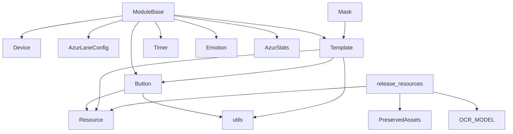

---
description:
alwaysApply: true
---
# module/base/ 模块分析

## 1. 模块概述

**定位**：基础工具层，为所有游戏逻辑模块提供核心抽象和通用工具。

**角色**：定义 `ModuleBase` 根类（所有功能模块的公共祖先）、`Button`/`Template` 视觉交互原语、`Resource` 资源管理、`Timer` 计时器、装饰器、过滤器、异步执行器等基础设施。

**输入/输出**：
- 输入：截图（`np.ndarray`）、配置（`AzurLaneConfig`）、设备实例（`Device`）
- 输出：布尔检测结果、点击操作、裁剪图像、过滤结果

**核心职责**：
1. 提供状态循环（`loop()`）和按钮检测/点击（`appear()`/`appear_then_click()`）的统一抽象
2. 定义 `Button`/`Template` 作为 UI 交互的基本单位，封装颜色检测和模板匹配
3. 管理资源生命周期（`Resource`），支持缓存释放和服务器切换
4. 提供 `Timer` 双重计时器、`Filter` 正则过滤、`Switch` 状态切换等通用组件
5. 提供装饰器（`Config.when`、`cached_property`、`retry`）和异步执行器

## 2. 文件清单与逐文件分析

### 2.1 base.py（462 行）

**导出类型**：类 `ModuleBase`

**导入依赖**：
- 内部：`button.Button`、`decorator.cached_property`、`timer.Timer`、`utils.*`、`combat.Emotion`、`config.AzurLaneConfig`、`config.server`、`device.Device`、`device.method.utils.HierarchyButton`、`logger`、`map_detection.utils.fit_points`、`statistics.AzurStats`、`webui.setting.cached_class_property`
- 外部：`typing`、`numpy`、`PIL.Image`

**逐段分析**：

- `L20-61`：`ModuleBase.__init__()` — 接受 `config`（字符串或 `AzurLaneConfig`）和 `device`（`None`、字符串或 `Device`），初始化 `interval_timer` 字典。支持多种构造方式。
- `L63-69`：`stat`/`emotion` 缓存属性 — 惰性创建 `AzurStats` 和 `Emotion` 实例。
- `L71-77`：`early_ocr_import()` — 预留的 OCR 预导入钩子，当前为空实现。
- `L79-97`：`worker` — 类级 `cached_class_property`，创建单线程 `ThreadPoolExecutor` 用于后台任务。
- `L99-103`：`ensure_button()` — 将字符串 xpath 转换为 `HierarchyButton`。
- `L105-154`：`loop()` — 状态循环生成器，核心设计模式。支持 `skip_first` 复用上次截图、`timeout` 超时控制。`for _ in self.loop()` 语法糖。
- `L155-188`：`loop_hierarchy()`/`loop_screenshot_hierarchy()` — 层次结构循环变体。
- `L190-240`：`appear()` — 按钮出现检测。支持 `HierarchyButton`、颜色检测（`appear_on`）、模板匹配（`match`）。`interval` 参数防止频繁触发。
- `L242-272`：`match_template_color()` — 先模板匹配再颜色验证的双重检测。
- `L274-286`：`appear_then_click()` — 检测到按钮后点击，含 0.1s 安全延迟（防止误触退役金船）。
- `L288-329`：`wait_until_appear()`/`wait_until_disappear()`/`wait_until_stable()` — 等待辅助方法。`wait_until_stable` 使用双重计时器确保 UI 稳定。
- `L331-386`：图像工具方法 — `image_crop()`、`image_color_count()`、`image_color_button()`。
- `L388-429`：间隔计时器管理 — `get_interval_timer()`、`interval_reset()`、`interval_clear()`。
- `L431-462`：`image_file` 属性（开发调试用）、`set_server()` 方法。

### 2.2 button.py（490 行）

**导出类型**：类 `Button`、`ButtonGrid`

**导入依赖**：
- 内部：`decorator.cached_property`、`resource.Resource`、`utils.*`、`config.server.VALID_SERVER`、`logger`
- 外部：`typing`、`os`、`traceback`、`PIL.ImageDraw`

**逐段分析**：

- `L16-111`：`Button.__init__()` — 五参数构造：`area`（检测区域）、`color`（期望颜色）、`button`（点击区域）、`file`（模板文件）、`name`（名称）。支持 dict（按服务器区分）和 tuple（通用）。`cached_property` 惰性解析。
- `L107-121`：`appear_on()` — 颜色检测：计算区域平均颜色与期望颜色的相似度，阈值默认 10。
- `L123-149`：`load_color()`/`load_offset()`/`clear_offset()` — 动态加载颜色和偏移。
- `L151-194`：模板加载 — `ensure_template()`（原图）、`ensure_binary_template()`（二值化）、`ensure_luma_template()`（亮度通道）。GIF 模板逐帧加载。
- `L196-203`：`resource_release()` — 释放所有缓存图像。
- `L205-289`：匹配方法 — `match()`（模板匹配 `TM_CCOEFF_NORMED`）、`match_binary()`（二值化后匹配）、`match_luma()`（亮度通道匹配）。GIF 模板逐帧尝试。
- `L331-350`：`match_template_color()` — 先 `match_luma` 再颜色验证。
- `L352-392`：`crop()`/`move()` — 基于相对坐标创建新 Button。
- `L394-410`：`split_server()` — 按服务器拆分为 4 个 Button。
- `L413-490`：`ButtonGrid` — 网格按钮生成器。`__getitem__` 按索引生成 Button。`generate()` 迭代器。`crop()`/`move()` 相对变换。

### 2.3 template.py（298 行）

**导出类型**：类 `Template`

**导入依赖**：
- 内部：`button.Button`、`decorator.cached_property`、`resource.Resource`、`utils.*`、`config.server.VALID_SERVER`、`map_detection.utils.Points`
- 外部：`os`、`imageio`

**逐段分析**：

- `L13-60`：`Template.__init__()` — 接受 `file` 参数。`image` 属性惰性加载，支持 GIF（逐帧，自动通道对齐）。
- `L62-88`：`image_binary`/`image_luma` — 惰性计算二值化和亮度图像。
- `L90-102`：`_match_gif()` — GIF 匹配，每帧同时尝试原图和水平翻转。
- `L131-164`：`match()` — 模板匹配，支持 `scaling` 缩放和 GIF 翻转。
- `L166-204`：`match_binary()`/`match_luma()` — 二值化和亮度匹配变体。
- `L224-248`：`match_result()`/`match_luma_result()` — 返回相似度和 Button 位置。
- `L250-284`：`match_multi()` — 多目标匹配，使用 `Points.group()` 聚类去重。
- `L286-298`：`split_server()` — 按服务器拆分。

### 2.4 resource.py（144 行）

**导出类型**：类 `Resource`、`PreservedAssets`，函数 `release_resources()`

**导入依赖**：
- 内部：`config.server`、`decorator.cached_property`、`decorator.del_cached_property`
- 外部：`re`

**逐段分析**：

- `L7-14`：`get_assets_from_file()` — 从源文件中用正则提取资源名。
- `L17-35`：`PreservedAssets` — 识别需要在任务切换时保留的 UI 资源（`ui.py`、`info_handler.py` 中的按钮）。
- `L41-86`：`Resource` — 基类。`instances` 类级字典跟踪所有实例。`resource_add()` 注册，`resource_release()` 释放缓存。`parse_property()` 根据服务器选择属性值。
- `L89-144`：`release_resources()` — 全局资源释放函数。按策略释放 OCR 模型（20-40MB）、UI 资源缓存（3MB+）、地图检测缓存。保留 `PreservedAssets` 中的 UI 资源。

### 2.5 utils.py（1289 行）

**导出类型**：大量工具函数和全局变量

**导入依赖**：
- 内部：`config.server`
- 外部：`numpy`、`cv2`、`PIL.Image`、`os`、`re`、`time`、`random`、`scipy.signal`

**关键函数分析**：

- `L18-35`：随机分布 — `random_normal_distribution_int()`、`random_rectangle_point()`、`random_rectangle_vector()`
- `L37-80`：区域操作 — `area_offset()`、`area_pad()`、`area_limit()`、`area_size()`、`area_center()`
- `L82-120`：`crop()` — 图像裁剪，处理越界（零填充或复制边缘）
- `L122-200`：颜色工具 — `color_similarity()`、`color_similar()`、`color_similarity_2d()`（向量化）、`extract_letters()`、`extract_white_letters()`
- `L202-280`：颜色获取 — `get_color()`、`get_bbox()`、`rgb2gray()`、`rgb2hsv()`、`rgb2yuv()`、`rgb2luma()`
- `L282-350`：图像处理 — `image_size()`、`image_color_count()`、`load_image()`、`save_image()`
- `L352-420`：节点转换 — `node2location()`、`location2node()`
- `L422-500`：进度条 — `color_bar_percentage()`
- `L502-600`：模板匹配辅助 — `TEMPLATE_MATCH_NON_NATIVE_720P` 全局标志、`set_template_match_non_native_720p()`、`lower_template_match_similarity()`
- `L602-700`：`crop_to_text()` — 文本区域裁剪

### 2.6 timer.py（206 行）

**导出类型**：类 `Timer`，函数 `future_time()`、`past_time()`、`future_time_range()`、`time_range_active()`

**导入依赖**：外部 `time`、`datetime`、`functools`

**逐段分析**：

- `L75-206`：`Timer` — 双重计时器。`limit`（时间限制）和 `count`（访问次数）。`reached()` 需要同时满足 `_access > count` 和 `time() - _start > limit`。`from_seconds()` 工厂方法按截图耗时估算 count。`start()`/`reset()`/`clear()` 控制状态。未启动时 `reached()` 返回 `True`（快速首次尝试）。

### 2.7 decorator.py（208 行）

**导出类型**：类 `Config`、`cached_property`，函数 `del_cached_property()`、`has_cached_property()`、`set_cached_property()`、`function_drop()`、`run_once()`

**导入依赖**：外部 `random`、`re`、`functools`、`typing`

**逐段分析**：

- `L9-77`：`Config` — 装饰器类。`@Config.when(SERVER='en')` 根据配置分发不同实现。`func_list` 类级字典存储同名函数的多个变体。
- `L80-98`：`cached_property` — 带泛型支持的缓存属性描述符。首次访问计算并存入 `__dict__`。
- `L101-136`：缓存属性辅助函数。
- `L138-178`：`function_drop()` — 随机丢弃函数调用，模拟卡顿，用于测试。
- `L181-208`：`run_once()` — 函数只执行一次。

### 2.8 filter.py（139 行）

**导出类型**：类 `Filter`

**导入依赖**：外部 `re`

**逐段分析**：

- `L1-139`：`Filter` — 正则过滤系统。`parse_filter()` 解析过滤字符串（支持 `>` 优先级分隔符和 Unicode 全角 `>`）。`apply()` 匹配对象属性。支持预设（`preset`）。

### 2.9 mask.py（56 行）

**导出类型**：类 `Mask`

**导入依赖**：内部 `template.Template`、`utils.*`

**逐段分析**：

- `L1-56`：`Mask` — 继承 `Template`，加载灰度遮罩图像。`apply()` 使用 `cv2.bitwise_and` 应用遮罩。

### 2.10 retry.py（123 行）

**导出类型**：函数 `retry()`

**导入依赖**：外部 `time`、`random`、`functools`

**逐段分析**：

- `L1-123`：`retry()` 装饰器 — 指数退避 + 抖动。支持 `exceptions`（可重试异常类型）、`tries`、`delay`、`backoff`、`jitter`、`logger`。

### 2.11 async_executor.py（69 行）

**导出类型**：类 `AsyncExecutor`

**导入依赖**：外部 `threading`、`asyncio`、`concurrent.futures`、`atexit`

**逐段分析**：

- `L1-69`：`AsyncExecutor` — 单例异步执行器。后台线程运行 `asyncio` 事件循环。`submit()` 提交同步/异步函数。`flush()` 等待所有任务完成。`atexit` 注册清理。

### 2.12 api_client.py（269 行）

**导出类型**：类 `ApiClient`

**导入依赖**：内部 `async_executor`、`decorator.run_once`、`logger`、`deploy.config`

**逐段分析**：

- `L1-269`：`ApiClient` — HTTP 客户端。双域名故障转移（`cloudflare` + `aliyun`）。端点：bug 日志、CL1 遥测、公告。通过 `AsyncExecutor` 异步提交。

### 2.13 device_id.py（166 行）

**导出类型**：类 `DeviceId`

**导入依赖**：内部 `config.AzurLaneConfig`、`logger`、`deploy.config`

**逐段分析**：

- `L1-166`：`DeviceId` — 设备指纹生成。通过 WMIC 查询硬件信息（CPU、主板、磁盘、MAC），SHA256 哈希生成唯一 ID。5 分钟刷新计时器。硬件变更自动检测用于数据库迁移。

## 3. 内部调用关系

## 4. 模块依赖分析

**外部依赖**：
- `numpy`：图像数组操作
- `cv2`（OpenCV）：模板匹配、颜色转换、图像处理
- `PIL`（Pillow）：图像加载、绘图
- `imageio`：GIF 读取
- `scipy.signal`：信号处理（峰值检测）

**内部依赖**：
- `module.config`：配置系统（`AzurLaneConfig`、`server`）
- `module.device`：设备层（`Device`、`HierarchyButton`）
- `module.combat`：情绪系统（`Emotion`）
- `module.logger`：日志系统
- `module.map_detection`：地图检测工具（`fit_points`、`Points`）
- `module.statistics`：统计（`AzurStats`）
- `module.webui`：WebUI 设置（`cached_class_property`）

## 5. 设计模式与架构分析

**设计模式**：
1. **模板方法模式**：`ModuleBase` 定义 `loop()`/`appear()` 等骨架，子类填充具体逻辑
2. **享元模式**：`Button`/`Template` 通过 `Resource.instances` 共享和管理
3. **策略模式**：`Config.when()` 装饰器根据配置动态选择实现
4. **观察者模式**：`ConfigWatcher` 监控配置文件变更
5. **单例模式**：`AsyncExecutor` 全局单例

**架构特点**：
- 所有游戏模块通过 `ModuleBase` 统一接口与设备交互
- `Button`/`Template` 是视觉交互的基本单位，封装了颜色检测和模板匹配
- 资源管理通过 `Resource` 基类实现生命周期控制

## 6. 类型系统分析

- 使用 `typing` 模块：`Tuple`、`Union`、`Callable`、`Generic`、`TypeVar`
- `cached_property` 支持泛型类型推导
- `Button`/`Template` 属性使用 `cached_property` 延迟计算
- `Timer` 使用 `float` 和 `int` 双精度计时

## 7. 性能分析

- `appear()` 方法在 `interval` 模式下使用 `Timer` 避免频繁计算
- `Button.match()` 使用 `cv2.matchTemplate` 的 `TM_CCOEFF_NORMED` 算法，复杂度 O(W*H)
- `color_similarity_2d()` 使用向量化 NumPy 操作批量计算
- `Template.match_multi()` 使用 `Points.group()` 聚类去重
- `Resource.release_resources()` 按需释放，避免内存泄漏
- `AsyncExecutor` 后台线程避免阻塞主线程

## 8. 安全分析

- `Button`/`Template` 文件路径通过 `Resource.parse_property()` 解析，支持服务器隔离
- `release_resources()` 保留关键 UI 资源，避免任务切换时丢失状态
- `DeviceId` 使用 SHA256 哈希，不暴露原始硬件信息

## 9. 代码质量评估

**优点**：
- 抽象层次清晰，`ModuleBase` 统一了所有游戏模块的接口
- `Button`/`Template` 设计灵活，支持多种检测模式
- 资源管理机制完善，支持缓存释放和服务器切换
- 装饰器系统强大，支持配置分发和缓存

**问题**：
- `utils.py` 过于庞大（1289 行），应拆分为 `color_utils.py`、`image_utils.py`、`area_utils.py` 等
- `ModuleBase.__init__()` 接受多种类型参数，类型检查不够严格
- `Button` 构造函数参数过多，应考虑使用 Builder 模式
- `filter.py` 的 `parse_filter()` 方法正则表达式复杂，可读性差

## 10. 潜在问题与改进建议

1. **utils.py 拆分**：将 1289 行拆分为多个子模块（`color.py`、`image.py`、`area.py`、`random.py`）
2. **Button 构造优化**：引入 Builder 模式或配置对象，减少参数数量
3. **类型注解增强**：为 `appear()`、`appear_then_click()` 等方法添加更精确的类型注解
4. **资源释放策略**：`release_resources()` 中的 OCR 模型释放逻辑过于复杂，应抽象为策略类
5. **测试覆盖**：核心工具函数（`crop()`、`color_similarity()`）缺少单元测试
