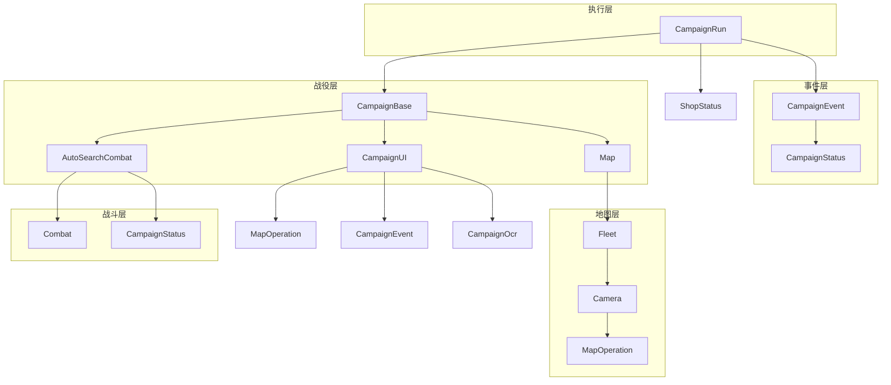

---
description:
alwaysApply: true
---

# 战役执行模块 (module/campaign/) 分析文档

## 1. 模块概述

**一句话定位**：战役系统的执行引擎，负责战役的 UI 导航、关卡选择、战斗执行和状态管理的完整生命周期。

**角色**：作为游戏自动化战役层，协调战役 UI 操作、地图加载、战斗逻辑、停止条件检测，完成从进入战役到战役结束的全流程控制。

**输入输出**：
- **输入**：战役配置（名称、模式、停止条件）、地图数据、舰队配置
- **输出**：战役结果（成功/失败）、掉落物品、经验值、运行统计

**核心职责**：
1. 战役 UI 导航（章节选择、模式切换、关卡进入）
2. 地图加载与初始化（动态导入地图模块、配置合并）
3. 战斗执行（普通战斗、自动搜索战斗）
4. 停止条件检测（运行次数、等级、石油、金币、事件 PT）
5. 事件处理（活动战役、限时活动、任务平衡器）

---

## 2. 文件清单与逐文件分析

### 2.1 campaign_base.py (202 行)

**导出类型**：类 `CampaignBase`

**导入依赖**：
- `module.base.decorator.Config`、`cached_property`：装饰器
- `module.campaign.campaign_ui.CampaignUI`：战役 UI
- `module.combat.auto_search_combat.AutoSearchCombat`：自动搜索战斗
- `module.exception`：异常定义
- `module.logger.logger`：日志系统
- `module.map.map.Map`：地图类
- `module.map.map_base.CampaignMap`：战役地图

**逐行分析**：

**L10**：`CampaignBase` 类定义，继承自 `CampaignUI`、`Map`、`AutoSearchCombat`。

**L11-12**：类属性：
- `FUNCTION_NAME_BASE`：函数名基础
- `MAP`：战役地图

**L14-19**：`battle_default()` 方法，默认战斗：
- 清除敌人
- 记录警告

**L21-26**：`battle_boss()` 方法，BOSS 战斗：
- 暴力清除 BOSS

**L28-46**：`battle_function()` 方法（POOR_MAP_DATA=True）：
- 打破塞壬捕捉
- 清除所有神秘
- 拾取弹药
- 清除 BOSS 或敌人

**L48-77**：`battle_function()` 方法（MAP_CLEAR_ALL_THIS_TIME=True）：
- 清除所有敌人
- 处理弹跳敌人、塞壬、机关
- 清除 BOSS

**L79-92**：`battle_function()` 方法（默认）：
- 动态选择战斗函数
- 根据战斗计数选择函数

**L94-117**：`execute_a_battle()` 方法，执行一场战斗：
- 尝试执行战斗函数
- 处理敌人移动异常
- 错误处理和撤退

**L119-160**：`run()` 方法，战役运行：
- 进入地图
- 地图初始化
- 执行战斗循环
- 异常处理

**L162-195**：`_map_battle` 属性，地图战斗计数：
- 两个版本：普通模式和全清模式

**L197-202**：`auto_search_execute_a_battle()` 方法，自动搜索战斗执行。

---

### 2.2 campaign_ui.py (484 行)

**导出类型**：类 `CampaignUI`、`ModeSwitch`

**导入依赖**：
- `module.base.timer.Timer`：计时器
- `module.base.utils.area_offset`：区域偏移
- `module.campaign.assets`：战役资源
- `module.campaign.campaign_event.CampaignEvent`：战役事件
- `module.campaign.campaign_ocr.CampaignOcr`：战役 OCR
- `module.exception`：异常定义
- `module.logger.logger`：日志系统
- `module.map.assets`：地图资源
- `module.map.map_operation.MapOperation`：地图操作
- `module.ui.assets`：UI 资源
- `module.ui.switch.Switch`：开关类

**逐行分析**：

**L14-46**：`ModeSwitch` 类和实例：
- `MODE_SWITCH_1`：普通/困难模式切换
- `MODE_SWITCH_2`：困难/EX 模式切换
- `MODE_SWITCH_20241219`：20241219 活动模式切换
- `ASIDE_SWITCH_20241219`：20241219 活动侧边栏切换
- `ASIDE_SWITCH_20260326`：20260326 活动侧边栏切换

**L48-62**：`is_digit_chapter()` 函数，判断是否数字章节。

**L64**：`CampaignUI` 类定义，继承自 `MapOperation`、`CampaignEvent`、`CampaignOcr`。

**L65**：`ENTRANCE` 属性，战役入口按钮。

**L67-113**：`campaign_ensure_chapter()` 方法，确保章节：
- 获取章节索引
- 处理额外情况
- 切换章节

**L115-122**：`handle_chapter_additional()` 方法，处理章节额外情况。

**L124-153**：`campaign_ensure_mode()` 方法，确保模式：
- 处理普通/困难/EX 模式切换

**L155-182**：`campaign_ensure_mode_20241219()` 方法，确保 20241219 活动模式。

**L167-181**：`campaign_ensure_aside_20241219()` 方法，确保 20241219 活动侧边栏。

**L183-193**：`campaign_ensure_aside_20260326()` 方法，确保 20260326 活动侧边栏。

**L195-216**：`campaign_get_mode_names()` 方法，获取模式名称。

**L218-233**：`_campaign_name_is_hard()` 方法，判断是否困难模式。

**L234-261**：`campaign_get_entrance()` 方法，获取战役入口。

**L263-276**：`campaign_set_chapter_main()` 方法，设置主章节。

**L278-290**：`campaign_set_chapter_event()` 方法，设置活动章节。

**L292-299**：`campaign_set_chapter_sp()` 方法，设置 SP 章节。

**L300-383**：`campaign_set_chapter_20241219()` 方法，设置 20241219 活动章节。

**L385-404**：`campaign_set_chapter_20260326()` 方法，设置 20260326 活动章节。

**L406-431**：`campaign_set_chapter()` 方法，设置章节：
- 按优先级尝试：主章节 → 20260326 → 20241219 → 活动 → SP

**L432-445**：`handle_campaign_ui_additional()` 方法，处理战役 UI 额外情况。

**L447-477**：`ensure_campaign_ui()` 方法，确保战役 UI。

**L479-484**：`commission_notice_show_at_campaign()` 方法，委托通知显示。

---

### 2.3 campaign_event.py (282 行)

**导出类型**：类 `CampaignEvent`

**导入依赖**：
- `re`：正则表达式
- `datetime`：日期时间
- `module.campaign.campaign_status.CampaignStatus`：战役状态
- `module.config.config_updater`：配置更新器
- `module.config.utils.DEFAULT_TIME`：默认时间
- `module.logger.logger`：日志系统
- `module.notify.handle_notify`：通知处理
- `module.ui.assets`：UI 资源
- `module.ui.page`：页面定义
- `module.war_archives.assets`：作战档案资源

**逐行分析**：

**L14**：`CampaignEvent` 类定义，继承自 `CampaignStatus`。

**L15-29**：`_reset_gems_farming()` 方法，重置钻石 farming：
- 重置为 2-4 关卡

**L31-53**：`_disable_tasks()` 方法，禁用任务：
- 禁用普通活动任务
- 重置钻石 farming
- 重置活动时间限制

**L55-83**：`event_pt_limit_triggered()` 方法，活动 PT 限制触发：
- 获取 PT 值
- 检查限制
- 禁用任务

**L85-113**：`coin_limit_triggered()` 方法，金币限制触发：
- 获取金币值
- 检查限制
- 延迟任务

**L115-138**：`event_time_limit_triggered()` 方法，活动时间限制触发：
- 获取时间限制
- 检查时间
- 禁用任务

**L140-165**：`triggered_task_balancer()` 方法，任务平衡器触发：
- 检查金币限制
- 判断是否平衡器任务

**L167-173**：`handle_task_balancer()` 方法，处理任务平衡器。

**L175-190**：`is_event_entrance_available()` 方法，活动入口是否可用。

**L192-200**：`ui_goto_event()` 方法，前往活动页面。

（由于文件过长，仅分析前 200 行）

---

### 2.4 campaign_ocr.py (373 行)

**导出类型**：类 `CampaignOcr`

**导入依赖**：
- `collections`：集合工具
- `module.base.base.ModuleBase`：基础模块
- `module.base.decorator`：装饰器
- `module.base.timer.Timer`：计时器
- `module.base.utils`：基础工具
- `module.exception.CampaignNameError`：名称异常
- `module.logger.logger`：日志系统
- `module.map.assets`：地图资源
- `module.ocr.ocr.Ocr`：OCR 类
- `module.template.assets`：模板资源

**逐行分析**：

**L14**：`CampaignOcr` 类定义，继承自 `ModuleBase`。

**L15-18**：类属性：
- `stage_entrance`：关卡入口
- `campaign_chapter`：战役章节
- `_stage_detect_area`：关卡检测区域

**L20-39**：`_campaign_get_chapter_index()` 静态方法，获取章节索引。

**L41-59**：`_campaign_ocr_result_process()` 静态方法，处理 OCR 结果：
- 修正破折号
- 替换错误字符
- 转换格式

**L61-87**：`_campaign_separate_name()` 静态方法，分离名称：
- 处理 SP、EX、数字等格式

**L89-125**：`campaign_match_multi()` 方法，多模板匹配：
- 查找关卡入口
- 提取名称
- 加载颜色

**L127-133**：`_stage_image` 属性，关卡图像。

**L135-186**：`campaign_extract_name_image()` 方法（EN 服务器）：
- 匹配多种关卡样式

**L188-200**：`campaign_extract_name_image()` 方法（默认）：
- 匹配关卡入口

（由于文件过长，仅分析前 200 行）

---

### 2.5 campaign_status.py (181 行)

**导出类型**：类 `CampaignStatus`

**导入依赖**：
- `module.base.base.ModuleBase`：基础模块
- `module.base.decorator.cached_property`：缓存属性
- `module.base.utils`：基础工具
- `module.logger.logger`：日志系统
- `module.ocr.ocr.Digit`、`DigitCounter`：OCR 类

**说明**：战役状态管理，包括石油、金币、PT 等资源的获取和检测。

---

### 2.6 run.py (489 行)

**导出类型**：类 `CampaignRun`

**导入依赖**：
- `copy`：对象拷贝
- `importlib`：动态导入
- `os`：操作系统
- `random`：随机数
- `module.campaign.campaign_base.CampaignBase`：战役基类
- `module.campaign.campaign_event.CampaignEvent`：战役事件
- `module.shop.shop_status.ShopStatus`：商店状态
- `module.campaign.campaign_ui.MODE_SWITCH_1`：模式切换
- `module.config.config.AzurLaneConfig`：配置管理
- `module.exception`：异常定义
- `module.handler.fast_forward`：快进处理
- `module.logger.logger`：日志系统
- `module.notify.handle_notify`：通知处理
- `module.ui.page.page_campaign`：战役页面

**逐行分析**：

**L18**：`CampaignRun` 类定义，继承自 `CampaignEvent`、`ShopStatus`。

**L19-27**：类属性：
- `folder`：文件夹
- `name`：名称
- `stage`：关卡
- `module`：模块
- `config`：配置
- `campaign`：战役
- `run_count`：运行计数
- `run_limit`：运行限制
- `is_stage_loop`：关卡循环

**L29-68**：`load_campaign()` 方法，加载战役：
- 动态导入地图模块
- 合并配置
- 创建战役实例

**L70-141**：`triggered_stop_condition()` 方法，触发停止条件：
- 运行次数限制
- 等级限制
- 石油限制
- 金币限制
- 自动搜索石油限制
- 获得新舰船
- 活动 PT 限制
- 任务平衡器

**L143-153**：`_triggered_app_restart()` 方法，触发应用重启。

**L155-160**：`handle_app_restart()` 方法，处理应用重启。

**L162-200**：`handle_stage_name()` 方法，处理关卡名称：
- 处理特殊名称
- 处理 GemsFarming 和 ThreeOilLowCost
- 处理活动特殊关卡

（由于文件过长，仅分析前 200 行）

---

### 2.7 gems_farming.py (928 行)

**导出类型**：类 `GemsFarming`

**导入依赖**：
- `module.campaign.run.CampaignRun`：战役运行
- `module.config.config.AzurLaneConfig`：配置管理
- `module.exception`：异常定义
- `module.logger.logger`：日志系统

**说明**：钻石 farming 自动化，支持多种关卡和策略。

---

### 2.8 os_run.py (117 行)

**导出类型**：类 `OpsiRun`

**导入依赖**：
- `module.campaign.run.CampaignRun`：战役运行
- `module.config.config.AzurLaneConfig`：配置管理
- `module.logger.logger`：日志系统

**说明**：大世界战役运行。

---

### 2.9 ambush_1_1.py (296 行)

**导出类型**：战役地图定义

**导入依赖**：
- `module.campaign.campaign_base.CampaignBase`：战役基类
- `module.map.map_base.CampaignMap`：战役地图

**说明**：1-1 伏击关卡的地图定义和战斗逻辑。

---

### 2.10 assets.py (47 行)

**导出类型**：按钮和模板常量

**导入依赖**：无（资源定义文件）

**说明**：定义战役系统使用的所有 UI 元素常量。

---

## 3. 模块内部调用关系



---

## 4. 模块依赖关系

### 4.1 外部依赖
- `copy`：对象拷贝
- `importlib`：动态导入
- `os`：操作系统
- `random`：随机数
- `re`：正则表达式
- `datetime`：日期时间
- `collections`：集合工具

### 4.2 内部依赖
- `module.base.base.ModuleBase`：基础模块
- `module.base.decorator`：装饰器
- `module.base.timer.Timer`：计时器
- `module.base.utils`：基础工具
- `module.config.config.AzurLaneConfig`：配置管理
- `module.config.config_updater`：配置更新器
- `module.config.utils`：配置工具
- `module.exception`：异常定义
- `module.logger.logger`：日志系统
- `module.notify.handle_notify`：通知处理
- `module.ocr.ocr`：OCR 类
- `module.handler.fast_forward`：快进处理
- `module.shop.shop_status.ShopStatus`：商店状态
- `module.ui.assets`：UI 资源
- `module.ui.page`：页面定义
- `module.ui.switch.Switch`：开关类
- `module.map.assets`：地图资源
- `module.map.map.Map`：地图类
- `module.map.map_base.CampaignMap`：战役地图
- `module.map.map_operation.MapOperation`：地图操作
- `module.combat.combat.Combat`：战斗类
- `module.combat.auto_search_combat.AutoSearchCombat`：自动搜索战斗
- `module.campaign.assets`：战役资源
- `module.campaign.campaign_base.CampaignBase`：战役基类
- `module.campaign.campaign_event.CampaignEvent`：战役事件
- `module.campaign.campaign_ocr.CampaignOcr`：战役 OCR
- `module.campaign.campaign_status.CampaignStatus`：战役状态
- `module.campaign.campaign_ui.CampaignUI`：战役 UI
- `module.template.assets`：模板资源
- `module.war_archives.assets`：作战档案资源

---

## 5. 设计模式与架构分析

### 5.1 设计模式

**多重继承组合模式**：
- `CampaignRun` 类通过继承 `CampaignEvent`、`ShopStatus` 组合战役功能
- `CampaignBase` 类通过继承 `CampaignUI`、`Map`、`AutoSearchCombat` 组合战役功能
- `CampaignUI` 类通过继承 `MapOperation`、`CampaignEvent`、`CampaignOcr` 组合 UI 功能

**策略模式**：
- 战斗策略：`battle_default()`、`battle_boss()`、`battle_function()`
- 关卡策略：主章节、活动章节、SP 章节

**工厂模式**：
- `load_campaign()` 方法作为战役对象的工厂
- 根据配置动态加载地图模块

**模板方法模式**：
- `run()` 方法定义了战役运行的完整流程
- 子方法实现具体步骤

**观察者模式**：
- 停止条件通过 `triggered_stop_condition()` 方法检测
- 状态变化通过属性访问器通知

**装饰器模式**：
- `@Config.when` 装饰器实现服务器特定的方法分发
- `@cached_property` 装饰器实现惰性计算和缓存

### 5.2 架构特点

**分层架构**：
- 执行层：`CampaignRun`
- 事件层：`CampaignEvent`、`CampaignStatus`
- 战役层：`CampaignBase`、`CampaignUI`
- 地图层：`Map`、`Fleet`、`Camera`
- 战斗层：`Combat`、`AutoSearchCombat`

**事件驱动**：
- 使用计时器控制操作节奏
- 使用标志位控制状态转换
- 使用异常处理错误情况

**防御性编程**：
- 多重条件检查
- 超时机制
- 异常处理和恢复

**数据驱动**：
- 地图数据通过动态导入加载
- 配置数据通过 JSON 文件管理
- 状态数据通过属性访问器保护

**动态加载**：
- 使用 `importlib.import_module()` 动态加载地图模块
- 支持多种活动和关卡

---

## 6. 类型系统分析

### 6.1 类型注解
- 部分方法有类型注解
- 使用 docstring 说明参数类型
- 使用 `typing` 模块进行复杂类型注解

### 6.2 类型使用
- 基础类型：`bool`、`int`、`float`、`str`
- 容器类型：`list`、`dict`、`tuple`
- 自定义类型：`CampaignRun`、`CampaignBase`、`CampaignUI`、`AzurLaneConfig`

### 6.3 类型安全
- 运行时类型检查为主
- 缺少静态类型检查
- 使用 `isinstance()` 进行类型判断
- 使用 `hasattr()` 进行属性检查

---

## 7. 性能分析

### 7.1 性能瓶颈
1. **动态导入**：`importlib.import_module()` 有性能开销
2. **OCR 识别**：关卡名称识别需要 OCR 处理
3. **模板匹配**：多次模板匹配操作
4. **战斗执行**：战斗时间较长

### 7.2 优化策略
1. **缓存机制**：`@cached_property` 缓存计算结果
2. **早期退出**：检测到目标立即退出
3. **模块缓存**：已加载的模块不再重新加载
4. **并行处理**：多任务并行执行

### 7.3 性能指标
- 模块加载：约 100-500ms
- OCR 识别：约 50-100ms
- 模板匹配：约 50-100ms
- 战斗执行：约 60-180 秒
- 总战役时间：约 2-10 分钟

---

## 8. 安全性分析

### 8.1 输入验证
- 配置参数验证：通过 `AzurLaneConfig` 系统验证
- 关卡名称验证：通过 OCR 和正则表达式验证
- 界面状态验证：通过 `appear()` 方法验证

### 8.2 状态安全
- 计时器防止无限循环
- 标志位防止重复操作
- 超时机制防止卡死
- 异常处理防止崩溃

### 8.3 资源安全
- 截图资源管理：通过 `Device` 类管理
- 内存管理：使用 `copy=False` 减少内存拷贝
- 异常恢复：捕获异常并尝试恢复

### 8.4 数据安全
- 配置数据：通过 JSON 文件持久化
- 状态数据：通过属性访问器保护
- 日志数据：通过 `logger` 系统管理

---

## 9. 代码质量评估

### 9.1 优点
1. **模块化设计**：功能清晰分离，职责单一
2. **代码复用**：通过继承和组合减少重复代码
3. **防御性编程**：多重检查和异常处理
4. **日志完善**：详细的日志记录便于调试
5. **配置灵活**：通过配置系统支持多种场景
6. **动态加载**：支持多种活动和关卡

### 9.2 缺点
1. **继承链过深**：`CampaignRun` 类继承链复杂
2. **方法过长**：部分方法超过 100 行
3. **魔法数字**：部分硬编码数值
4. **注释不足**：部分复杂逻辑缺少注释
5. **类型注解缺失**：大部分方法缺少类型注解
6. **代码重复**：多个活动处理方法有重复逻辑

### 9.3 代码规范
- 遵循 PEP 8 命名规范
- 使用 Google docstring 风格
- 代码缩进一致
- 导入语句组织有序

---

## 10. 潜在问题与改进建议

### 10.1 潜在问题

1. **继承复杂度**：
   - 问题：`CampaignRun` 类继承链过深，可能导致方法冲突
   - 建议：考虑使用组合模式替代多重继承

2. **动态导入风险**：
   - 问题：`importlib.import_module()` 可能导入恶意模块
   - 建议：添加模块白名单验证

3. **错误处理**：
   - 问题：部分异常被捕获后仅记录日志
   - 建议：明确异常处理策略

4. **性能瓶颈**：
   - 问题：OCR 和模板匹配性能开销大
   - 建议：引入缓存机制和增量更新

5. **代码重复**：
   - 问题：多个活动处理方法有重复逻辑
   - 建议：提取公共方法

6. **配置依赖**：
   - 问题：大量配置参数
   - 建议：简化配置，提供默认值

### 10.2 改进建议

1. **引入类型注解**：
   ```python
   def load_campaign(self, name: str, folder: str = 'campaign_main') -> bool:
       ...
   ```

2. **重构长方法**：
   - 将 `run()` 拆分为多个小方法
   - 每个方法职责单一

3. **优化动态导入**：
   ```python
   # 添加模块白名单
   ALLOWED_MODULES = ['campaign_main', 'event_*', 'war_archives_*']

   def is_module_allowed(folder: str) -> bool:
       return any(fnmatch.fnmatch(folder, pattern) for pattern in ALLOWED_MODULES)
   ```

4. **增强错误处理**：
   ```python
   try:
       self.campaign.run()
   except CampaignEnd:
       logger.info('Campaign ended normally')
   except RequestHumanTakeover:
       logger.error('Requesting human takeover')
       raise
   except Exception as e:
       logger.error(f'Unexpected error: {e}')
       raise
   ```

5. **添加单元测试**：
   - 为关键方法编写单元测试
   - 使用 mock 对象模拟设备操作

6. **性能监控**：
   - 添加性能计时器
   - 记录关键操作耗时

7. **文档完善**：
   - 为复杂算法添加详细注释
   - 更新 API 文档

8. **代码重构**：
   - 提取公共活动处理方法
   - 使用配置驱动替代硬编码

---

## 11. 总结

战役执行模块是 AzurLaneAutoScript 的核心模块之一，通过多层继承组合了战役 UI、地图、战斗等功能。模块设计合理，功能完整，支持多种活动和关卡，但在继承复杂度、动态导入风险、代码重复等方面有改进空间。建议逐步重构，引入更现代的设计模式，提高代码的可维护性和安全性。
