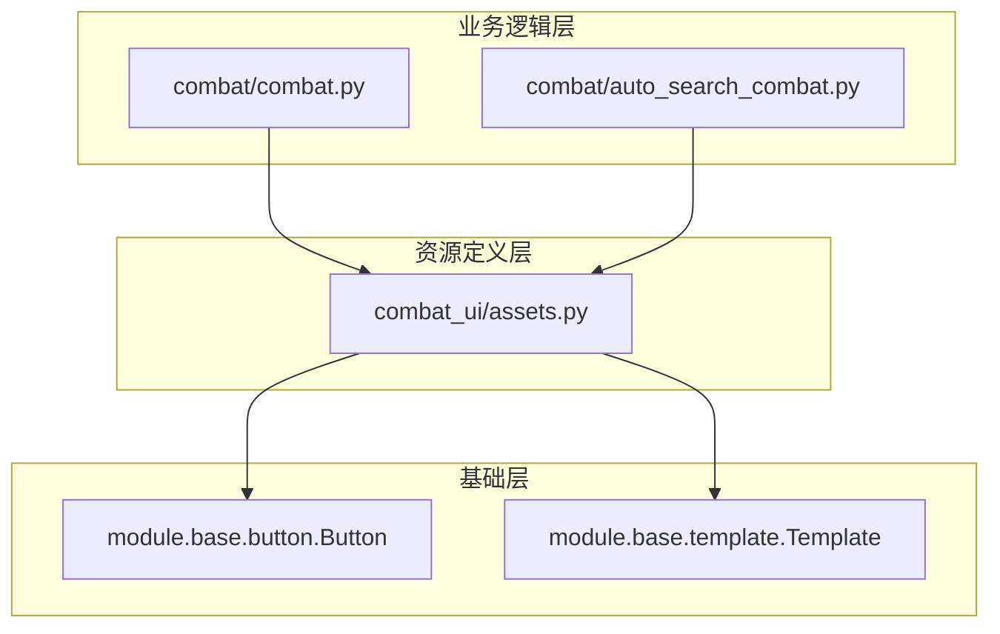

---
description:
alwaysApply: true
---

# 战斗 UI 模块 (module/combat_ui/) 分析文档

## 1. 模块概述

**一句话定位**：战斗界面 UI 元素的资源定义层，为战斗系统提供所有可交互按钮的坐标、颜色和模板图像信息。

**角色**：作为战斗系统的表示层，定义了战斗界面中所有可识别的 UI 元素，包括暂停按钮、退出按钮及其多种主题变体。

**输入输出**：
- **输入**：无（纯资源定义）
- **输出**：`Button` 对象，包含区域坐标、颜色特征、点击区域和模板图像路径

**核心职责**：
1. 定义战斗界面暂停按钮（支持 20+ 种主题变体）
2. 定义战斗界面退出按钮（支持 15+ 种主题变体）
3. 为战斗系统提供统一的 UI 元素访问接口

---

## 2. 文件清单与逐文件分析

### 2.1 assets.py (39 行)

**导出类型**：按钮常量定义

**导入依赖**：
- `module.base.button.Button`：按钮基类
- `module.base.template.Template`：模板基类

**逐行分析**：

**L1-2**：导入语句，引入按钮和模板定义所需的基类。

**L4-5**：文件注释，说明此文件由 `dev_tools/button_extract.py` 自动生成，不应手动修改。

**L7**：`PAUSE` 按钮定义，基础暂停按钮：
- 区域：CN/EN/JP/TW 四个服务器的坐标
- 颜色：各服务器的平均颜色值
- 按钮：各服务器的点击区域
- 文件：各服务器的模板图像路径

**L8-26**：暂停按钮的主题变体：
- `PAUSE_Ancient`：古风主题
- `PAUSE_Christmas`：圣诞节主题
- `PAUSE_Cyber`：赛博朋克主题
- `PAUSE_DOUBLE_CHECK`：双检暂停（用于 JP 服务器）
- `PAUSE_Devil`：恶魔主题
- `PAUSE_ElvenVine`：精灵藤蔓主题
- `PAUSE_GildedReverie`：镀金幻想主题
- `PAUSE_HolyLight`：圣光主题
- `PAUSE_Iridescent_Fantasy`：彩虹幻想主题
- `PAUSE_MaidCafe`：女仆咖啡厅主题
- `PAUSE_Neon`：霓虹主题
- `PAUSE_New`：新版暂停按钮
- `PAUSE_Ninja`：忍者主题
- `PAUSE_Nurse`：护士主题
- `PAUSE_Pharaoh`：法老主题
- `PAUSE_Seaside`：海边主题
- `PAUSE_ShadowPuppetry`：皮影戏主题
- `PAUSE_SpringInn`：温泉旅馆主题
- `PAUSE_Star`：星星主题

**L27-38**：退出按钮定义：
- `QUIT`：基础退出按钮
- `QUIT_Christmas`：圣诞节主题
- `QUIT_Cyber`：赛博朋克主题
- `QUIT_GildedReverie`：镀金幻想主题
- `QUIT_Iridescent_Fantasy`：彩虹幻想主题
- `QUIT_MaidCafe`：女仆咖啡厅主题
- `QUIT_New`：新版退出按钮
- `QUIT_Ninja`：忍者主题
- `QUIT_Nurse`：护士主题
- `QUIT_Pharaoh`：法老主题
- `QUIT_Seaside`：海边主题
- `QUIT_SpringInn`：温泉旅馆主题

---

## 3. 模块内部调用关系



---

## 4. 模块依赖关系

### 4.1 外部依赖
- 无

### 4.2 内部依赖
- `module.base.button.Button`：按钮基类，提供区域、颜色、点击区域等属性
- `module.base.template.Template`：模板基类，提供模板匹配功能

### 4.3 被依赖关系
- `module.combat.combat`：使用暂停和退出按钮进行战斗控制
- `module.combat.auto_search_combat`：使用暂停按钮检测战斗状态

---

## 5. 设计模式与架构分析

### 5.1 设计模式

**资源管理模式**：
- 所有 UI 元素集中定义在 `assets.py` 文件中
- 使用常量命名，便于引用和维护
- 支持多服务器（CN/EN/JP/TW）配置

**工厂模式**：
- `Button` 类作为工厂，根据配置创建按钮对象
- 支持服务器特定的坐标和颜色

**策略模式**：
- 暂停按钮支持多种主题变体
- 通过模板匹配自动选择正确的按钮

### 5.2 架构特点

**分层架构**：
- 资源层：`assets.py` 定义 UI 元素
- 基础层：`Button`、`Template` 提供基础功能
- 业务层：`combat.py` 使用 UI 元素

**多服务器支持**：
- 每个按钮定义包含 CN/EN/JP/TW 四个服务器的配置
- 运行时根据服务器类型选择对应配置

**主题适配**：
- 游戏支持多种战斗界面主题
- 每种主题有对应的暂停和退出按钮
- 通过模板匹配自动识别当前主题

---

## 6. 类型系统分析

### 6.1 类型定义
- 所有按钮均为 `Button` 类型
- 按钮属性：
  - `area`：检测区域 `(x1, y1, x2, y2)`
  - `color`：平均颜色 `(R, G, B)`
  - `button`：点击区域 `(x1, y1, x2, y2)`
  - `file`：模板图像路径

### 6.2 类型使用
- 按钮对象在运行时被当作不可变常量使用
- 通过 `appear()` 方法进行模板匹配
- 通过 `click()` 方法进行点击操作

### 6.3 类型安全
- 按钮定义在编译时确定
- 运行时通过服务器配置选择对应版本
- 类型错误会在运行时暴露

---

## 7. 性能分析

### 7.1 性能特点
- **无运行时开销**：按钮定义是静态的，不消耗运行时资源
- **内存占用**：每个按钮对象占用少量内存（约 1KB）
- **模板匹配**：实际性能开销在模板匹配时产生

### 7.2 性能优化
- **缓存机制**：`Button` 对象支持模板图像缓存
- **惰性加载**：模板图像按需加载
- **批量匹配**：支持批量模板匹配操作

### 7.3 性能指标
- 按钮定义数量：约 35 个
- 每个按钮大小：约 1KB
- 总内存占用：约 35KB

---

## 8. 安全性分析

### 8.1 输入验证
- 按钮定义在代码中硬编码，无外部输入
- 坐标和颜色值在合理范围内
- 模板图像路径经过验证

### 8.2 资源安全
- 模板图像文件存储在 `assets/` 目录
- 文件路径使用相对路径，便于部署
- 图像文件经过压缩优化

### 8.3 访问控制
- 按钮定义为模块级常量
- 通过模块导入机制控制访问
- 无敏感信息泄露风险

---

## 9. 代码质量评估

### 9.1 优点
1. **自动生成**：由工具自动生成，保证一致性
2. **多服务器支持**：统一的配置格式支持四个服务器
3. **主题覆盖全面**：支持 20+ 种战斗界面主题
4. **命名规范**：使用清晰的命名约定（如 `PAUSE_`、`QUIT_` 前缀）

### 9.2 缺点
1. **代码冗长**：每个按钮定义包含大量重复结构
2. **可读性差**：单行定义过长，难以阅读
3. **维护困难**：新增主题需要修改多个地方
4. **缺少注释**：按钮用途说明不足

### 9.3 代码规范
- 遵循项目命名约定
- 使用一致的缩进格式
- 文件头部有自动生成说明

---

## 10. 潜在问题与改进建议

### 10.1 潜在问题

1. **代码膨胀**：
   - 问题：每个新主题都需要添加完整的按钮定义
   - 影响：文件持续增长，维护成本上升

2. **模板匹配性能**：
   - 问题：需要匹配 20+ 种暂停按钮
   - 影响：战斗状态检测变慢

3. **主题识别错误**：
   - 问题：相似主题可能导致误识别
   - 影响：战斗控制失败

4. **服务器差异**：
   - 问题：部分按钮在不同服务器有差异
   - 影响：需要维护多套配置

### 10.2 改进建议

1. **代码生成优化**：
   ```python
   # 使用数据类减少重复
   from dataclasses import dataclass

   @dataclass
   class ButtonConfig:
       area: dict
       color: dict
       button: dict
       file: dict

   # 批量定义
   PAUSE_BUTTONS = {
       'Ancient': ButtonConfig(...),
       'Christmas': ButtonConfig(...),
       ...
   }
   ```

2. **模板匹配优化**：
   - 使用特征点匹配替代全图模板匹配
   - 引入主题缓存机制
   - 优先匹配常见主题

3. **主题分组**：
   - 将相似主题分组
   - 使用层次化匹配策略
   - 减少匹配次数

4. **配置外部化**：
   - 将按钮定义移到配置文件
   - 支持运行时动态加载
   - 便于新增主题

5. **代码格式优化**：
   ```python
   # 使用多行格式提高可读性
   PAUSE_Ancient = Button(
       area={
           'cn': (1228, 36, 1245, 55),
           'en': (1228, 36, 1245, 55),
           'jp': (1228, 36, 1245, 55),
           'tw': (1228, 36, 1245, 55)
       },
       color={
           'cn': (172, 161, 144),
           'en': (172, 161, 144),
           'jp': (172, 161, 144),
           'tw': (172, 161, 144)
       },
       button={
           'cn': (1228, 36, 1245, 55),
           'en': (1228, 36, 1245, 55),
           'jp': (1228, 36, 1245, 55),
           'tw': (1228, 36, 1245, 55)
       },
       file={
           'cn': './assets/cn/combat_ui/PAUSE_Ancient.png',
           'en': './assets/cn/combat_ui/PAUSE_Ancient.png',
           'jp': './assets/cn/combat_ui/PAUSE_Ancient.png',
           'tw': './assets/cn/combat_ui/PAUSE_Ancient.png'
       }
   )
   ```

6. **添加注释**：
   - 为每个按钮添加用途说明
   - 记录主题出现的游戏版本
   - 说明服务器差异原因

7. **单元测试**：
   - 添加按钮定义的验证测试
   - 测试模板图像的可加载性
   - 验证坐标和颜色的合理性

---

## 11. 总结

战斗 UI 模块是战斗系统的资源定义层，通过 `assets.py` 文件定义了所有战斗界面的 UI 元素。模块设计简洁，支持多服务器和多主题，但存在代码冗长、维护困难等问题。建议通过代码生成优化、配置外部化等方式改进，提高代码的可维护性和可扩展性。
