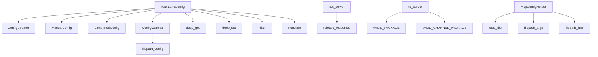

---
description:
alwaysApply: true
---

# module/config/ 模块分析

## 1. 模块概述

**定位**：配置管理系统，负责加载、合并、验证、持久化和热重载用户配置。

**角色**：定义 `AzurLaneConfig` 核心配置类，提供嵌套字典访问（`deep.py`）、服务器管理（`server.py`）、文件监控（`watcher.py`）、配置工具函数（`utils.py`）和 MCP 集成（`mcp_helper.py`）。

**输入/输出**：
- 输入：`config/{name}.json` 用户配置文件、`args.json` 参数定义、`i18n/*.json` 翻译文件
- 输出：绑定到任务的配置属性、调度队列（`pending_task`/`waiting_task`）

**核心职责**：
1. 加载用户配置并与模板合并（`ConfigUpdater`）
2. 将配置路径绑定到任务属性（`bind()`）
3. 提供高性能嵌套字典访问（`deep_get`/`deep_set`）
4. 管理服务器选择和包名映射（`server.py`）
5. 监控配置文件变更并触发重载（`ConfigWatcher`）
6. 计算任务调度优先级和延迟（`get_next_task()`/`task_delay()`）

## 2. 文件清单与逐文件分析

### 2.1 config.py（836 行）

**导出类型**：类 `AzurLaneConfig`、`Function`、`TaskEnd`，函数 `name_to_function()`

**导入依赖**：
- 内部：`filter.Filter`、`config_generated.GeneratedConfig`、`config_manual.ManualConfig`、`config_updater.ConfigUpdater`、`deep.deep_get/deep_set`、`utils.*`、`watcher.ConfigWatcher`、`exception.*`、`logger`、`map.map_grids.SelectedGrids`
- 外部：`copy`、`operator`、`os`、`platform`、`sys`、`threading`、`datetime`、`pywebio`

**逐段分析**：

- `L23-60`：`Function` 类 — 任务函数抽象，包含 `enable`、`command`、`next_run`。用于调度队列排序。
- `L63-77`：`AzurLaneConfig.__setattr__()` — 重写属性设置，将修改记录到 `modified` 字典，支持自动保存。
- `L79-119`：`__init__()` — 初始化配置。`data`（原始 JSON）、`modified`（修改记录）、`bound`（属性绑定映射）、`overridden`（强制覆盖）。支持模板配置（只读）。
- `L121-134`：`init_task()` — 初始化任务。调用 `load()` → `bind()` → `save()`。
- `L136-141`：`load()` — 读取配置文件，应用覆盖和修改。
- `L143-192`：`bind()` — 核心绑定方法。根据任务列表（`General` + `Alas` + 任务特定组）将配置路径映射到属性名。`visited` 集合防止重复绑定。
- `L195-214`：`ocr_backend`/`ocr_device` 属性 — 智能 OCR 配置。`auto` 模式自动检测 GPU 能力（DirectML/Vulkan/CoreML）。
- `L235-294`：`get_next_task()`/`get_next()` — 调度核心。遍历所有任务，按 `next_run` 分为 `pending`/`waiting`，使用 `Filter` 按优先级排序。
- `L296-314`：`save()`/`update()` — 持久化修改到 JSON 文件。
- `L316-347`：`override()`/`config_override()` — 强制覆盖配置值，重置过期的 `NextRun`。
- `L361-370`：`multi_set()` — 上下文管理器，批量修改后一次性保存。
- `L372-398`：`cross_get()`/`cross_set()` — 跨任务配置访问。
- `L400-462`：`task_delay()` — 设置任务延迟。支持多种延迟方式：成功/失败间隔、服务器更新时间、目标时间、分钟数。取最近的未来时间。
- `L464-530`：`opsi_task_delay()` — 大世界任务专用延迟，处理侦察扫描、潜艇呼叫、行动力限制等。

### 2.2 deep.py（533 行）

**导出类型**：函数 `deep_get()`、`deep_get_with_error()`、`deep_exist()`、`deep_set()`、`deep_default()`、`deep_pop()`、`deep_iter_depth1()`、`deep_iter_depth2()`、`deep_iter()`、`deep_values()`、`deep_iter_diff()`、`deep_iter_patch()`

**导入依赖**：外部 `collections.deque`

**关键函数分析**：

- `L16-46`：`deep_get()` — 嵌套字典获取。240 + 30*depth ns 性能。`try/except` 比 `if key in dict` 快（key 存在时）。
- `L83-111`：`deep_exist()` — 检查键是否存在。
- `L114-165`：`deep_set()` — 嵌套字典设置。150*depth ns。自动创建中间字典。
- `L168-219`：`deep_default()` — 仅在键不存在时设置（`setdefault`）。
- `L222-246`：`deep_pop()` — 嵌套字典弹出。
- `L249-363`：`deep_iter()` — BFS 遍历嵌套字典。使用 `deque` 优化。支持 `min_depth`/`depth` 控制遍历深度。300us 遍历 530+ 行配置。
- `L366-432`：`deep_values()` — 仅迭代值的变体。
- `L435-483`：`deep_iter_diff()` — 比较两个字典的差异。时间成本与差异数量成正比。
- `L486-533`：`deep_iter_patch()` — 生成 JSON Patch 风格的变更事件（`OP_ADD`/`OP_SET`/`OP_DEL`）。

### 2.3 server.py（141 行）

**导出类型**：全局变量 `server`，常量 `VALID_SERVER`、`VALID_PACKAGE`、`VALID_CHANNEL_PACKAGE`、`DICT_PACKAGE_TO_ACTIVITY`、`VALID_SERVER_LIST`，函数 `set_server()`、`to_server()`、`to_package()`

**导入依赖**：无

**逐段分析**：

- `L5`：全局 `server = 'cn'` — 默认服务器。
- `L7-96`：常量定义 — 4 个有效服务器、包名→服务器映射、渠道包映射、服务器列表。
- `L99-111`：`set_server()` — 设置全局服务器并触发资源释放。
- `L114-126`：`to_server()` — 包名/服务器名转服务器。未知包名默认 `'cn'`。
- `L129-141`：`to_package()` — 服务器名转包名。

### 2.4 watcher.py（33 行）

**导出类型**：类 `ConfigWatcher`

**导入依赖**：
- 内部：`utils.filepath_config`、`utils.DEFAULT_TIME`、`logger`
- 外部：`os`、`datetime`

**逐段分析**：

- `L8-33`：`ConfigWatcher` — 文件修改时间监控。`start_watching()` 记录初始时间，`should_reload()` 检查文件是否被修改。用于任务间热重载。

### 2.5 utils.py（676 行）

**导出类型**：常量 `LANGUAGES`、`SERVER_TO_LANG`、`LANG_TO_SERVER`、`SERVER_TO_TIMEZONE`、`DEFAULT_TIME`，函数 `filepath_args()`、`filepath_config()`、`read_file()`、`write_file()`、`parse_value()`、`server_timezone()`、`server_time_offset()`、`get_server_next_update()`、`get_os_next_reset()`、`random_id()`、`is_good_gpu()` 等

**导入依赖**：
- 内部：`config.server`、`deploy.atomic`、`submodule.utils`、`base.decorator`、`logger`
- 外部：`json`、`random`、`string`、`time`、`datetime`、`yaml`、`os`

**关键函数分析**：

- `L17-31`：常量 — 5 种语言、服务器→语言映射、服务器→时区映射。
- `L45-68`：文件路径函数 — `filepath_args()`、`filepath_argument()`、`filepath_i18n()`、`filepath_config()`。
- `L74-125`：`read_file()`/`write_file()` — JSON/YAML 读写，使用原子操作。
- `L128-149`：`iter_folder()` — 文件夹迭代器。
- `L152-166`：`is_oobe_needed()` — 检查是否需要首次设置向导。
- `L185-203`：`alas_instance()` — 获取所有 ALAS 实例名称。
- `L206-242`：`parse_value()` — 字符串→类型转换（bool、int、float、datetime）。
- `L308-319`：`server_timezone()`/`server_time_offset()` — 服务器时区计算。
- `L404-449`：`get_server_next_update()`/`get_server_last_update()` — 计算服务器更新时间。
- `L647-672`：`is_good_gpu()` — 检测高性能 GPU（>=1GB 显存）。

### 2.6 mcp_helper.py（106 行）

**导出类型**：类 `McpConfigHelper`

**导入依赖**：
- 内部：`utils.read_file`、`utils.filepath_args`、`utils.filepath_i18n`
- 外部：`json`、`os`、`typing`

**逐段分析**：

- `L6-106`：`McpConfigHelper` — MCP 集成辅助类。`get_tasks()` 获取任务列表，`get_task_details()` 获取任务元数据（含 i18n 翻译），`get_dashboard_resources()` 获取仪表盘资源。

## 3. 内部调用关系

## 4. 模块依赖分析

**外部依赖**：
- `pywebio`：WebUI 框架（仅 `config.py` 导入）
- `yaml`：YAML 解析
- `json`：JSON 解析

**内部依赖**：
- `module.base.filter`：任务优先级过滤
- `module.base.decorator`：`cached_property`、`run_once`
- `module.exception`：`RequestHumanTakeover`、`ScriptError`
- `module.logger`：日志系统
- `module.map.map_grids`：`SelectedGrids`（仅类型引用）
- `deploy.atomic`：原子文件读写
- `module.submodule.utils`：子模块工具

## 5. 设计模式与架构分析

**设计模式**：
1. **代理模式**：`__setattr__()` 重写，将属性修改代理到 `modified` 字典
2. **观察者模式**：`ConfigWatcher` 监控文件变更
3. **策略模式**：`task_delay()` 支持多种延迟策略
4. **上下文管理器**：`multi_set()` 批量修改
5. **工厂模式**：`name_to_function()` 创建 `Function` 实例

**架构特点**：
- 四重继承：`ConfigUpdater` + `ManualConfig` + `GeneratedConfig` + `ConfigWatcher`
- 配置路径格式：`<Task>.<Group>.<Argument>` → 属性名 `<Group>_<Argument>`
- 嵌套字典是核心数据结构，`deep.py` 提供高性能访问
- 全局服务器变量 `server` 影响所有资源加载

## 6. 类型系统分析

- `Function` 类使用 `deep_get` 从字典提取属性，类型安全性依赖运行时检查
- `deep_*` 函数使用 `type(keys) is str` 而非 `isinstance()` 进行类型判断（性能优化）
- `AzurLaneConfig` 的属性通过 `bind()` 动态添加，无静态类型保证
- `McpConfigHelper` 使用 `typing` 注解（`Dict`、`List`、`Optional`）

## 7. 性能分析

- `deep_get()`：240 + 30*depth ns，使用 `try/except` 而非 `if key in dict`
- `deep_set()`：150*depth ns，自动创建中间字典
- `deep_iter()`：300us 遍历 530+ 行配置（depth=3），使用 `deque` BFS
- `deep_iter_diff()`：时间成本与差异数量成正比，相等时几乎零成本
- `bind()` 使用 `visited` 集合避免重复绑定
- `get_next_task()` 遍历所有任务，O(n) 复杂度

## 8. 安全分析

- `filepath_config()` 使用相对路径，可能存在路径遍历风险
- `read_file()` 使用 `atomic_read_bytes/text` 原子读取，防止部分写入
- `write_file()` 使用 `atomic_write` 原子写入
- `server.py` 的 `to_server()` 未知包名默认 `'cn'`，可能误判

## 9. 代码质量评估

**优点**：
- `deep.py` 性能优化极致，注释详细说明了性能特征
- `task_delay()` 支持多种延迟方式，灵活性强
- `multi_set()` 上下文管理器避免频繁写入
- `ConfigWatcher` 实现简洁，满足热重载需求

**问题**：
- `config.py` 过于庞大（836 行），应拆分调度逻辑到独立模块
- `AzurLaneConfig` 四重继承增加理解和维护难度
- `Function` 类使用 `deep_get` 而非直接属性访问，类型安全性差
- `server.py` 使用全局变量，测试困难
- `utils.py` 的 `is_good_gpu()` 使用 `@run_once` 装饰器，但 `subprocess.run` 可能失败

## 10. 潜在问题与改进建议

1. **config.py 拆分**：将调度逻辑（`get_next_task`/`task_delay`/`opsi_task_delay`）提取到 `scheduler.py`
2. **服务器管理重构**：将 `server.py` 的全局变量改为配置类属性，支持依赖注入
3. **类型安全增强**：为 `bind()` 生成的属性添加类型注解（可通过 `config_generated.py` 实现）
4. **deep.py 测试**：添加边界条件测试（空字典、非字典输入、深度为 0 等）
5. **配置验证**：在 `load()` 后添加 schema 验证，及早发现配置错误
6. **MCP 集成增强**：`McpConfigHelper` 缺少配置写入能力，仅支持只读访问
