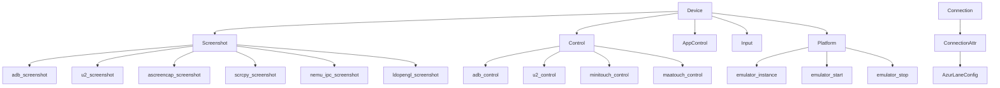

---
description:
alwaysApply: true
---

# module/device/ 模块分析

## 1. 模块概述

**定位**：设备连接层，封装 ADB/uiautomator2 与安卓模拟器的交互。

**角色**：定义 `Device` 统一设备接口（截图、控制、应用管理）、`Connection` ADB 连接层、`ConnectionAttr` 连接属性和模拟器检测。支持多种截图/控制后端和模拟器平台。

**输入/输出**：
- 输入：配置（`AzurLaneConfig`）、模拟器序列号
- 输出：截图（`np.ndarray`）、点击/滑动操作、ADB 命令执行

**核心职责**：
1. 提供统一的截图接口（ADB、uiautomator2、aScreenCap、scrcpy、nemu_ipc 等）
2. 提供统一的控制接口（ADB、uiautomator2、minitouch、MaaTouch 等）
3. 检测和管理模拟器连接（MuMu、LDPlayer、BlueStacks、Nox、VMOS、WSA）
4. 卡死检测和点击频率控制
5. 应用启动/停止/重启管理

## 2. 文件清单与逐文件分析

### 2.1 device.py（452 行）

**导出类型**：类 `Device`

**导入依赖**：
- 内部：`env`、`pkg_resources`、`timer.Timer`、`config.utils`、`app_control.AppControl`、`control.Control`、`input.Input`、`platform.Platform`、`screenshot.Screenshot`、`exception.*`、`handler.assets`、`logger`
- 外部：`collections`、`sys`、`datetime`、`cv2`、`lxml.etree`

**逐段分析**：

- `L70-138`：`Device.__init__()` — 四重继承：`Screenshot + Control + AppControl + Input`。4 次重试启动模拟器。自动检测截图方法和 OCR 设备。初始化 MaaTouch/minitouch。
- `L140-178`：`platform` 属性 — 惰性创建 `Platform` 实例。`connect=False` 避免在模拟器离线时触发完整 ADB 连接。
- `L180-248`：方法检查 — `method_check()` 验证截图/控制方法组合。`nemu_ipc` 仅限 MuMu、`ldopengl` 仅限 LDPlayer、`Hermit` 仅限 VMOS。
- `L250-270`：`handle_night_commission()` — 处理夜间委托弹窗。
- `L272-293`：`screenshot()` — 重写截图方法。添加卡死检测、夜间委托处理、图像指纹检测。
- `L326-345`：`_check_image_stuck()` — 图像指纹检测。将截图缩放到 16x16 并计算哈希，30 秒无变化判定卡死。
- `L347-370`：`stuck_record_check()` — 卡死检测。60 秒常规超时、195 秒长超时（战斗/登录期间）。
- `L372-421`：点击记录 — `click_record_add()`/`click_record_check()`。最近 15 次点击中，单按钮 >=12 次或双按钮各 >=6 次触发 `GameTooManyClickError`。
- `L423-451`：`disable_stuck_detection()`/`app_start()`/`app_stop()` — 禁用检测和应用管理。

### 2.2 connection.py（1299 行）

**导出类型**：类 `Connection`、`AdbDeviceWithStatus`

**导入依赖**：
- 内部：`decorator.*`、`timer.Timer`、`utils.ensure_time`、`config.deep`、`config.server`、`connection_attr.ConnectionAttr`、`env`、`method.pool`、`method.remove_warning`、`method.utils.*`、`exception.*`、`logger`、`map.map_grids`
- 外部：`ipaddress`、`json`、`logging`、`re`、`socket`、`subprocess`、`time`、`uiautomator2`、`adbutils`

**逐段分析**：

- `L31-92`：`retry()` 装饰器 — ADB 操作重试。处理 `ConnectionResetError`、`AdbError`、`PackageNotInstalled`。截图/连接方法失败触发 `EmulatorNotRunningError`。
- `L95-118`：`AdbDeviceWithStatus` — 扩展 `AdbDevice`，添加状态和端口检测。
- `L121-144`：`Connection.__init__()` — 继承 `ConnectionAttr`。检测设备、ADB 连接、包名检测。MuMu 应用保活检查。
- `L146-193`：`adb_command()` — ADB 命令执行。HTTP 模式下不可用。`subprocess_run()` 子进程执行。
- `L204-278`：`adb_shell()` — ADB shell 命令。支持流式输出。HTTP 模式通过 u2 shell。
- `L280-300`：`adb_getprop()`/`cpu_abi` — 系统属性查询。
- `L300-600`：ADB 连接管理 — `adb_connect()`、`adb_reconnect()`、`adb_disconnect()`。处理 MuMu 特殊端口映射。
- `L600-900`：设备检测 — `detect_device()`、`detect_package()`。扫描可用设备、匹配包名。
- `L900-1299`：高级功能 — `adb_forward()`、`adb_reverse()`、`adb_push()`。逆向服务器用于快速数据传输。MuMu/BlueStacks 特殊处理。

### 2.3 connection_attr.py（355 行）

**导出类型**：类 `ConnectionAttr`

**导入依赖**：
- 内部：`decorator.cached_property`、`config.AzurLaneConfig`、`config.env`、`config.deep`、`method.utils`、`exception.RequestHumanTakeover`、`logger`
- 外部：`os`、`re`、`adbutils`、`uiautomator2`

**逐段分析**：

- `L17-57`：`ConnectionAttr.__init__()` — 初始化 ADB 客户端。移除代理环境变量。解析序列号。
- `L59-100`：`revise_serial()` — 序列号修正。处理中文标点、端口映射、模拟器名称等。
- `L102-135`：`serial_check()` — 序列号检查。BlueStacks Hyper-V、WSA、HTTP 连接验证。
- `L137-209`：设备系列检测 — `is_bluestacks4/5_hyperv`、`is_wsa`、`is_mumu12_family`、`is_ldplayer_bluestacks_family`、`is_nox_family`、`is_vmos`、`is_emulator`、`is_network_device`、`is_over_http`。
- `L211-288`：BlueStacks 查找 — `find_bluestacks4/5_hyperv()` 从注册表读取动态端口。
- `L290-355`：缓存属性 — `adb_binary`（ADB 可执行文件路径）、`adb_client`、`adb`、`u2`（uiautomator2 设备）。

### 2.4 screenshot.py / control.py / input.py / app_control.py

这些文件定义了 `Device` 的各个功能面：

- `screenshot.py`：截图后端分发。根据 `Emulator_ScreenshotMethod` 选择 ADB/uiautomator2/aScreenCap/scrcpy/nemu_ipc/ldopengl。
- `control.py`：控制后端分发。根据 `Emulator_ControlMethod` 选择 ADB/uiautomator2/minitouch/MaaTouch/Hermit/nemu_ipc。
- `input.py`：输入抽象层。`click()`、`swipe()`、`drag()`、`long_click()`。
- `app_control.py`：应用管理。`app_start()`、`app_stop()`、`app_is_running()`、`detect_package()`。

### 2.5 method/ 目录

包含各种截图/控制后端的实现：

- `adb.py`/`adb_nc.py`：ADB 截图（压缩/无压缩）
- `uiautomator2.py`：uiautomator2 截图
- `ascreencap.py`/`ascreencap_nc.py`：aScreenCap 截图
- `droidcast.py`/`droidcast_raw.py`：DroidCast 截图
- `scrcpy.py`：scrcpy 截图
- `nemu_ipc.py`：MuMu 12 IPC 截图（最快）
- `ldopengl.py`：LDPlayer OpenGL 截图
- `minitouch.py`：minitouch 控制
- `maatouch.py`：MaaTouch 控制
- `hermit.py`：Hermit 控制（VMOS）

### 2.6 platform/ 目录

模拟器平台管理：

- `platform.py`：`Platform` 类，统一模拟器管理接口
- `windows/`：Windows 模拟器（MuMu、LDPlayer、BlueStacks、Nox、Memu）
- `mac/`：Mac 模拟器（BlueStacksAir、MuMuPro）
- `ssh.py`：SSH 远程模拟器

## 3. 内部调用关系

## 4. 模块依赖分析

**外部依赖**：
- `adbutils`：ADB 客户端
- `uiautomator2`：uiautomator2 客户端
- `cv2`：图像处理
- `lxml`：XML 解析（层次结构）
- `numpy`：数组操作

**内部依赖**：
- `module.config`：配置系统
- `module.base`：基础工具（`Timer`、`cached_property`）
- `module.exception`：异常定义
- `module.logger`：日志系统
- `module.handler.assets`：UI 资源
- `module.map.map_grids`：地图网格

## 5. 设计模式与架构分析

**设计模式**：
1. **多重继承**：`Device = Screenshot + Control + AppControl + Input`
2. **策略模式**：截图/控制方法通过配置选择不同后端
3. **装饰器模式**：`@retry` 重试、`@Config.when` 配置分发
4. **代理模式**：`Platform` 代理模拟器管理
5. **缓存属性**：`cached_property` 延迟初始化 ADB 客户端和设备

**架构特点**：
- `Device` 是外观类，组合多个功能面
- `Connection` 继承 `ConnectionAttr`，提供 ADB 操作
- 截图/控制后端通过配置动态选择
- 模拟器平台通过 `Platform` 统一管理

## 6. 类型系统分析

- `ConnectionAttr` 使用 `cached_property` 延迟初始化
- `Device.click_record` 使用 `collections.deque(maxlen=15)` 限制大小
- `AdbDeviceWithStatus` 扩展 `AdbDevice` 添加状态
- `@Config.when` 装饰器根据配置分发不同实现

## 7. 性能分析

- 截图延迟约 350ms（主要瓶颈）
- `nemu_ipc` 截图最快（IPC 直连）
- `ldopengl` OpenGL 截图较快
- `_check_image_stuck()` 使用 16x16 哈希，计算开销极小
- `click_record_check()` 使用 `Counter.most_common()`，O(n) 复杂度

## 8. 安全分析

- `adb_shell()` 移除 shell 警告（`remove_shell_warning`）
- `ConnectionAttr` 移除代理环境变量，防止 uiautomator2 流量代理
- 序列号修正防止用户输入错误
- HTTP 连接模式下 `adb_command()` 禁用，防止安全风险

## 9. 代码质量评估

**优点**：
- 支持多种截图/控制后端，灵活性强
- 模拟器检测覆盖全面（MuMu、LDPlayer、BlueStacks、Nox、VMOS、WSA）
- 卡死检测机制完善（时间+点击+图像指纹）
- `@retry` 装饰器统一处理 ADB 错误

**问题**：
- `connection.py` 过于庞大（1299 行），应拆分
- 多重继承增加理解难度
- `@Config.when` 装饰器导致同名方法有两个实现，IDE 支持差
- 部分方法缺少类型注解

## 10. 潜在问题与改进建议

1. **connection.py 拆分**：将 ADB 连接、设备检测、高级功能分离到独立文件
2. **截图后端抽象**：定义 `ScreenshotBackend` 接口，替代当前的条件分发
3. **控制后端抽象**：同上，定义 `ControlBackend` 接口
4. **类型注解增强**：为 `adb_shell()`、`screenshot()` 等方法添加精确类型
5. **测试覆盖**：卡死检测、点击记录等核心逻辑缺少单元测试
6. **Platform 重构**：将模拟器管理逻辑从 `ConnectionAttr` 移到 `Platform`
