---
description:
alwaysApply: true
---

# AzurLaneAutoScript 游戏功能模块综合分析

> 本文档对 AzurLaneAutoScript 项目的 28 个游戏功能模块进行全面分析，涵盖模块概述、文件结构、依赖关系、设计模式、代码质量等方面。

## 目录

1. [模块总览](#模块总览)
2. [模块详细分析](#模块详细分析)
   - [科研系统 (module/research/)](#科研系统-moduleresearch)
   - [委托系统 (module/commission/)](#委托系统-modulecommission)
   - [战术学院 (module/tactical/)](#战术学院-moduletactical)
   - [宿舍管理 (module/dorm/)](#宿舍管理-moduledorm)
   - [指挥喵 (module/meowfficer/)](#指挥喵-modulemeowfficer)
   - [大舰队 (module/guild/)](#大舰队-moduleguild)
   - [商店系统 (module/shop/ + module/shop_event/)](#商店系统-moduleshop--moduleshop_event)
   - [奖励收取 (module/reward/)](#奖励收取-modulereward)
   - [演习 PvP (module/exercise/)](#演习-pvp-moduleexercise)
   - [建造系统 (module/gacha/)](#建造系统-modulegacha)
   - [每日任务 (module/daily/)](#每日任务-moduledaily)
   - [困难模式 (module/hard/)](#困难模式-modulehard)
   - [SOS 任务 (module/sos/)](#sos-任务-modulesos)
   - [作战档案 (module/war_archives/)](#作战档案-modulewar_archives)
   - [突袭任务 (module/raid/)](#突袭任务-moduleraid)
   - [活动处理 (module/event/)](#活动处理-moduleevent)
   - [活动剧情 (module/eventstory/)](#活动剧情-moduleeventstory)
   - [医院活动 (module/event_hospital/)](#医院活动-moduleevent_hospital)
   - [联动活动 (module/coalition/)](#联动活动-modulecoalition)
   - [岛屿系统 (module/island/)](#岛屿系统-moduleisland)
   - [私人休息室 (module/private_quarters/)](#私人休息室-moduleprivate_quarters)
   - [船坞系统 (module/shipyard/)](#船坞系统-moduleshipyard)
   - [免费福利 (module/freebies/)](#免费福利-modulefreebies)
   - [小游戏 (module/minigame/)](#小游戏-moduleminigame)
   - [觉醒系统 (module/awaken/)](#觉醒系统-moduleawaken)
   - [退役系统 (module/retire/)](#退役系统-moduleretire)
   - [装备管理 (module/equipment/)](#装备管理-moduleequipment)
   - [META 奖励 (module/meta_reward/)](#meta-奖励-modulemeta_reward)
3. [模块依赖关系图](#模块依赖关系图)
4. [设计模式与架构分析](#设计模式与架构分析)
5. [性能分析](#性能分析)
6. [代码质量评估](#代码质量评估)
7. [潜在问题与改进建议](#潜在问题与改进建议)

---

## 模块总览

| 模块 | 代码行数 | 核心类 | 主要职责 | 复杂度 |
|------|---------|--------|---------|--------|
| research | 3336 | `RewardResearch` | 科研项目管理、队列调度 | 高 |
| commission | 1513 | `RewardCommission` | 委托识别、选择、执行 | 高 |
| tactical | 851 | `RewardTacticalClass` | 战术学院教材选择、技能学习 | 中 |
| dorm | 897 | `RewardDorm` | 宿舍喂食、收集、家具购买 | 中 |
| meowfficer | 1494 | `RewardMeowfficer` | 指挥喵购买、训练、强化 | 中 |
| guild | 1437 | `GuildLobby` | 大舰队奖励、后勤、作战 | 中 |
| shop | 2222 | `GeneralShop` | 通用商店、勋章商店等 | 高 |
| shop_event | 1105 | `ShopEvent` | 活动商店购买 | 中 |
| reward | 326 | `Reward` | 基础奖励收取 | 低 |
| exercise | 789 | `Exercise` | 演习 PvP 战斗 | 中 |
| gacha | 591 | `GachaUI` | 建造系统 UI 导航 | 低 |
| daily | 405 | `Daily` | 每日任务执行 | 中 |
| hard | 88 | `CampaignHard` | 困难模式战役 | 低 |
| sos | 251 | `CampaignSos` | SOS 信号任务 | 低 |
| war_archives | 155 | `CampaignWarArchives` | 作战档案战役 | 低 |
| raid | 1058 | `Raid` | 突袭活动战斗 | 高 |
| event | 229 | `EventBase` | 活动关卡处理 | 低 |
| eventstory | 240 | `EventStory` | 活动剧情处理 | 中 |
| event_hospital | 967 | `Hospital` | 医院活动调查、战斗 | 中 |
| coalition | 883 | `Coalition` | 联动活动战斗 | 中 |
| island | 2963 | `Island` | 岛屿系统项目、运输 | 高 |
| private_quarters | 947 | `PrivateQuarters` | 私人休息室互动、商店 | 中 |
| shipyard | 717 | `RewardShipyard` | 船坞蓝图购买 | 中 |
| freebies | 679 | `Freebies` | 免费福利收取 | 低 |
| minigame | 448 | `Minigame` | 小游戏执行 | 低 |
| awaken | 412 | `Awaken` | 舰船觉醒升级 | 中 |
| retire | 2478 | `Retirement` | 舰船退役、强化 | 高 |
| equipment | 842 | `Equipment` | 装备管理、更换 | 中 |
| meta_reward | 349 | `MetaReward` | META 奖励收取 | 低 |

**总计**: 约 28,000 行代码

---

## 模块详细分析

### 科研系统 (module/research/)

#### 模块概述
科研系统是 AzurLaneAutoScript 中最复杂的功能模块之一，负责自动化管理游戏中的科研项目。它能够识别当前可用的科研项目、根据预设过滤器选择最优项目、管理科研队列、处理科研奖励，并支持多种服务器（CN/EN/JP/TW）。

#### 文件清单与分析

| 文件 | 行数 | 导出类型 | 主要职责 |
|------|------|---------|---------|
| `research.py` | 605 | `RewardResearch` | 核心调度器，管理科研生命周期 |
| `selector.py` | 297 | `ResearchSelector` | 科研项目选择和过滤逻辑 |
| `project.py` | 694 | `ResearchProject`, `ResearchProjectJp` | 科研项目数据模型和检测 |
| `project_data.py` | ~800 | `LIST_RESEARCH_PROJECT` | 科研项目静态数据 |
| `preset.py` | ~100 | `DICT_FILTER_PRESET` | 预设过滤器字符串 |
| `preset_generator.py` | ~50 | - | 预设生成工具 |
| `queue.py` | ~200 | `ResearchQueue` | 科研队列管理 |
| `series.py` | ~150 | - | 科研系列识别 |
| `ui.py` | ~100 | `ResearchUI` | 科研 UI 交互 |
| `assets.py` | ~200 | - | 按钮和模板资源定义 |

#### 核心类关系

```python
class RewardResearch(ResearchSelector, ResearchQueue, StorageHandler):
    """科研系统主类，组合了选择器、队列管理和存储处理"""
    
    def run(self):
        """主执行流程"""
        self.ui_ensure(page_research)  # 导航到科研页面
        self.queue_receive()           # 接收队列奖励
        self.receive_6th_research()    # 处理第6个项目
        self.research_fill_queue()     # 填充队列
        self.config.task_delay(...)    # 设置下次运行时间
```

#### 关键算法

**1. 科研项目检测 (`project.py:L385-L398`)**
```python
def research_detect(image):
    """从截图中检测5个科研项目"""
    projects = []
    for name, series in zip(get_research_name(image), get_research_series_3(image)):
        project = ResearchProject(name=name, series=series)
        projects.append(project)
    return projects
```

**2. 项目过滤系统 (`selector.py:L159-L204`)**
```python
def research_sort_filter(self, enforce=False):
    """根据配置过滤和排序科研项目"""
    preset = self.config.Research_PresetFilter
    string = DICT_FILTER_PRESET[preset]  # 加载预设过滤器
    FILTER.load(string)
    priority = FILTER.apply(self.projects, func=self._research_check)
    return priority
```

**3. 队列管理 (`research.py:L472-L507`)**
```python
def research_fill_queue(self):
    """填充科研队列直到满"""
    for _ in range(5):
        if self.get_queue_slot() > 0:
            success = self.research_queue_append()
            if success:
                total += 1
            else:
                break
    return total
```

#### 设计模式
- **策略模式**: 通过 `@Config.when(SERVER='jp')` 实现服务器特定的检测逻辑
- **模板方法模式**: `research_project_start_with_requirements()` 定义了启动项目的标准流程
- **组合模式**: `RewardResearch` 组合了多个功能类（ResearchSelector, ResearchQueue, StorageHandler）

#### 性能特点
- OCR 识别: 使用自定义 `Ocr` 类识别科研名称，支持多种语言
- 模板匹配: 使用 OpenCV 模板匹配检测科研系列和状态
- 缓存机制: 使用 `@cached_property` 缓存计算结果

---

### 委托系统 (module/commission/)

#### 模块概述
委托系统负责自动化管理游戏中的委托任务，包括日常委托和紧急委托。它能够扫描委托列表、根据过滤器选择最优委托、执行委托、接收奖励，并支持复杂的调度逻辑。

#### 文件清单与分析

| 文件 | 行数 | 导出类型 | 主要职责 |
|------|------|---------|---------|
| `commission.py` | 774 | `RewardCommission` | 委托系统主类 |
| `project.py` | ~400 | `Commission` | 委托项目数据模型 |
| `project_data.py` | ~200 | - | 委托项目静态数据 |
| `preset.py` | ~100 | `DICT_FILTER_PRESET` | 预设过滤器 |
| `assets.py` | ~100 | - | 按钮和模板资源 |

#### 核心功能

**1. 委托检测 (`commission.py:L63-L82`)**
```python
def _commission_detect(self, image):
    """从截图中检测所有委托"""
    commission = []
    for y in lines_detect(image):  # 检测白色分隔线
        comm = Commission(image, y=y, config=self.config)
        commission.append(comm)
    return SelectedGrids(commission)
```

**2. 委托选择 (`commission.py:L116-L217`)**
```python
def _commission_choose(self, daily, urgent):
    """根据过滤器选择最优委托"""
    COMMISSION_FILTER.load(string)
    run = COMMISSION_FILTER.apply(total.grids, func=self._commission_check)
    return daily_choose, urgent_choose
```

**3. 委托执行 (`commission.py:L356-L436`)**
```python
def _commission_start_click(self, comm, is_urgent=False):
    """启动委托，处理各种弹窗和异常"""
    while 1:
        if self.appear_then_click(COMMISSION_START, interval=7):
            continue
        if self.handle_popup_confirm('COMMISSION_START'):
            continue
        # ... 更多状态处理
```

#### 特殊处理
- **夜间委托转换**: 自动将紧急委托转换为夜间委托格式
- **过期委托优先**: 优先处理即将过期的重要委托
- **委托收入记录**: 记录委托奖励到数据库

---

### 战术学院 (module/tactical/)

#### 模块概述
战术学院模块负责管理游戏中的技能学习系统，包括选择教材、管理技能槽位、处理经验溢出等。

#### 文件清单与分析

| 文件 | 行数 | 导出类型 | 主要职责 |
|------|------|---------|---------|
| `tactical_class.py` | 851 | `RewardTacticalClass` | 战术学院主类 |
| `assets.py` | ~100 | - | 按钮和模板资源 |

#### 核心功能

**1. 教材选择 (`tactical_class.py:L381-L441`)**
```python
def _tactical_books_choose(self):
    """根据配置选择最优教材"""
    BOOK_FILTER.load(self.config.Tactical_TacticalFilter)
    books = BOOK_FILTER.apply(self.books.grids)
    if len(books):
        book = books[0]
        self._tactical_book_select(book)
        self.device.click(TACTICAL_CLASS_START)
        return True
```

**2. 经验溢出控制 (`tactical_class.py:L271-L307`)**
```python
def _tactical_books_filter_exp(self):
    """过滤掉会导致经验溢出的教材"""
    current, remain, total = SKILL_EXP.ocr(self.device.image)
    if total == 5800:  # 即将满级
        def filter_exp_func(book):
            overflow = self.config.ControlExpOverflow_T{book.tier}Allow
            if (current + book.exp_value) > (total + overflow):
                return False
            return True
        self.books = SelectedGrids([book for book in self.books if filter_exp_func(book)])
```

**3. 技能自动切换 (`tactical_class.py:L327-L379`)**
```python
def _try_switch_to_next_skill(self):
    """当前技能满级时切换到下一个技能"""
    self.device.click(TACTICAL_CLASS_CANCEL)  # 取消当前
    selected_skill = self.find_not_full_level_skill()  # 找下一个
    if selected_skill:
        self._tactical_skill_select(selected_skill)
        self.device.click(SKILL_CONFIRM)
        return True
    return False
```

---

### 宿舍管理 (module/dorm/)

#### 模块概述
宿舍模块负责管理游戏中的宿舍系统，包括收集硬币和爱心、喂食舰船、购买家具等。

#### 文件清单与分析

| 文件 | 行数 | 导出类型 | 主要职责 |
|------|------|---------|---------|
| `dorm.py` | 630 | `RewardDorm` | 宿舍管理主类 |
| `buy_furniture.py` | ~200 | `BuyFurniture` | 家具购买逻辑 |
| `assets.py` | ~100 | - | 按钮和模板资源 |

#### 核心功能

**1. 资源收集 (`dorm.py:L233-L265`)**
```python
def dorm_collect(self):
    """使用一键收集按钮收集所有硬币和爱心"""
    while 1:
        if self.appear_then_click(DORM_QUICK_COLLECT, interval=1):
            continue
        if self.info_bar_count() > 0:
            break  # 收集完成
```

**2. 喂食系统 (`dorm.py:L307-L363`)**
```python
def dorm_feed_once(self):
    """执行一次喂食"""
    food, fill = self.dorm_food_get()  # 获取食物和饱食度
    FOOD_FILTER.load(self.config.Dorm_FeedFilter)
    for selected in FOOD_FILTER.apply(food):
        if selected.amount > 0 and fill > selected.feed:
            count = min(fill // selected.feed, selected.amount)
            self._dorm_feed_click(button=button, count=count)
            return True
```

**3. 长按喂食 (`dorm.py:L107-L201`)**
```python
@Config.when(DEVICE_CONTROL_METHOD='minitouch')
def _dorm_feed_long_tap(self, button, count):
    """使用 minitouch 实现长按喂食"""
    builder = self.device.minitouch_builder
    builder.down(x, y).commit()
    while 1:
        builder.move(x, y).commit().wait(10)
        if not self._dorm_has_food(button):
            break
    builder.up().commit()
```

---

### 指挥喵 (module/meowfficer/)

#### 模块概述
指挥喵模块负责管理游戏中的指挥喵系统，包括购买、训练、强化和要塞任务。

#### 文件清单与分析

| 文件 | 行数 | 导出类型 | 主要职责 |
|------|------|---------|---------|
| `meowfficer.py` | 72 | `RewardMeowfficer` | 指挥喵主调度器 |
| `buy.py` | ~200 | `MeowfficerBuy` | 指挥喵购买 |
| `train.py` | ~200 | `MeowfficerTrain` | 指挥喵训练 |
| `enhance.py` | ~200 | `MeowfficerEnhance` | 指挥喵强化 |
| `fort.py` | ~300 | `MeowfficerFort` | 要塞任务 |
| `collect.py` | ~200 | `MeowfficerCollect` | 指挥喵收集 |
| `base.py` | ~200 | `MeowfficerBase` | 基础功能 |
| `assets.py` | ~100 | - | 按钮和模板资源 |

#### 调度逻辑 (`meowfficer.py:L27-L72`)
```python
def run(self):
    """按顺序执行各项操作"""
    if self.config.Meowfficer_BuyAmount > 0:
        self.meow_buy()           # 购买
    if self.config.Meowfficer_FortChoreMeowfficer:
        self.meow_fort()          # 要塞任务
    if self.config.MeowfficerTrain_Enable:
        self.meow_train()         # 训练
        if self.config.MeowfficerTrain_Mode == 'seamlessly':
            self.meow_enhance()   # 强化
```

---

### 大舰队 (module/guild/)

#### 模块概述
大舰队模块负责管理游戏中的大舰队系统，包括领取奖励、后勤补给和作战任务。

#### 文件清单与分析

| 文件 | 行数 | 导出类型 | 主要职责 |
|------|------|---------|---------|
| `lobby.py` | 98 | `GuildLobby` | 大厅奖励领取 |
| `guild_reward.py` | ~300 | `GuildReward` | 奖励处理 |
| `logistics.py` | ~200 | `GuildLogistics` | 后勤补给 |
| `operations.py` | ~200 | `GuildOperations` | 作战任务 |
| `guild_combat.py` | ~200 | `GuildCombat` | 战斗处理 |
| `base.py` | ~200 | `GuildBase` | 基础功能 |
| `assets.py` | ~100 | - | 按钮和模板资源 |

#### 奖励领取 (`lobby.py:L15-L30`)
```python
def guild_lobby_get_report(self):
    """检测并返回报告按钮"""
    image = color_similarity_2d(self.image_crop(GUILD_REPORT_AVAILABLE), color=(255, 8, 8))
    points = np.array(np.where(image > 221)).T[:, ::-1]
    if len(points):
        area = area_offset((-51, -45, -13, 0), offset=points[0])
        return Button(area=area, ...)
    return None
```

---

### 商店系统 (module/shop/ + module/shop_event/)

#### 模块概述
商店系统负责管理游戏中的各种商店，包括通用商店、勋章商店、功勋商店、舰队商店、凭证商店和活动商店。

#### 文件清单与分析

**module/shop/**

| 文件 | 行数 | 导出类型 | 主要职责 |
|------|------|---------|---------|
| `shop_general.py` | 160 | `GeneralShop_250814` | 通用商店 |
| `shop_medal.py` | ~150 | `MedalShop` | 勋章商店 |
| `shop_merit.py` | ~150 | `MeritShop` | 功勋商店 |
| `shop_guild.py` | ~150 | `GuildShop` | 舰队商店 |
| `shop_voucher.py` | ~150 | `VoucherShop` | 凭证商店 |
| `shop_core.py` | ~150 | `CoreShop` | 核心商店 |
| `shop_reward.py` | ~150 | `RewardShop` | 奖励商店 |
| `shop_status.py` | ~100 | `ShopStatus` | 商店状态检测 |
| `clerk.py` | ~200 | `ShopClerk` | 购买逻辑 |
| `base.py` | ~300 | `ShopItemGrid` | 商品网格 |
| `ui.py` | ~200 | `ShopUI` | 商店 UI 导航 |
| `assets.py` | ~200 | - | 按钮和模板资源 |

**module/shop_event/**

| 文件 | 行数 | 导出类型 | 主要职责 |
|------|------|---------|---------|
| `shop_event.py` | ~200 | `ShopEvent` | 活动商店主类 |
| `clerk.py` | ~200 | `ShopEventClerk` | 活动商店购买 |
| `item.py` | ~200 | `ShopEventItem` | 活动商品 |
| `selector.py` | ~200 | `ShopEventSelector` | 商品选择 |
| `ui.py` | ~200 | `ShopEventUI` | 活动商店 UI |
| `assets.py` | ~100 | - | 按钮和模板资源 |

#### 通用商店购买逻辑 (`shop_general.py:L93-L137`)
```python
def shop_check_item(self, item):
    """检查商品是否可购买"""
    if item.cost == 'Coins':
        if item.price > self._currency:
            return False
        return True
    if self.config.GeneralShop_UseGems:
        if item.cost == 'Gems':
            if item.price > self.gems:
                return False
            return True
    return False
```

---

### 奖励收取 (module/reward/)

#### 模块概述
奖励模块负责收取游戏中的基础资源奖励（石油、金币、经验）和任务奖励。

#### 文件清单与分析

| 文件 | 行数 | 导出类型 | 主要职责 |
|------|------|---------|---------|
| `reward.py` | 326 | `Reward` | 奖励收取主类 |
| `assets.py` | ~50 | - | 按钮和模板资源 |

#### 核心功能

**1. 资源收取 (`reward.py:L14-L55`)**
```python
def reward_receive(self, oil, coin, exp):
    """收取石油、金币、经验"""
    while 1:
        if oil and self.appear_then_click(OIL, interval=60):
            continue
        if coin and self.appear_then_click(COIN, interval=60):
            continue
        if exp and self.appear_then_click(EXP, interval=60):
            continue
        if confirm_timer.reached():
            break
```

**2. 任务奖励 (`reward.py:L220-L247`)**
```python
def reward_mission(self, daily=True, weekly=True):
    """收取任务奖励"""
    if not self.reward_mission_notice():
        return False  # 没有任务通知
    self.ui_goto(page_mission)
    if daily:
        self._reward_mission_all()      # 日常任务
    if weekly:
        self._reward_mission_weekly()   # 周常任务
```

---

### 演习 PvP (module/exercise/)

#### 模块概述
演习模块负责管理游戏中的 PvP 演习系统，包括选择对手、执行战斗、管理演习次数等。

#### 文件清单与分析

| 文件 | 行数 | 导出类型 | 主要职责 |
|------|------|---------|---------|
| `exercise.py` | 274 | `Exercise` | 演习主类 |
| `combat.py` | ~200 | `ExerciseCombat` | 演习战斗 |
| `opponent.py` | ~150 | `Opponent` | 对手分析 |
| `equipment.py` | ~100 | `ExerciseEquipment` | 装备管理 |
| `hp_daemon.py` | ~100 | `HPDaemon` | 血量监控 |
| `assets.py` | ~100 | - | 按钮和模板资源 |

#### 演习策略 (`exercise.py:L185-L199`)
```python
def _get_exercise_strategy(self):
    """获取演习策略"""
    if self.config.Exercise_ExerciseStrategy == "aggressive":
        preserve = 0  # 激进模式，用完所有次数
        admiral_interval = None
    else:
        preserve = 5  # 保守模式，保留5次
        admiral_interval = ADMIRAL_TRIAL_HOUR_INTERVAL[...]
    return preserve, admiral_interval
```

#### 对手选择 (`exercise.py:L125-L155`)
```python
def _exercise_easiest_else_exp(self):
    """优先选择最弱对手，失败则选择经验最高的"""
    method = "easiest_else_exp"
    while 1:
        opponents = self._opponent_sort(method=method)
        success = self._combat(opponents[0])
        if success:
            return success
        else:
            if self.opponent_change_count < 5:
                self._new_opponent()  # 刷新对手
            else:
                method = "max_exp"  # 切换到最大经验模式
```

---

### 建造系统 (module/gacha/)

#### 模块概述
建造模块负责管理游戏中的舰船建造系统，包括 UI 导航和建造类型切换。

#### 文件清单与分析

| 文件 | 行数 | 导出类型 | 主要职责 |
|------|------|---------|---------|
| `ui.py` | 209 | `GachaUI` | 建造系统 UI |
| `gacha_reward.py` | ~200 | `GachaReward` | 建造奖励 |
| `assets.py` | ~100 | - | 按钮和模板资源 |

#### UI 导航 (`ui.py:L43-L100`)
```python
@cached_property
def _gacha_side_navbar(self):
    """建造系统侧边栏"""
    gacha_side_navbar = ButtonGrid(
        origin=(21, 126), delta=(0, 98),
        button_shape=(60, 80), grid_shape=(1, 5),
        name='GACHA_SIDE_NAVBAR')
    return Navbar(grids=gacha_side_navbar, ...)
```

---

### 每日任务 (module/daily/)

#### 模块概述
每日模块负责执行游戏中的每日任务，包括战术研修、破交作战、兵装训练等。

#### 文件清单与分析

| 文件 | 行数 | 导出类型 | 主要职责 |
|------|------|---------|---------|
| `daily.py` | 346 | `Daily` | 每日任务主类 |
| `equipment.py` | ~50 | `DailyEquipment` | 装备管理 |
| `assets.py` | ~50 | - | 按钮和模板资源 |

#### 每日任务执行 (`daily.py:L156-L207`)
```python
def daily_execute(self, remain=3, stage=1, fleet=1):
    """执行每日任务"""
    button = DAILY_MISSION_LIST[stage - 1]
    for n in range(remain):
        result = self.daily_enter(button)
        if not result:
            break
        self.combat(emotion_reduce=False, save_get_items=False, ...)
```

#### 任务类型映射 (`daily.py:L96-L140`)
```python
# emergency_module_development 模式
fleets = [
    0,
    self.config.Daily_EmergencyModuleDevelopmentFleet,
    self.config.Daily_EscortMissionFleet,
    self.config.Daily_AdvanceMissionFleet,
    self.config.Daily_FierceAssaultFleet,
    self.config.Daily_TacticalTrainingFleet,
    0,  # Supply Line Disruption
    self.config.Daily_ModuleDevelopmentFleet,
]
```

---

### 困难模式 (module/hard/)

#### 模块概述
困难模块负责执行游戏中的困难模式战役。

#### 文件清单与分析

| 文件 | 行数 | 导出类型 | 主要职责 |
|------|------|---------|---------|
| `hard.py` | 55 | `CampaignHard` | 困难模式主类 |
| `equipment.py` | ~30 | - | 装备管理 |
| `assets.py` | ~20 | - | 按钮和模板资源 |

#### 执行逻辑 (`hard.py:L17-L54`)
```python
def run(self):
    """执行困难模式战役"""
    name = to_map_file_name(self.config.Hard_HardStage)
    self.config.override(
        Campaign_Mode='hard',
        Campaign_UseFleetLock=True,
        Campaign_UseAutoSearch=True,
    )
    self.load_campaign(name='campaign_hard', folder='campaign_hard')
    remain = OCR_HARD_REMAIN.ocr(self.device.image)
    for n in range(remain):
        self.campaign.run()
```

---

### SOS 任务 (module/sos/)

#### 模块概述
SOS 模块负责执行游戏中的 SOS 信号任务。

#### 文件清单与分析

| 文件 | 行数 | 导出类型 | 主要职责 |
|------|------|---------|---------|
| `sos.py` | 238 | `CampaignSos` | SOS 任务主类 |
| `assets.py` | ~30 | - | 按钮和模板资源 |

#### 信号选择 (`sos.py:L57-L85`)
```python
def _find_target_chapter(self, chapter):
    """查找目标章节的信号"""
    signal_search_buttons = TEMPLATE_SIGNAL_SEARCH.match_multi(self.device.image)
    sos_goto_buttons = TEMPLATE_SIGNAL_GOTO.match_multi(self.device.image)
    all_buttons = sos_goto_buttons + signal_search_buttons + sos_confirm_buttons
    
    chapter_buttons = [button.crop(self._sos_chapter_crop) for button in all_buttons]
    self._sos_chapter_ocr.buttons = chapter_buttons
    chapter_list = self._sos_chapter_ocr.ocr(self.device.image)
    
    if chapter in chapter_list:
        return all_buttons[chapter_list.index(chapter)]
    return None
```

---

### 作战档案 (module/war_archives/)

#### 模块概述
作战档案模块负责执行游戏中的作战档案战役。

#### 文件清单与分析

| 文件 | 行数 | 导出类型 | 主要职责 |
|------|------|---------|---------|
| `war_archives.py` | 46 | `CampaignWarArchives` | 作战档案主类 |
| `dictionary.py` | ~100 | - | 档案数据 |
| `assets.py` | ~20 | - | 按钮和模板资源 |

#### 停止条件 (`war_archives.py:L22-L35`)
```python
def triggered_stop_condition(self, oil_check=True):
    """检查停止条件"""
    if self.appear(WAR_ARCHIVES_CAMPAIGN_CHECK):
        current, remain, total = DATA_KEY_CAMPAIGN.ocr(self.device.image)
        if remain == total:  # 数据钥匙用完
            self.config.task_delay(server_update=True)
            return True
    return super().triggered_stop_condition(oil_check)
```

---

### 突袭任务 (module/raid/)

#### 模块概述
突袭模块负责管理游戏中的限时共斗（Raid）活动，支持多种活动类型和难度。

#### 文件清单与分析

| 文件 | 行数 | 导出类型 | 主要职责 |
|------|------|---------|---------|
| `raid.py` | 485 | `Raid` | 突袭主类 |
| `combat.py` | ~200 | `RaidCombat` | 突袭战斗 |
| `run.py` | ~200 | `RaidRun` | 突袭运行 |
| `daily.py` | ~100 | `RaidDaily` | 每日突袭 |
| `scuttle.py` | ~100 | `RaidScuttle` | 突袭扫荡 |
| `assets.py` | ~200 | - | 按钮和模板资源 |

#### 活动类型映射 (`raid.py:L69-L101`)
```python
def raid_name_shorten(name):
    """将活动名称转换为简称"""
    if name == 'raid_20200624':
        return 'ESSEX'
    elif name == 'raid_20210708':
        return 'SURUGA'
    elif name == 'raid_20220127':
        return 'BRISTOL'
    # ... 更多活动
```

#### OCR 配置 (`raid.py:L119-L178`)
```python
def raid_ocr(raid, mode):
    """根据活动类型配置 OCR"""
    if raid == 'ESSEX':
        return RaidCounter(button, letter=(57, 52, 255), threshold=128)
    elif raid == 'SURUGA':
        return RaidCounter(button, letter=(49, 48, 49), threshold=128)
    # ... 更多配置
```

---

### 活动处理 (module/event/)

#### 模块概述
活动模块提供活动关卡的基础处理框架。

#### 文件清单与分析

| 文件 | 行数 | 导出类型 | 主要职责 |
|------|------|---------|---------|
| `base.py` | 55 | `EventBase` | 活动基础类 |
| `campaign_abcd.py` | ~80 | `CampaignABCD` | ABCD 关卡 |
| `campaign_sp.py` | ~80 | `CampaignSP` | SP 关卡 |
| `maritime_escort.py` | ~30 | `MaritimeEscort` | 海上护卫 |
| `assets.py` | ~20 | - | 按钮和模板资源 |

#### 关卡名称转换 (`base.py:L30-L54`)
```python
def convert_stages(self, stages):
    """转换关卡名称"""
    def convert(n):
        return self.handle_stage_name(n, folder=self.config.Campaign_Event)[0]
    
    if isinstance(stages, str):
        return convert(stages)
    if isinstance(stages, list):
        return [convert(name) for name in stages]
```

---

### 活动剧情 (module/eventstory/)

#### 模块概述
活动剧情模块负责处理游戏中的活动剧情，支持剧情跳过和战斗处理。

#### 文件清单与分析

| 文件 | 行数 | 导出类型 | 主要职责 |
|------|------|---------|---------|
| `eventstory.py` | 226 | `EventStory` | 活动剧情主类 |
| `assets.py` | ~30 | - | 按钮和模板资源 |

#### 剧情处理 (`eventstory.py:L91-L155`)
```python
def event_story(self, skip_first_screenshot=True):
    """处理活动剧情"""
    while 1:
        if self.is_combat_executing():
            return 'battle'  # 进入战斗
        if self.match_template_color(STORY_FINISHED):
            return 'finish'  # 剧情完成
        
        # 跳过剧情
        if self.handle_story_skip():
            continue
        # 点击继续
        if self.appear_then_click(STORY_MIDDLE):
            continue
```

---

### 医院活动 (module/event_hospital/)

#### 模块概述
医院活动模块负责处理游戏中的医院调查活动，包括线索收集、战斗和奖励领取。

#### 文件清单与分析

| 文件 | 行数 | 导出类型 | 主要职责 |
|------|------|---------|---------|
| `hospital.py` | 266 | `Hospital` | 医院活动主类 |
| `clue.py` | ~200 | `HospitalClue` | 线索处理 |
| `combat.py` | ~200 | `HospitalCombat` | 医院战斗 |
| `hospital_event.py` | ~150 | `HospitalEvent` | 医院事件 |
| `ui.py` | ~100 | `HospitalUI` | 医院 UI |
| `assets.py` | ~100 | - | 按钮和模板资源 |

#### 调查循环 (`hospital.py:L120-L142`)
```python
def loop_invest(self):
    """执行所有调查"""
    while 1:
        self.emotion.check_reduce(battle=1)
        entered = self.invest_enter()
        if not entered:
            break
        self.hospital_combat()
        if self.config.task_switched():
            self.config.task_stop()
        break  # 战斗后 aside 会重置
```

---

### 联动活动 (module/coalition/)

#### 模块概述
联动活动模块负责处理游戏中的联动活动（霜冻、小学院等）。

#### 文件清单与分析

| 文件 | 行数 | 导出类型 | 主要职责 |
|------|------|---------|---------|
| `coalition.py` | 258 | `Coalition` | 联动活动主类 |
| `coalition_sp.py` | ~200 | `CoalitionSP` | SP 关卡 |
| `combat.py` | ~200 | `CoalitionCombat` | 联动战斗 |
| `ui.py` | ~150 | `CoalitionUI` | 联动 UI |
| `assets.py` | ~100 | - | 按钮和模板资源 |

#### PT 获取 (`coalition.py:L49-L80`)
```python
def get_event_pt(self):
    """获取活动 PT"""
    event = self.config.Campaign_Event
    if event == 'coalition_20230323':
        ocr = Digit(FROSTFALL_OCR_PT, ...)
    elif event == 'coalition_20240627':
        ocr = AcademyPtOcr(ACADEMY_PT_OCR, ...)
    # ... 更多活动类型
    
    pt = ocr.ocr(self.device.image)
    return pt
```

---

### 岛屿系统 (module/island/)

#### 模块概述
岛屿系统模块是较复杂的模块之一，负责管理游戏中的岛屿系统，包括赛季任务、科技、运输和项目。

#### 文件清单与分析

| 文件 | 行数 | 导出类型 | 主要职责 |
|------|------|---------|---------|
| `island.py` | 76 | `Island` | 岛屿主调度器 |
| `project.py` | ~500 | `IslandProjectRun` | 岛屿项目 |
| `project_data.py` | ~800 | - | 项目数据 |
| `transport.py` | ~400 | `IslandTransportRun` | 运输管理 |
| `season_task.py` | ~300 | `SeasonTask` | 赛季任务 |
| `technology.py` | ~300 | `Technology` | 科技研究 |
| `data.py` | ~200 | - | 静态数据 |
| `ui.py` | ~200 | `IslandUI` | 岛屿 UI |
| `assets.py` | ~200 | - | 按钮和模板资源 |

#### 岛屿运行 (`island.py:L26-L56`)
```python
def island_run(self, transport=True, project=True, names=None):
    """执行岛屿日常"""
    future_finish = []
    if transport:
        if self.island_transport_enter():
            future_finish.extend(self.island_transport_run())
    if project:
        if self.island_management_enter():
            future_finish.extend(self.island_project_run(names=names))
    
    if len(future_finish):
        self.config.task_delay(target=future_finish)
```

---

### 私人休息室 (module/private_quarters/)

#### 模块概述
私人休息室模块负责管理游戏中的私人休息室系统，包括店员互动、商店购买等。

#### 文件清单与分析

| 文件 | 行数 | 导出类型 | 主要职责 |
|------|------|---------|---------|
| `private_quarters.py` | 179 | `PrivateQuarters` | 私人休息室主类 |
| `interact.py` | ~200 | `PQInteract` | 互动逻辑 |
| `shop.py` | ~200 | `PQShop` | 商店购买 |
| `clerk.py` | ~150 | `PQClerk` | 店员处理 |
| `status.py` | ~100 | `PQStatus` | 状态检测 |
| `ui.py` | ~100 | `PQUI` | UI 导航 |
| `assets.py` | ~100 | - | 按钮和模板资源 |

#### 互动执行 (`private_quarters.py:L97-L117`)
```python
def pq_execute_interact(self, target_ship):
    """执行与目标舰娘的互动"""
    target_title = target_ship.title().replace('_', ' ')
    if target_ship not in self.available_targets:
        logger.error(f'Unsupported target ship: {target_title}')
        return
    
    if not self.pq_goto_room(target_ship, retry=3):
        return
    self.pq_interact()
```

---

### 船坞系统 (module/shipyard/)

#### 模块概述
船坞模块负责管理游戏中的船坞系统，包括蓝图购买和使用。

#### 文件清单与分析

| 文件 | 行数 | 导出类型 | 主要职责 |
|------|------|---------|---------|
| `shipyard_reward.py` | 271 | `RewardShipyard` | 船坞奖励主类 |
| `ui.py` | ~200 | `ShipyardUI` | 船坞 UI |
| `ui_globals.py` | ~100 | - | UI 全局变量 |
| `assets.py` | ~100 | - | 按钮和模板资源 |

#### 蓝图购买计算 (`shipyard_reward.py:L33-L58`)
```python
def _shipyard_get_cost(self, amount, rarity=None):
    """计算蓝图购买成本"""
    if rarity == 'PR':
        cost = [v for k, v in PRBP_BUY_PRIZE.items() if amount in k]
        return cost[0] if cost else 1500
    elif rarity == 'DR':
        cost = [v for k, v in DRBP_BUY_PRIZE.items() if amount in k]
        return cost[0] if cost else 6000
```

---

### 免费福利 (module/freebies/)

#### 模块概述
免费福利模块负责收取游戏中的各种免费奖励。

#### 文件清单与分析

| 文件 | 行数 | 导出类型 | 主要职责 |
|------|------|---------|---------|
| `freebies.py` | 30 | `Freebies` | 免费福利主调度器 |
| `battle_pass.py` | ~200 | `BattlePass` | 通行证奖励 |
| `data_key.py` | ~150 | `DataKey` | 数据钥匙 |
| `mail_white.py` | ~150 | `MailWhite` | 邮件收取 |
| `supply_pack.py` | ~150 | `SupplyPack_250814` | 补给包 |
| `assets.py` | ~50 | - | 按钮和模板资源 |

#### 调度逻辑 (`freebies.py:L10-L29`)
```python
def run(self):
    """按顺序收取各种免费福利"""
    if self.config.BattlePass_Collect:
        BattlePass(self.config, self.device).run()
    if self.config.DataKey_Collect:
        DataKey(self.config, self.device).run()
    MailWhite(self.config, self.device).run()
    if self.config.SupplyPack_Collect:
        SupplyPack_250814(self.config, self.device).run()
```

---

### 小游戏 (module/minigame/)

#### 模块概述
小游戏模块负责执行游戏中的小游戏。

#### 文件清单与分析

| 文件 | 行数 | 导出类型 | 主要职责 |
|------|------|---------|---------|
| `minigame.py` | 244 | `Minigame`, `MinigameRun` | 小游戏主类 |
| `new_year_challenge.py` | ~150 | `NewYearChallenge` | 新年挑战 |
| `assets.py` | ~50 | - | 按钮和模板资源 |

#### 小游戏执行 (`minigame.py:L181-L243`)
```python
def run(self):
    """执行小游戏"""
    self.ui_ensure(page_academy)
    self.go_to_main_page()
    
    while 1:
        coin_count = self.get_coin_amount()
        if coin_count == 0:
            break
        if minigame_instance.minigame_run():
            play_count += 1
            continue
```

---

### 觉醒系统 (module/awaken/)

#### 模块概述
觉醒模块负责管理游戏中的舰船觉醒系统。

#### 文件清单与分析

| 文件 | 行数 | 导出类型 | 主要职责 |
|------|------|---------|---------|
| `awaken.py` | 396 | `Awaken` | 觉醒主类 |
| `assets.py` | ~30 | - | 按钮和模板资源 |

#### 觉醒执行 (`awaken.py:L231-L285`)
```python
def awaken_ship(self, use_array=False):
    """觉醒一艘舰船"""
    stop_level = 125 if use_array else 120
    
    for _ in range(7):
        level = self.get_ship_level()
        if level >= stop_level:
            return 'level_max'
        result = self.awaken_once(use_array)
        if result == 'success':
            continue
        if result in ['insufficient', 'no_exp']:
            return result
```

---

### 退役系统 (module/retire/)

#### 模块概述
退役模块是较复杂的模块之一，负责管理游戏中的舰船退役和强化系统。

#### 文件清单与分析

| 文件 | 行数 | 导出类型 | 主要职责 |
|------|------|---------|---------|
| `retirement.py` | 725 | `Retirement` | 退役主类 |
| `enhancement.py` | ~300 | `Enhancement` | 强化处理 |
| `scanner.py` | ~300 | `ShipScanner` | 舰船扫描 |
| `dock.py` | ~400 | `Dock` | 船坞操作 |
| `setting.py` | ~200 | `QuickRetireSettingHandler` | 退役设置 |
| `assets.py` | ~200 | - | 按钮和模板资源 |

#### 一键退役 (`retirement.py:L241-L301`)
```python
def retire_ships_one_click(self):
    """一键退役"""
    while 1:
        # 点击一键退役按钮
        if self.appear_then_click(ONE_CLICK_RETIREMENT, interval=2):
            click_count += 1
            continue
        # 等待确认界面
        if self.appear(SHIP_CONFIRM_2):
            break
        if self.info_bar_count():
            logger.info('No more ships to retire.')
            break
    
    self._retirement_confirm()
    return total
```

#### GemsFarming 旗舰退役 (`retirement.py:L362-L422`)
```python
def retire_gems_farming_flagships(keep_one=True):
    """退役 GemsFarming 废弃旗舰"""
    scanner = ShipScanner(rarity='common', fleet=0, status='free', level=(2, 100))
    ships = scanner.scan(self.device.image)
    
    if keep_one:
        ships.sort(key=lambda s: -s.level)
        ships = ships[:-1]  # 保留等级最高的
    
    for ship in ships:
        self.device.click(ship.button)
```

---

### 装备管理 (module/equipment/)

#### 模块概述
装备模块负责管理游戏中的装备系统，包括装备更换和查看。

#### 文件清单与分析

| 文件 | 行数 | 导出类型 | 主要职责 |
|------|------|---------|---------|
| `equipment.py` | 290 | `Equipment` | 装备管理主类 |
| `equipment_change.py` | ~200 | `EquipmentChange` | 装备更换 |
| `equipment_code.py` | ~200 | `EquipmentCode` | 装备代码 |
| `fleet_equipment.py` | ~150 | `FleetEquipment` | 舰队装备 |
| `assets.py` | ~100 | - | 按钮和模板资源 |

#### 装备卸下 (`equipment.py:L171-L210`)
```python
def _equip_take_off_one(self):
    """卸下一件装备"""
    while 1:
        if self.handle_storage_full():
            continue
        if self.appear_then_click(EQUIP_OFF):
            continue
        if self.info_bar_count():
            break  # 卸下完成
```

---

### META 奖励 (module/meta_reward/)

#### 模块概述
META 奖励模块负责收取游戏中的 META 舰船奖励。

#### 文件清单与分析

| 文件 | 行数 | 导出类型 | 主要职责 |
|------|------|---------|---------|
| `meta_reward.py` | 333 | `MetaReward`, `BeaconReward`, `DossierReward` | META 奖励主类 |
| `assets.py` | ~30 | - | 按钮和模板资源 |

#### 信标奖励 (`meta_reward.py:L24-L71`)
```python
def meta_reward_receive(self):
    """收取 META 信标奖励"""
    while 1:
        if self.appear(REWARD_CHECK) and self.image_color_count(REWARD_RECEIVE, ...):
            break  # 奖励已收取
        
        if self.match_template_color(REWARD_RECEIVE):
            self.device.click(REWARD_RECEIVE)
            continue
        if self.handle_get_items():
            received = True
            continue
```

---

## 模块依赖关系图

```mermaid
graph TD
    subgraph 核心基础
        MB[ModuleBase]
        UI[UI]
        Combat[Combat]
        Campaign[CampaignRun]
    end
    
    subgraph 科研系统
        Research[research]
        ResearchSelector[ResearchSelector]
        ResearchQueue[ResearchQueue]
    end
    
    subgraph 委托系统
        Commission[commission]
    end
    
    subgraph 战术学院
        Tactical[tactical]
    end
    
    subgraph 宿舍管理
        Dorm[dorm]
    end
    
    subgraph 指挥喵
        Meowfficer[meowfficer]
    end
    
    subgraph 大舰队
        Guild[guild]
    end
    
    subgraph 商店系统
        Shop[shop]
        ShopEvent[shop_event]
    end
    
    subgraph 战斗相关
        Daily[daily]
        Hard[hard]
        SOS[sos]
        WarArchives[war_archives]
        Raid[raid]
        Exercise[exercise]
    end
    
    subgraph 活动相关
        Event[event]
        EventStory[eventstory]
        EventHospital[event_hospital]
        Coalition[coalition]
    end
    
    subgraph 其他系统
        Reward[reward]
        Gacha[gacha]
        Island[island]
        PrivateQuarters[private_quarters]
        Shipyard[shipyard]
        Freebies[freebies]
        Minigame[minigame]
        Awaken[awaken]
        Retire[retire]
        Equipment[equipment]
        MetaReward[meta_reward]
    end
    
    MB --> UI
    MB --> Combat
    UI --> Campaign
    
    Research --> ResearchSelector
    Research --> ResearchQueue
    Research --> MB
    
    Commission --> UI
    Tactical --> UI
    Dorm --> UI
    Meowfficer --> UI
    Guild --> MB
    Shop --> MB
    ShopEvent --> MB
    
    Daily --> Combat
    Hard --> Campaign
    SOS --> Campaign
    WarArchives --> Campaign
    Raid --> Campaign
    Exercise --> Combat
    
    Event --> Campaign
    EventStory --> Combat
    EventHospital --> Combat
    Coalition --> Campaign
    
    Reward --> UI
    Gacha --> UI
    Island --> MB
    PrivateQuarters --> MB
    Shipyard --> MB
    Freebies --> MB
    Minigame --> UI
    Awaken --> MB
    Retire --> MB
    Equipment --> MB
    MetaReward --> Combat
```



---

## 设计模式与架构分析

### 1. 状态循环模式

所有模块都遵循统一的状态循环模式，这是项目的核心设计：

```python
def some_function(self, skip_first_screenshot=True):
    while 1:
        if skip_first_screenshot:
            skip_first_screenshot = False
        else:
            self.device.screenshot()
        
        # 结束条件
        if self.appear(END_CONDITION):
            break
        
        # 点击操作（带间隔）
        if self.appear_then_click(BUTTON_A, interval=2):
            continue
```

**优势**：
- 统一的交互模式，降低学习成本
- 内置防抖和超时机制
- 易于调试和维护

### 2. 多重继承与组合

模块广泛使用多重继承来组合功能：

```python
class RewardResearch(ResearchSelector, ResearchQueue, StorageHandler):
    """组合了选择器、队列管理和存储处理"""
```

**优势**：
- 代码复用
- 职责分离
- 灵活组合

**风险**：
- 菱形继承问题
- 方法解析顺序复杂

### 3. 服务器特定分发

使用 `@Config.when` 装饰器实现服务器特定逻辑：

```python
@Config.when(SERVER='jp')
def research_detect(self):
    """JP 服务器特定的检测逻辑"""
    pass

@Config.when(SERVER=None)
def research_detect(self):
    """默认检测逻辑"""
    pass
```

### 4. 过滤器系统

使用正则表达式过滤器处理复杂的选择逻辑：

```python
FILTER_REGEX = re.compile('(s[12345678])?...')
FILTER_ATTR = ('series', 'ship', 'ship_rarity', 'genre', 'number', 'duration')
FILTER = Filter(FILTER_REGEX, FILTER_ATTR, FILTER_PRESET)

FILTER.load(string)
priority = FILTER.apply(self.projects, func=self._research_check)
```

### 5. 资源管理模式

所有 UI 元素通过 `Button` 和 `Template` 类管理：

```python
class Button:
    """UI 按钮，包含边界框、颜色、点击区域"""
    area: tuple      # (x1, y1, x2, y2)
    color: tuple     # (r, g, b)
    button: tuple    # 点击区域
    name: str        # 按钮名称
```

---

## 性能分析

### 1. 截图延迟

项目的主要性能瓶颈在于 ADB 截图：

| 操作 | 耗时 | 说明 |
|------|------|------|
| ADB 截图 | ~350ms | 主要瓶颈 |
| 图像处理 | ~2.5ms | OpenCV 操作 |
| OCR 识别 | ~100-180ms | RapidOCR |
| 模板匹配 | ~5-10ms | OpenCV 模板匹配 |

### 2. 优化策略

**1. 复用截图**
```python
def some_function(self, skip_first_screenshot=True):
    """skip_first_screenshot=True 复用上一个状态循环的截图"""
```

**2. 间隔控制**
```python
if self.appear_then_click(BUTTON, interval=2):
    """interval 参数防止快速重复点击"""
```

**3. 缓存机制**
```python
@cached_property
def _equip_side_navbar(self):
    """计算一次，缓存结果"""
```

### 3. 性能热点

**OCR 识别**（`module/ocr/`）：
- 使用 NCNN 后端加速推理
- 支持 DirectML (Windows) 和 CoreML (macOS) GPU 加速

**模板匹配**（`module/base/template.py`）：
- 使用 OpenCV `matchTemplate`
- 支持 GIF 模板

---

## 代码质量评估

### 1. 优点

**1. 统一的代码风格**
- 所有模块遵循相同的状态循环模式
- 统一的日志格式：`logger.hr()` 和 `logger.attr()`
- 清晰的页面状态注释：`Pages: in: xxx, out: xxx`

**2. 完善的错误处理**
- 异常层次清晰：`GameStuckError`, `GameTooManyClickError`, `RequestHumanTakeover`
- 重试机制：自动重试最多 3 次
- 优雅降级：失败时尝试替代方案

**3. 良好的可扩展性**
- 模块化设计，易于添加新功能
- 服务器特定逻辑通过装饰器分发
- 配置系统灵活，支持热重载

**4. 详细的日志记录**
- 使用 Rich 进行带颜色的控制台输出
- 支持文件轮转和 Web UI 流式输出
- 错误时保存截图和日志

### 2. 不足

**1. 代码行数超标**
- 部分文件超过 500 行限制（如 `research.py` 605 行）
- 建议拆分为更小的模块

**2. 注释密度不均**
- 核心模块注释充分
- 部分辅助模块注释较少

**3. 类型注解缺失**
- 大部分函数缺少类型注解
- 建议逐步添加类型注解

**4. 测试覆盖不足**
- 没有正式的 Python 测试套件
- 仅依赖真实模拟器测试

---

## 潜在问题与改进建议

### 1. 代码组织

**问题**：部分模块文件过大
**建议**：
- 将 `research.py` 拆分为 `research_scheduler.py` 和 `research_executor.py`
- 将 `commission.py` 拆分为 `commission_scanner.py` 和 `commission_executor.py`

### 2. 类型安全

**问题**：缺少类型注解
**建议**：
```python
# 当前
def research_select(self, priority, drop=None, add_queue=True):
    pass

# 建议
from typing import List, Optional
from module.research.project import ResearchProject

def research_select(
    self, 
    priority: List[Union[ResearchProject, str]], 
    drop: Optional[DropImage] = None, 
    add_queue: bool = True
) -> bool:
    pass
```

### 3. 错误处理

**问题**：部分异常处理过于宽泛
**建议**：
```python
# 当前
except Exception as e:
    logger.warning(f'Failed: {e}')

# 建议
except (GameStuckError, GameTooManyClickError) as e:
    logger.warning(f'Game error: {e}')
    raise
except Exception as e:
    logger.error(f'Unexpected error: {e}', exc_info=True)
    raise
```

### 4. 性能优化

**问题**：OCR 识别是主要瓶颈
**建议**：
- 使用缓存避免重复 OCR
- 批量处理多个 OCR 请求
- 考虑使用更快的 OCR 后端

### 5. 测试覆盖

**问题**：缺少自动化测试
**建议**：
- 为每个模块添加单元测试
- 使用 mock 对象模拟设备交互
- 添加集成测试验证完整流程

### 6. 文档完善

**问题**：部分模块缺少详细文档
**建议**：
- 为每个公共方法添加 docstring
- 添加使用示例
- 创建模块架构图

### 7. 配置验证

**问题**：配置错误可能导致运行时异常
**建议**：
- 在配置加载时进行验证
- 提供配置校验工具
- 添加配置迁移脚本

---

## 总结

AzurLaneAutoScript 的游戏功能模块设计良好，具有以下特点：

1. **统一的架构模式**：所有模块遵循相同的状态循环模式，降低了学习和维护成本
2. **灵活的扩展性**：通过多重继承和装饰器模式，易于添加新功能和服务器支持
3. **完善的错误处理**：清晰的异常层次和重试机制，保证了系统的稳定性
4. **详细的日志记录**：便于调试和问题追踪

主要改进方向：
1. 添加类型注解提高代码质量
2. 拆分过大的文件提高可维护性
3. 增加自动化测试覆盖
4. 优化 OCR 和模板匹配性能

总体而言，这是一个设计成熟、功能完善的自动化框架，能够有效管理碧蓝航线游戏中的各种任务。
