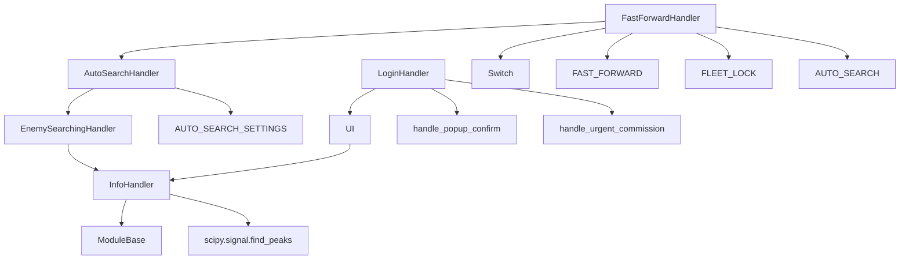

---
description:
alwaysApply: true
---

# module/handler/ 模块分析

## 1. 模块概述

**定位**：游戏处理器层，负责处理游戏中的各种弹窗、对话框、登录流程和战斗准备。

**角色**：定义 `InfoHandler` 弹窗处理基类、`LoginHandler` 登录流程、`AutoSearchHandler` 自动搜索、`FastForwardHandler` 快进/清除模式、`EnemySearchingHandler` 敌人搜索。继承链：`ModuleBase → InfoHandler → UI → LoginHandler → EnemySearchingHandler → AutoSearchHandler → FastForwardHandler`。

**输入/输出**：
- 输入：截图（`np.ndarray`）、游戏状态
- 输出：弹窗处理结果（`bool`）、地图信息

**核心职责**：
1. 检测和关闭各种弹窗/对话框
2. 处理登录流程和应用重启
3. 管理自动搜索设置
4. 处理快进/清除模式
5. 检测地图信息（清除率、星级、威胁等级）

## 2. 文件清单与逐文件分析

### 2.1 info_handler.py（608 行）

**导出类型**：类 `InfoHandler`，函数 `info_letter_preprocess()`

**导入依赖**：
- 内部：`base.base`、`base.button`、`base.timer`、`base.utils.*`、`exception.GameNotRunningError`、`handler.assets.*`、`logger`、`os_handler.assets`、`ui_white.assets`
- 外部：`scipy.signal`

**逐段分析**：

- `L14-27`：`info_letter_preprocess()` — 信息栏字母预处理。
- `L30-87`：信息栏检测 — `info_bar_count()` 使用 `scipy.signal.find_peaks` 检测蓝色线条。`wait_until_info_bar_disappear()` 等待消失。`ensure_no_info_bar()` 确保无信息栏。
- `L92-148`：弹窗处理 — `handle_popup_confirm()`（确认弹窗）、`handle_popup_cancel()`（取消弹窗）、`handle_popup_single()`（单按钮弹窗）。支持白色主题变体。
- `L151-182`：`handle_urgent_commission()` — 紧急委托处理。3-6 秒后检查游戏客户端是否被热更新杀死。
- `L184-240`：其他弹窗 — `handle_combat_low_emotion()`（低情绪）、`handle_use_data_key()`（数据钥匙）、`handle_vote_popup()`（投票）、`handle_get_skin()`（皮肤）。
- `L246-280`：大舰队弹窗 — `handle_guild_popup_confirm()`/`handle_guild_popup_cancel()`。
- `L282-608`：剧情处理 — `_story_option_buttons()` 使用信号处理峰值检测剧情选项。`handle_story_skip()` 跳过剧情。

### 2.2 login.py（346 行）

**导出类型**：类 `LoginHandler`

**导入依赖**：
- 内部：`device.pkg_resources`、`config.server`、`base.button`、`base.timer`、`base.utils`、`handler.assets.*`、`logger`、`map.assets`、`ui.assets`、`ui.page`、`ui.ui`
- 外部：`numpy`、`scipy.signal.find_peaks`、`uiautomator2`

**逐段分析**：

- `L26-107`：`_handle_app_login()` — 登录流程。循环处理：登录检查、Android 无响应、公告、活动列表、维护、更新、CN 用户协议、玩家回归、弹窗。1.5 秒确认计时器。
- `L109-139`：`handle_cn_user_agreement()` — CN 用户协议处理。检测蓝色确认按钮，滑动阅读协议。
- `L141-166`：`handle_app_login()`/`app_stop()`/`app_start()` — 登录入口和应用管理。
- `L176-210`：`app_restart()` — 智能重启。4 次尝试，首次等待 30 秒，后续 20 秒。验证应用是否运行。
- `L212-248`：`ensure_no_unfinished_campaign()` — 确保无未完成战役。
- `L250-300`：`handle_user_agreement()` — uiautomator2 xpath 方式的用户协议处理。

### 2.3 auto_search.py（247 行）

**导出类型**：类 `AutoSearchHandler`

**导入依赖**：
- 内部：`base.button`、`base.decorator`、`base.timer`、`handler.assets.*`、`handler.enemy_searching`、`logger`、`map.assets`
- 外部：`numpy`

**逐段分析**：

- `L11-27`：常量定义 — `AUTO_SEARCH_SETTINGS`（6 种设置）和名称↔索引映射。
- `L30-109`：`AutoSearchHandler` 继承 `EnemySearchingHandler`。`_fleet_sidebar()` 侧边栏检测（EN/其他服务器不同布局）。`fleet_preparation_sidebar_ensure()` 确保侧边栏索引。
- `L111-168`：`_auto_search_set_click()`/`auto_search_setting_ensure()` — 自动搜索设置。检测活跃设置（绿色），点击目标设置。
- `L170-247`：自动搜索地图选项 — `is_auto_search_running()`、`handle_auto_search_map_option()`、`is_in_auto_search_menu()`。

### 2.4 fast_forward.py（641 行）

**导出类型**：类 `FastForwardHandler`，函数 `map_files()`、`to_map_input_name()`、`to_map_file_name()`

**导入依赖**：
- 内部：`base.timer`、`base.utils`、`handler.assets.*`、`handler.auto_search`、`logger`、`ui.switch`
- 外部：`os`、`re`

**逐段分析**：

- `L11-25`：Switch 定义 — `FAST_FORWARD`（快进开关）、`FLEET_LOCK`（舰队锁定）、`AUTO_SEARCH`（自动搜索，4 种 ON 状态 + 4 种 OFF 状态）。
- `L28-92`：地图文件工具 — `map_files()` 列出战役目录下的地图文件。`to_map_input_name()`/`to_map_file_name()` 名称转换。
- `L95-178`：`FastForwardHandler` 继承 `AutoSearchHandler`。地图状态属性：`map_clear_percentage`、`map_achieved_star_*`、`map_is_100_percent_clear`、`map_is_3_stars`、`map_is_threat_safe`、`map_has_clear_mode`、`map_is_clear_mode`、`map_is_auto_search`、`map_is_2x_book`。`map_get_info()` 获取地图信息。
- `L180-260`：`handle_fast_forward()` — 快进处理。设置清除模式、自动搜索、2x 书。`map_wait_auto_search()` 等待自动搜索出现。
- `L262-300`：`handle_auto_search()`/`_auto_search_set()` — 自动搜索开关。防止未知状态误触。
- `L300-641`：地图信息检测 — `get_map_clear_percentage()` 进度条百分比。`handle_map_stop()` 地图停止条件。`handle_map_2x_book()` 2x 书设置。`STAGE_INCREASE` 关卡递增定义。

### 2.5 enemy_searching.py

**导出类型**：类 `EnemySearchingHandler`

**导入依赖**：
- 内部：`handler.info_handler`

**逐段分析**：

- 继承 `InfoHandler`，处理地图中的敌人搜索相关弹窗。

### 2.6 ambush.py / mystery.py / strategy.py / sensitive_info.py

其他处理器：

- `ambush.py`：伏击遭遇处理
- `mystery.py`：神秘格子处理
- `strategy.py`：策略面板处理
- `sensitive_info.py`：敏感信息遮罩

## 3. 内部调用关系

## 4. 模块依赖分析

**外部依赖**：
- `scipy.signal`：峰值检测（信息栏、剧情选项）
- `numpy`：数组操作
- `uiautomator2`：xpath 元素查找（用户协议）

**内部依赖**：
- `module.base`：`ModuleBase`、`Button`、`ButtonGrid`、`Timer`、`utils`
- `module.ui`：`UI`、`Switch`、`Page`
- `module.config.server`：服务器配置
- `module.exception`：`GameNotRunningError`
- `module.handler.assets`：UI 资源
- `module.map.assets`：地图资源
- `module.ui.assets`：UI 资源
- `module.ui_white.assets`：白色主题资源

## 5. 设计模式与架构分析

**设计模式**：
1. **模板方法**：`InfoHandler` 定义弹窗处理骨架，子类重写特定处理
2. **策略模式**：`@Config.when` 根据服务器选择不同实现
3. **状态模式**：`Switch` 管理快进/锁定/自动搜索状态
4. **责任链**：`ui_additional()` 按优先级处理多种弹窗

**架构特点**：
- 继承链：`ModuleBase → InfoHandler → UI → LoginHandler → EnemySearchingHandler → AutoSearchHandler → FastForwardHandler`
- `InfoHandler` 是所有弹窗处理的基础
- `FastForwardHandler` 是最顶层处理器，组合了所有功能

## 6. 类型系统分析

- `InfoHandler._popup_offset` 使用类变量定义默认偏移
- `FastForwardHandler` 使用类变量定义地图状态
- `Switch.state_list` 使用字典列表
- `AUTO_SEARCH_SETTINGS` 使用全局 Button 列表

## 7. 性能分析

- `info_bar_count()` 使用 `scipy.signal.find_peaks`，O(n) 复杂度
- `_story_option_buttons()` 使用信号处理峰值检测
- `get_map_clear_percentage()` 使用颜色条百分比计算
- `handle_urgent_commission()` 3-6 秒后检查游戏客户端

## 8. 安全分析

- `handle_urgent_commission()` 检测热更新杀死游戏客户端
- `app_restart()` 4 次重试，防止永久失败
- `handle_cn_user_agreement()` 处理 CN 用户协议
- `sensitive_info.py` 遮罩敏感信息

## 9. 代码质量评估

**优点**：
- 弹窗处理覆盖全面（20+ 种类型）
- 智能重启逻辑（4 次尝试）
- 信号处理用于峰值检测
- 服务器特定处理（`@Config.when`）

**问题**：
- `info_handler.py` 过于庞大（608 行），应拆分
- `fast_forward.py` 的 `STAGE_INCREASE` 硬编码
- 继承链过深（6 层）
- 部分方法缺少类型注解

## 10. 潜在问题与改进建议

1. **info_handler.py 拆分**：将弹窗处理、信息栏检测、剧情处理分离
2. **继承链扁平化**：使用组合替代多层继承
3. **地图配置化**：`STAGE_INCREASE` 移到配置文件
4. **类型注解增强**：为 `handle_popup_confirm()` 等方法添加精确类型
5. **测试覆盖**：弹窗处理、登录流程等核心逻辑缺少单元测试
6. **重构 Switch**：`AUTO_SEARCH` 的 8 种状态定义过于复杂，应简化
