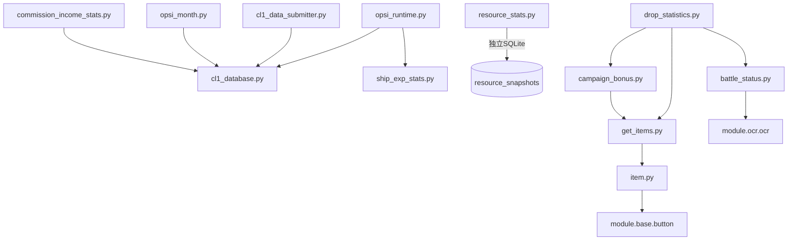
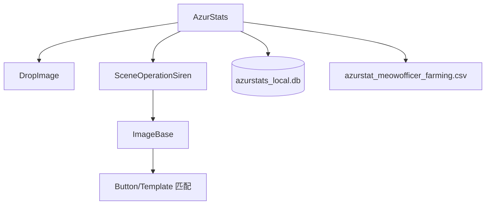
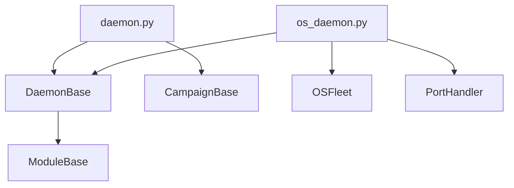
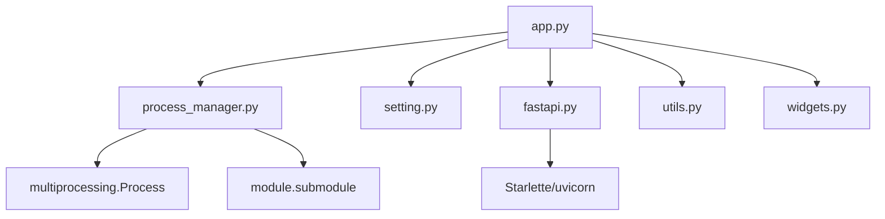
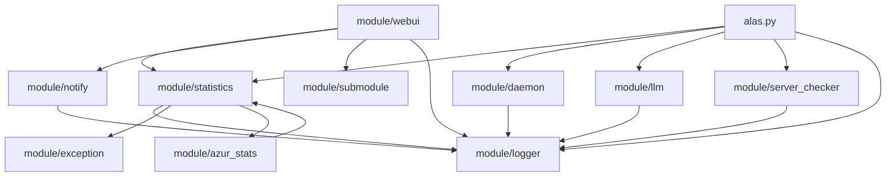

---
description:
alwaysApply: true
---

# AzurLaneAutoScript 基础设施层模块综合分析

> 本文档分析 ALAS 项目中 10 个基础设施层模块的架构、设计模式、依赖关系及代码质量。

---

## 1. module/statistics/ - 掉落统计系统

### 模块概述

**定位**：游戏掉落物品的图像识别、模板匹配与数据统计系统。

**角色**：从战斗截图中提取掉落物品信息，通过 OCR 识别数量，通过模板匹配识别物品名称，将结果记录到 CSV 或本地数据库。

**输入输出**：
- 输入：1280x720 游戏截图（PNG）
- 输出：CSV 掉落记录、SQLite 统计数据、模板图像文件

**核心职责**：
1. 掉落物品图像识别与模板管理
2. 战斗状态 OCR 识别（敌人名称）
3. 战役奖励统计
4. 大世界运行期事件记录（侵蚀1/短猫）
5. 资源快照时间序列记录
6. 委托收益聚合统计
7. 舰船经验效率统计

### 文件清单与逐文件分析

#### `cl1_database.py` (1343 行)
- **导出类型**：`Cl1Database` 类、`db` 单例实例
- **导入依赖**：`sqlite3`, `json`, `pycryptodome` (AES-GCM), `module.base.device_id`, `module.logger`
- **核心功能**：AES-GCM 加密的 SQLite 数据库管理，存储侵蚀1/短猫的战斗统计、明石事件、行动力快照、委托收益等
- **关键设计**：
  - 使用 `device_id` 派生 256 位 AES 密钥，数据加密存储
  - 支持设备 ID 变更时的全库重加密迁移
  - 异步版本方法通过 `AsyncExecutor` 提交到后台线程
  - 短猫统计按侵蚀等级 (2-6) 拆分，支持有效轮次换算

#### `cl1_data_submitter.py` (227 行)
- **导出类型**：`Cl1DataSubmitter` 类、`get_cl1_submitter()` 工厂函数
- **导入依赖**：`requests`, `hashlib`, `module.base.api_client.ApiClient`, `module.statistics.cl1_database`
- **核心功能**：定时收集 CL1 统计数据并提交到云端 API
- **关键设计**：10 分钟提交间隔控制，使用 `ApiClient` 处理双域名故障转移

#### `drop_statistics.py` (190 行)
- **导出类型**：`DropStatistics` 类
- **导入依赖**：`tqdm`, `module.ocr.al_ocr`, `module.ocr.ocr`, `module.statistics.battle_status`, `module.statistics.campaign_bonus`, `module.statistics.get_items`
- **核心功能**：批量处理截图文件夹，提取掉落物品并输出 CSV
- **关键设计**：两步工作流（先提取模板，再解析掉落），支持垂直拼接的多帧截图

#### `item.py` (464 行)
- **导出类型**：`Item` 类、`ItemGrid` 类、`AmountOcr` 类
- **导入依赖**：`numpy`, `cv2`, `module.base.button`, `module.ocr.ocr`
- **核心功能**：物品图像识别核心——模板匹配、数量 OCR、标签预测
- **关键设计**：
  - `ItemGrid.match_template()` 优先匹配高频命中的模板（LRU 优化）
  - `AmountOcr` 支持批量 OCR 和超限重试/截断
  - 物品名称后缀数字自动去除（如 `Javelin_2` → `Javelin`）

#### `get_items.py` (96 行)
- **导出类型**：`GetItemsStatistics` 类、`merge_get_items()` 函数
- **导入依赖**：`module.combat.assets`, `module.handler.assets`, `module.statistics.item`
- **核心功能**：识别"获得物品"界面，支持 1/2/3 行布局和奇偶数物品排列

#### `campaign_bonus.py` (80 行)
- **导出类型**：`CampaignBonusStatistics` 类、`BonusItem` 类
- **导入依赖**：继承 `GetItemsStatistics`
- **核心功能**：战役奖励界面识别，包含金币验证和数量修正逻辑

#### `battle_status.py` (29 行)
- **导出类型**：`BattleStatusStatistics` 类
- **导入依赖**：`module.ocr.ocr.Ocr`, `module.combat.assets`
- **核心功能**：OCR 识别敌人名称（如"中型主力舰队"）

#### `opsi_runtime.py` (276 行)
- **导出类型**：多个函数（`record_cl1_auto_search_battle`, `record_meow_auto_search_battle`, `record_siren_research_device` 等）
- **导入依赖**：`module.statistics.cl1_database`, `module.statistics.ship_exp_stats`
- **核心功能**：大世界运行期事件的统一入口，将任务代码的领域事件落到统计库
- **关键设计**：任务代码只上报事件，具体落库细节集中维护

#### `opsi_month.py` (268 行)
- **导出类型**：`OpsiMonthStats` 类、`get_opsi_stats()` 等函数
- **导入依赖**：`module.statistics.cl1_database`
- **核心功能**：月度统计汇总——战斗次数、明石概率、行动力时间线、资源时间线

#### `resource_stats.py` (143 行)
- **导出类型**：`record_resource_snapshot()`, `get_resource_timeline()` 函数
- **导入依赖**：`sqlite3`, `threading`
- **核心功能**：通用资源快照记录（石油、物资、钻石等 12 种资源），线程安全

#### `commission_income_stats.py` (186 行)
- **导出类型**：`get_commission_income_summary()`, `get_recent_commission_entries()` 函数
- **导入依赖**：`module.statistics.cl1_database`
- **核心功能**：委托收益按日/周/月聚合，供统计页面渲染

#### `ship_exp_stats.py` (412 行)
- **导出类型**：`ShipExpStats` 类、`get_ship_exp_stats()` 工厂函数
- **导入依赖**：`module.os.ship_exp_data`
- **核心功能**：舰船经验效率统计——战斗时间记录、每日经验效率、升级进度预估
- **关键设计**：JSON 文件存储，支持侵蚀1/短猫分开统计

#### `utils.py` (75 行)
- **导出类型**：`ImageError`, `ImageInvalidResolution` 异常类、`load_folder()`, `pack()`, `unpack()` 函数
- **核心功能**：图像加载、垂直拼接/拆分、文件夹遍历

### 模块内部调用关系



### 模块依赖关系

**外部依赖**：
- `pycryptodome`：AES-GCM 加密
- `numpy`：图像处理
- `opencv-python`：模板匹配
- `tqdm`：进度条
- `sqlite3`：数据库

**内部依赖**：
- `module.base.device_id`：设备指纹
- `module.base.api_client`：API 客户端
- `module.base.async_executor`：异步执行器
- `module.ocr.ocr`：OCR 识别
- `module.logger`：日志系统

### 设计模式与架构分析

1. **单例模式**：`Cl1Database` 使用模块级 `db` 单例，`ShipExpStats` 使用工厂函数 + 实例缓存
2. **策略模式**：`ItemGrid` 的模板匹配策略支持动态扩展
3. **观察者模式**：`opsi_runtime.py` 作为事件收集器，任务代码上报事件
4. **异步代理模式**：`async_*` 方法通过 `AsyncExecutor` 提交到后台线程

### 性能分析

- 模板匹配使用颜色预过滤（`color_similar`），避免全量 `cv2.matchTemplate`
- 高频模板优先匹配（LRU 排序），减少匹配次数
- SQLite 使用 `UPSERT` 避免先查后改
- 异步方法避免阻塞主游戏循环

### 安全性分析

- **加密存储**：`cl1_database.py` 使用 AES-GCM 加密，密钥从 `device_id` 派生
- **固定盐**：`PBKDF2` 使用固定盐 `b"AlasCl1SecureStorage"`，安全性较弱
- **密钥迁移**：设备 ID 变更时自动重加密，但旧密钥无法验证完整性
- **数据隔离**：按实例和月份分表，但共享同一数据库文件

### 代码质量评估

- **优点**：类型注解完整、异常处理充分、文档注释详细
- **缺点**：`cl1_database.py` 过长（1343 行），应拆分为多个子模块
- **命名**：遵循项目约定，使用下划线分隔

### 潜在问题与改进建议

1. `cl1_database.py` 建议拆分为 `db_core.py`（加密/CRUD）、`meow_stats.py`（短猫统计）、`commission_stats.py`（委托统计）
2. `resource_stats.py` 与 `cl1_database.py` 使用不同的 SQLite 数据库，建议统一
3. `ship_exp_stats.py` 使用 JSON 文件存储，建议迁移到 SQLite
4. 固定盐应改为随机盐并存储

---

## 2. module/azur_stats/ - AzurStats 数据提交

### 模块概述

**定位**：游戏掉落截图的场景识别与数据提取模块。

**角色**：从战斗截图中识别游戏场景（大世界、获得物品等），提取物品信息并结构化存储。

**输入输出**：
- 输入：1280x720 游戏截图
- 输出：结构化物品数据（dataclass）

**核心职责**：
1. 游戏场景分类（服务器识别、界面类型判断）
2. 大世界掉落物品提取
3. 本地 SQLite 存储

### 文件清单与逐文件分析

#### `image/base.py` (103 行)
- **导出类型**：`ImageBase` 类、`CLASSIFY_CACHE` 全局缓存
- **导入依赖**：`numpy`, `module.base.button`, `module.base.template`
- **核心功能**：图像识别基类——服务器分类、颜色计数、获得物品行数判断
- **关键设计**：`CLASSIFY_CACHE` 缓存 Button 的服务器拆分结果

#### `image/get_items.py` / `image/auto_search_reward.py` / `image/opsi_reward.py` / `image/opsi_zone.py`
- **导出类型**：各场景的图像识别类
- **核心功能**：特定场景的物品提取逻辑

#### `scene/base.py` (120 行)
- **导出类型**：`SceneBase` 类
- **导入依赖**：`module.azur_stats.image.base`, `module.base.decorator`, `module.statistics.utils`
- **核心功能**：场景基类——加载文件、管理缓存、遍历文件夹执行方法

#### `scene/operation_siren.py`
- **导出类型**：`SceneOperationSiren` 类
- **核心功能**：大世界场景识别，提取掉落物品的服务器、区域、侵蚀等级、物品名称和数量

#### `statistics/azurstats.py` (383 行)
- **导出类型**：`AzurStats` 类、`DropImage` 类
- **导入依赖**：`sqlite3`, `threading`, `numpy`, `module.base.device_id`
- **核心功能**：AzurStats 主类——截图保存、本地解析、CSV 导出
- **关键设计**：
  - `DropImage` 使用上下文管理器模式（`__enter__`/`__exit__`）
  - 短猫掉落统计按侵蚀等级聚合
  - 线程安全的 SQLite 写入

### 模块内部调用关系



### 设计模式与架构分析

1. **模板方法模式**：`SceneBase.parse_scene()` 由子类实现
2. **上下文管理器**：`DropImage` 的 `with` 语句自动提交
3. **缓存模式**：`CLASSIFY_CACHE` 避免重复的服务器拆分

### 性能分析

- 图像处理在主线程同步执行，可能阻塞游戏循环
- SQLite 写入使用 `_record_lock` 串行化

### 安全性分析

- 无敏感数据泄露风险
- `device_id` 用于数据隔离

### 代码质量评估

- **优点**：职责清晰，场景识别与数据存储分离
- **缺点**：`azurstats.py` 中 CSV 和 SQLite 两种存储方式并存，应统一

### 潜在问题与改进建议

1. 建议废弃 CSV 存储，统一使用 SQLite
2. 图像解析应考虑异步执行，避免阻塞游戏循环

---

## 3. module/notify/ - 推送通知

### 模块概述

**定位**：游戏任务完成或异常时的外部通知推送。

**角色**：整合 onepush 库，根据用户配置向多种渠道（QQ、微信、Webhook 等）推送消息。

**输入输出**：
- 输入：通知标题、内容、配置字符串（YAML）
- 输出：HTTP 请求到通知服务

**核心职责**：
1. 解析 onepush 配置
2. 调用对应渠道的 notifier
3. WebUI 本地通知

### 文件清单与逐文件分析

#### `__init__.py` (10 行)
- **导出类型**：`handle_notify()`, `notify_webui()` 惰性导入函数
- **核心功能**：延迟导入，避免启动时加载 onepush

#### `notify.py` (102 行)
- **导出类型**：`handle_notify()`, `notify_webui()` 函数
- **导入依赖**：`onepush`, `yaml`, `requests`
- **核心功能**：
  - `handle_notify()`：解析 YAML 配置，调用 onepush notifier，支持 Custom 和 gocqhttp 特殊处理
  - `notify_webui()`：向 WebUI 本地端口 POST 通知

### 模块依赖关系

**外部依赖**：
- `onepush`：多渠道通知库
- `pyyaml`：配置解析
- `requests`：HTTP 请求

**内部依赖**：
- `module.logger`：日志
- `module.webui.setting`：端口配置

### 设计模式与架构分析

1. **策略模式**：通过 `provider` 字段动态选择通知渠道
2. **惰性导入**：`__init__.py` 延迟导入避免启动开销

### 安全性分析

- **敏感信息**：配置中可能包含 token/key，异常日志中不应输出
- **代码处理**：`except Exception as e: logger.error(e)` 避免输出完整异常（包含变量）

### 代码质量评估

- **优点**：简洁清晰，异常处理得当
- **缺点**：`handle_notify()` 中 Custom 和 gocqhttp 的特殊处理应抽取为独立方法

### 潜在问题与改进建议

1. 建议将特殊渠道处理抽取为策略类
2. 添加通知发送失败的重试机制

---

## 4. module/daemon/ - 守护模式

### 模块概述

**定位**：游戏后台监控与自动处理模式。

**角色**：在用户不操作时自动处理战斗、弹窗、退役等，保持游戏运行。

**输入输出**：
- 输入：游戏截图
- 输出：自动化操作（点击、滑动）

**核心职责**：
1. 战斗自动处理（准备、进行、结束）
2. 弹窗/对话框自动关闭
3. 退役、紧急委托处理
4. 大世界守护（港口维修、敌人选择）

### 文件清单与逐文件分析

#### `daemon_base.py` (8 行)
- **导出类型**：`DaemonBase` 类
- **核心功能**：继承 `ModuleBase`，禁用卡死检测

#### `daemon.py` (71 行)
- **导出类型**：`AzurLaneDaemon` 类
- **导入依赖**：`CampaignBase`, `DaemonBase`
- **核心功能**：主线守护循环——战斗、地图操作、退役、紧急委托、弹窗处理
- **关键设计**：无终止条件，需手动停止

#### `os_daemon.py` (73 行)
- **导出类型**：`AzurLaneDaemon` 类（大世界版本）
- **导入依赖**：`DaemonBase`, `OSFleet`, `PortHandler`
- **核心功能**：大世界守护——战斗、地图事件、港口维修、敌人选择

#### `benchmark.py` / `ocr_benchmark.py`
- **核心功能**：性能基准测试

#### `game_manager.py` / `uncensored.py`
- **核心功能**：游戏管理、去和谐处理

### 模块内部调用关系



### 设计模式与架构分析

1. **模板方法模式**：`run()` 方法定义守护循环骨架
2. **组合模式**：通过多重继承组合战斗、地图、港口等功能

### 性能分析

- 禁用卡死检测，避免长时间无操作误触发
- 截图间隔由 `interval` 参数控制

### 安全性分析

- 无特殊安全风险
- 守护模式下持续运行，需注意资源消耗

### 代码质量评估

- **优点**：职责清晰，主线循环简洁
- **缺点**：`daemon.py` 和 `os_daemon.py` 有重复的战斗处理逻辑

### 潜在问题与改进建议

1. 建议抽取公共的战斗处理逻辑到基类
2. 添加守护模式的健康检查机制

---

## 5. module/webui/ - WebUI 应用

### 模块概述

**定位**：ALAS 的 Web 管理界面。

**角色**：基于 PyWebIO 构建的可视化控制台，提供任务配置、仪表盘、日志流、多实例管理等功能。

**输入输出**：
- 输入：用户浏览器请求
- 输出：HTML 页面、WebSocket 日志流

**核心职责**：
1. 任务配置渲染与编辑
2. 仪表盘展示（资源、统计）
3. 多实例进程管理
4. 实时日志流转发
5. 更新管理

### 文件清单与逐文件分析

#### `app.py` (5060+ 行)
- **导出类型**：`AlasGUI` 类
- **导入依赖**：`pywebio`, `module.config`, `module.webui.*`
- **核心功能**：WebUI 主应用——菜单、配置、仪表盘、统计图表
- **关键设计**：
  - 继承 `Frame` 基类
  - 使用 `@use_scope` 装饰器管理 UI 作用域
  - 体力 K 线图、资源趋势图、短猫统计等复杂图表

#### `process_manager.py` (309 行)
- **导出类型**：`ProcessManager` 类
- **导入依赖**：`multiprocessing`, `threading`, `queue`
- **核心功能**：多实例进程管理——启动、停止、状态检测、日志队列
- **关键设计**：
  - 使用 `multiprocessing.Process` 运行实例
  - `ConsoleRenderable` 队列实现跨进程日志传输
  - 状态检测通过分析日志尾部内容判断

#### `fastapi.py`
- **核心功能**：FastAPI/Starlette ASGI 应用，提供 API 路由

#### `setting.py`
- **核心功能**：全局状态管理（`State` 类）

#### `utils.py` / `widgets.py`
- **核心功能**：工具函数、UI 组件

#### `lang.py` / `translate.py`
- **核心功能**：国际化支持

#### `updater.py`
- **核心功能**：Git 更新管理

#### `dashboard_utils.py` / `event_calculator.py`
- **核心功能**：仪表盘工具、活动计算器

### 模块内部调用关系



### 设计模式与架构分析

1. **MVC 模式**：`app.py` 是 Controller，PyWebIO 是 View，`AzurLaneConfig` 是 Model
2. **进程池模式**：`ProcessManager` 管理多个 ALAS 实例进程
3. **观察者模式**：日志队列实现跨进程事件传递

### 性能分析

- 日志队列使用 `queue.Queue`，有最大长度限制（400 条）
- 状态检测通过分析日志字符串，非轮询式
- 图表渲染在前端完成，后端只提供数据

### 安全性分析

- 无认证机制，依赖网络隔离
- API 端点无权限控制

### 代码质量评估

- **优点**：功能完整，国际化支持好
- **缺点**：`app.py` 过长（5000+ 行），应拆分为多个视图模块

### 潜在问题与改进建议

1. `app.py` 应按功能拆分为 `dashboard.py`, `config.py`, `stat.py` 等
2. 添加基本的认证机制
3. 日志队列应支持持久化

---

## 6. module/submodule/ - 外部桥接

### 模块概述

**定位**：外部功能模块（MAA、FPY）的动态加载与配置管理。

**角色**：通过 `importlib` 动态加载子模块，管理模块配置映射。

**输入输出**：
- 输入：模块名称、配置名称
- 输出：加载的模块对象、配置对象

**核心职责**：
1. 子模块动态加载
2. 配置与模块的映射管理
3. 可用功能/模块枚举

### 文件清单与逐文件分析

#### `submodule.py` (28 行)
- **导出类型**：`load_mod()`, `load_config()` 函数
- **导入依赖**：`importlib`, `module.submodule.utils`
- **核心功能**：动态加载子模块和配置

#### `utils.py` (91 行)
- **导出类型**：`MOD_DICT`, `MOD_FUNC_DICT` 字典、多个工具函数
- **核心功能**：模块目录映射、可用功能枚举、配置模块查找

### 设计模式与架构分析

1. **插件模式**：通过 `importlib` 动态加载，支持运行时扩展
2. **注册表模式**：`MOD_DICT` 和 `MOD_FUNC_DICT` 作为模块注册表

### 代码质量评估

- **优点**：简洁，扩展性好
- **缺点**：模块映射硬编码，应支持配置文件

---

## 7. module/llm.py - LLM 错误分析

### 模块概述

**定位**：使用 LLM（如 GPT-4o-mini）分析异常堆栈和日志上下文。

**角色**：当异常发生时，自动调用 OpenAI API 进行错误诊断，提供改进建议。

**输入输出**：
- 输入：异常对象、配置（API Key、Base URL、Model）
- 输出：LLM 分析报告（中文）

**核心职责**：
1. 异常堆栈格式化
2. 日志上下文提取（最近 500 行）
3. OpenAI API 调用
4. 结果缓存（避免重复分析）

### 文件清单与逐文件分析

#### `llm.py` (108 行)
- **导出类型**：`analyze_exception()` 函数
- **导入依赖**：`openai`, `hashlib`, `traceback`
- **核心功能**：LLM 错误分析
- **关键设计**：
  - 使用 MD5 哈希缓存已分析的错误
  - 缓存上限 50 条，超出时清空
  - 总上下文限制 64K 字符（traceback 20K + 日志 40K）
  - 提示词要求中文输出

### 模块依赖关系

**外部依赖**：
- `openai`：OpenAI Python SDK

**内部依赖**：
- `module.logger`：日志系统（读取日志文件）

### 安全性分析

- **敏感信息**：日志中可能包含用户数据，发送到外部 API 存在隐私风险
- **API Key**：配置中存储 API Key，需确保不被日志输出
- **代码处理**：日志中多次强调"严禁提交此模块的相关日志"

### 代码质量评估

- **优点**：功能简洁，缓存机制避免重复调用
- **缺点**：缓存清空策略简单（全量清空），应使用 LRU

### 潜在问题与改进建议

1. 缓存应使用 LRU 策略而非全量清空
2. 添加用户确认机制，避免自动发送敏感数据
3. 支持本地 LLM（如 Ollama）作为备选

---

## 8. module/logger.py - 日志系统

### 模块概述

**定位**：ALAS 的统一日志系统。

**角色**：基于 Rich 库的彩色日志输出，支持控制台、文件、WebUI 三种输出目标。

**输入输出**：
- 输入：日志消息
- 输出：控制台输出、日志文件、WebUI 渲染对象

**核心职责**：
1. 控制台彩色日志（Rich）
2. 文件日志（按天轮转，支持压缩归档）
3. WebUI 日志流（`ConsoleRenderable` 队列）
4. 日志格式化（`hr()`, `attr()`, `rule()`）

### 文件清单与逐文件分析

#### `logger.py` (609 行)
- **导出类型**：`logger` 全局实例、`set_file_logger()`, `set_func_logger()`, `hr()`, `attr()` 等函数
- **导入依赖**：`rich`, `logging`, `multiprocessing`, `tarfile`, `zipfile`
- **核心功能**：
  - `RichHandler`：控制台彩色输出
  - `RichTimedRotatingHandler`：按天轮转文件日志，支持 gzip/bz2/xz/zip 压缩
  - `RichRenderableHandler`：WebUI 日志流
  - `aggressive_convert()`：错误消息的"傲娇"风格化

### 设计模式与架构分析

1. **装饰器模式**：`aggressive_convert()` 包装 `logger.error` 和 `logger.critical`
2. **策略模式**：文件轮转支持多种压缩方式
3. **单例模式**：全局 `logger` 实例

### 性能分析

- Rich 渲染有一定开销，但对 350ms 截图间隔影响可忽略
- 文件轮转在后台线程执行，不阻塞主线程

### 安全性分析

- 日志文件存储在本地，无泄露风险
- `aggressive_convert()` 只对中文消息生效，不影响英文日志

### 代码质量评估

- **优点**：功能完整，支持多种输出目标
- **缺点**：`aggressive_convert()` 的"傲娇"风格可能不适合生产环境

### 潜在问题与改进建议

1. `aggressive_convert()` 应提供配置开关
2. 日志文件路径应可配置

---

## 9. module/exception.py - 异常定义

### 模块概述

**定位**：ALAS 的异常类层次结构。

**角色**：定义所有游戏状态异常，供任务调度器和处理器使用。

**输入输出**：
- 输入：无（纯定义模块）
- 输出：异常类

**核心职责**：
1. 定义战役结束异常（`CampaignEnd`, `OilExhausted`, `OilMaxed`）
2. 定义地图导航异常（`MapDetectionError`, `MapWalkError`）
3. 定义游戏状态异常（`GameStuckError`, `GameBugError`）
4. 定义连接异常（`EmulatorNotRunningError`, `GameNotRunningError`）
5. 定义不可恢复异常（`RequestHumanTakeover`）

### 文件清单与逐文件分析

#### `exception.py` (72 行)
- **导出类型**：12 个异常类
- **导入依赖**：无
- **异常层次**：
  ```
  Exception
  ├── CampaignEnd          # 正常战役结束
  ├── OilExhausted         # 石油耗尽
  ├── OilMaxed             # 石油满
  ├── MapDetectionError    # 地图检测失败
  ├── MapWalkError         # 地图行走失败
  ├── MapEnemyMoved        # 敌人移动
  ├── CampaignNameError    # 战役名称错误
  ├── ScriptError          # 开发者错误
  ├── ScriptEnd            # 脚本结束
  ├── GameStuckError       # 游戏卡死
  ├── GameBugError         # 游戏 Bug
  ├── GameTooManyClickError # 点击过多
  ├── EmulatorNotRunningError # 模拟器未运行
  ├── GameNotRunningError  # 游戏未运行
  ├── GamePageUnknownError # 未知页面
  ├── RequestHumanTakeover # 请求人工接管
  └── AutoSearchSetError   # 自动搜索设置错误
  ```

### 设计模式与架构分析

1. **异常层次**：按严重程度分类（正常结束 → 可恢复 → 不可恢复）
2. **无继承关系**：所有异常直接继承 `Exception`，简化捕获逻辑

### 代码质量评估

- **优点**：异常命名清晰，注释说明用途
- **缺点**：缺少异常基类分类（如 `RecoverableError`, `FatalError`）

### 潜在问题与改进建议

1. 建议添加异常基类，便于批量捕获
2. 部分异常（如 `ScriptError`）应包含更多上下文信息

---

## 10. module/server_checker.py - 服务器检查

### 模块概述

**定位**：游戏服务器状态检查。

**角色**：通过外部 API 检查游戏服务器是否可用，支持维护检测和自动重试。

**输入输出**：
- 输入：服务器名称
- 输出：服务器可用状态（bool）

**核心职责**：
1. 服务器状态查询
2. 维护检测
3. 网络故障快速重试
4. 渐进式退避（2-10 分钟）

### 文件清单与逐文件分析

#### `server_checker.py` (205 行)
- **导出类型**：`ServerChecker` 类
- **导入依赖**：`requests`, `module.base.timer.Timer`, `module.config.server`
- **核心功能**：
  - `_load_server()`：调用 `sc.shiratama.cn` API 查询服务器状态
  - `wait_until_available()`：阻塞等待服务器可用
  - `fast_retry()`：网络故障时通过百度验证网络连通性
  - 渐进式退避：每次不可用增加 120 秒，上限 600 秒

### 设计模式与架构分析

1. **状态模式**：`_state` 使用 `deque(maxlen=2)` 跟踪最近两次状态
2. **退避策略**：渐进式增加检查间隔
3. **快速重试**：网络故障时通过备用站点验证

### 性能分析

- API 调用超时 15 秒
- 百度连通性检查超时 5 秒
- 渐进式退避免频繁请求

### 安全性分析

- API 使用 HTTP（非 HTTPS），存在中间人攻击风险
- `trust_env = False` 忽略代理设置

### 代码质量评估

- **优点**：容错机制完善，支持快速重试
- **缺点**：API 基地址硬编码

### 潜在问题与改进建议

1. API 应使用 HTTPS
2. API 基地址应可配置
3. 添加服务器状态缓存，避免频繁请求

---

## 综合架构分析

### 模块间依赖关系



### 共性设计模式

1. **单例模式**：数据库、日志器、统计实例
2. **工厂模式**：`get_ship_exp_stats()`, `get_cl1_submitter()`
3. **惰性导入**：避免循环依赖和启动开销
4. **异步代理**：`async_*` 方法通过 `AsyncExecutor` 后台执行
5. **上下文管理器**：`DropImage` 的自动提交

### 性能瓶颈

1. **截图等待**：~350ms，占运行时间 99%
2. **模板匹配**：~2.5ms，已优化（颜色预过滤、LRU）
3. **OCR 识别**：~100-180ms，支持 GPU 加速
4. **SQLite 写入**：使用异步避免阻塞

### 安全风险

1. **LLM 数据泄露**：日志可能包含用户数据
2. **API Key 存储**：配置文件明文存储
3. **HTTP API**：服务器检查使用 HTTP
4. **固定加密盐**：`cl1_database.py` 使用固定盐

### 代码质量总结

| 模块 | 行数 | 质量评分 | 主要问题 |
|------|------|----------|----------|
| statistics | ~4000 | 8/10 | `cl1_database.py` 过长 |
| azur_stats | ~800 | 7/10 | CSV/SQLite 存储并存 |
| notify | ~110 | 8/10 | 特殊渠道处理未抽取 |
| daemon | ~250 | 7/10 | 重复逻辑 |
| webui | ~8000+ | 6/10 | `app.py` 严重过长 |
| submodule | ~120 | 8/10 | 映射硬编码 |
| llm | ~110 | 7/10 | 缓存策略简单 |
| logger | ~610 | 8/10 | "傲娇"风格 |
| exception | ~72 | 8/10 | 缺少基类分类 |
| server_checker | ~205 | 8/10 | HTTP API |

### 改进优先级

1. **高优先级**：
   - 拆分 `webui/app.py`（5000+ 行）
   - 拆分 `statistics/cl1_database.py`（1343 行）
   - LLM 模块添加隐私保护

2. **中优先级**：
   - 统一 `resource_stats.py` 和 `cl1_database.py` 的数据库
   - 服务器检查改用 HTTPS
   - 添加 WebUI 认证机制

3. **低优先级**：
   - `ship_exp_stats.py` 迁移到 SQLite
   - 异常类添加基类分类
   - `aggressive_convert()` 添加配置开关
