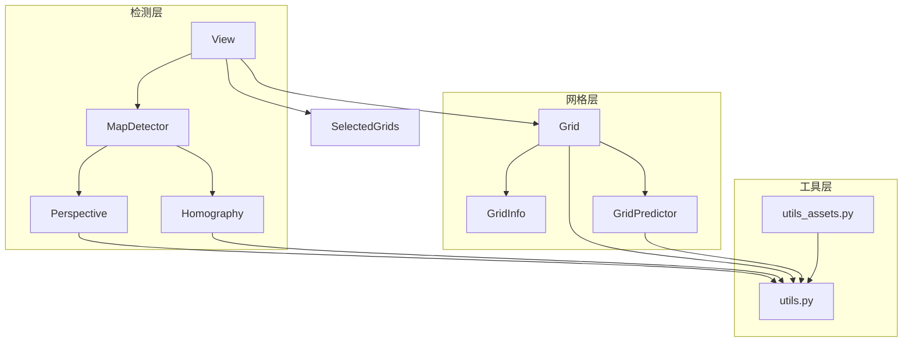

---
description:
alwaysApply: true
---

# 地图检测模块 (module/map_detection/) 分析文档

## 1. 模块概述

**一句话定位**：游戏地图的视觉检测引擎，负责从屏幕截图中识别地图网格、边界、透视关系和网格信息。

**角色**：作为地图系统的感知层，通过图像处理和计算机视觉技术，将屏幕截图转换为结构化的地图数据，为地图导航和战斗提供基础数据支持。

**输入输出**：
- **输入**：屏幕截图（1280x720 像素）
- **输出**：地图网格数据、边界信息、透视变换矩阵、网格预测结果

**核心职责**：
1. 透视检测与校正（Perspective/Homography）
2. 网格识别与分类（Grid/GridInfo/GridPredictor）
3. 地图边界检测（View）
4. 网格信息预测（颜色、类型、状态）
5. 坐标系统转换（屏幕坐标 <-> 网格坐标）

---

## 2. 文件清单与逐文件分析

### 2.1 detector.py (55 行)

**导出类型**：类 `MapDetector`

**导入依赖**：
- `numpy`：数值计算
- `module.config.config.AzurLaneConfig`：配置管理
- `module.map_detection.homography.Homography`：单应性变换
- `module.map_detection.perspective.Perspective`：透视检测

**逐行分析**：

**L8-20**：`MapDetector` 类属性：
- `image`：图像数组
- `config`：配置对象
- `left_edge`、`right_edge`、`lower_edge`、`upper_edge`：边界标志
- `generate`：生成器函数

**L22-29**：`__init__()` 方法，初始化检测器：
- 设置配置
- 初始化后端

**L31-42**：`detector_set_backend()` 方法，设置检测后端：
- 支持 `homography` 和 `perspective` 两种后端
- 默认使用配置中的后端

**L44-55**：`load()` 方法，加载图像：
- 调用后端的 `load()` 方法
- 更新边界标志
- 设置生成器

---

### 2.2 perspective.py (438 行)

**导出类型**：类 `Perspective`

**导入依赖**：
- `time`：时间测量
- `warnings`：警告控制
- `numpy`：数值计算
- `PIL`：图像处理
- `scipy.signal`：信号处理
- `module.base.utils`：基础工具
- `module.config.config.AzurLaneConfig`：配置管理
- `module.exception.MapDetectionError`：检测异常
- `module.logger.logger`：日志系统
- `module.map_detection.utils`：检测工具
- `module.map_detection.utils_assets`：资源工具

**逐行分析**：

**L18-53**：`Perspective` 类属性：
- `image`：图像数组
- `config`：配置对象
- `left_edge`、`right_edge`、`lower_edge`、`upper_edge`：边界线
- `horizontal`、`vertical`：水平/垂直线
- `crossings`：交叉点
- `vanish_point`、`distant_point`：消失点/远点
- `map_inner`：地图内部区域

**L55-60**：`__init__()` 方法，初始化透视检测器。

**L62-161**：`load()` 方法，加载图像并检测：
- 图像初始化：裁剪、灰度化、UI 遮罩
- 线检测：水平线、垂直线、边缘线
- 线预处理：分组、删除、信任设置
- 透视计算：交叉点、消失点、远点
- 线清洗：中点清洗、边缘分离
- 日志输出：检测结果统计

**L162-174**：`load_image()` 方法，图像预处理：
- RGB 转灰度
- 应用 UI 遮罩
- 反转图像

**L176-204**：`find_peaks()` 静态方法，峰值检测：
- 使用 `scipy.signal.find_peaks`
- 支持水平/垂直模式
- 应用遮罩

**L206-230**：`hough_lines()` 方法，霍夫线检测：
- 使用 `cv2.HoughLines`
- 过滤角度范围
- 处理 rho 符号

**L232-240**：`detect_lines()` 方法，线检测包装器。

**L242-270**：`draw()` 方法，绘制检测结果。

**L272-285**：`_vanish_point_value()` 方法，消失点价值函数：
- 使用对数距离度量
- 鼓励重合线，惩罚错误线

**L287-300**：`_distant_point_value()` 方法，远点价值函数。

**L302-391**：`mid_cleanse()` 方法，中点清洗：
- 转换坐标系统
- 绘制线条
- 拟合中点
- 激活函数处理
- 填充中点

**L393-430**：`line_cleanse()` 方法，线清洗：
- 分离边缘
- 裁剪中点
- 转换为线对象

**L432-438**：`generate()` 方法，生成网格：
- 交叉点计算
- 区域生成

---

### 2.3 homography.py (442 行)

**导出类型**：类 `Homography`

**导入依赖**：
- `time`：时间测量
- `numpy`：数值计算
- `PIL`：图像处理
- `module.base.utils`：基础工具
- `module.config.config.AzurLaneConfig`：配置管理
- `module.exception.MapDetectionError`：检测异常
- `module.logger.logger`：日志系统
- `module.map_detection.perspective.Perspective`：透视检测
- `module.map_detection.utils`：检测工具
- `module.map_detection.utils_assets`：资源工具

**逐行分析**：

**L15-56**：`Homography` 类属性：
- `image`：图像数组
- `config`：配置对象
- `left_edge`、`right_edge`、`lower_edge`、`upper_edge`：边界标志
- `homo_storage`：存储数据
- `homo_data`、`homo_invt`：变换矩阵
- `homo_size`：变换后大小
- `homo_loca`：位置
- `homo_loaded`：加载标志
- `map_inner`：地图内部
- `_map_edge_count`：边缘计数

**L59-65**：`__init__()` 方法，初始化单应性检测器。

**L67-82**：`ui_mask_homo_stroke` 属性，UI 遮罩笔画：
- 根据模式选择遮罩
- 透视变换
- 形态学操作

**L84-92**：`load()` 方法，加载图像：
- 首次加载时计算单应性
- 调用 `detect()` 方法

**L94-121**：`load_homography()` 方法，加载单应性数据：
- 支持多种输入格式
- 从存储、透视、图像、文件加载

**L123-154**：`find_homography()` 方法，计算单应性：
- 生成透视数据
- 对齐图像到左上角
- 计算变换矩阵

**L156-200**：`detect()` 方法，检测地图：
- 图像初始化
- 透视变换
- 边缘检测
- 查找空闲网格
- 检测地图边缘

（由于文件过长，仅分析前 200 行）

---

### 2.4 grid.py (47 行)

**导出类型**：类 `Grid`

**导入依赖**：
- `module.base.decorator.cached_property`：缓存属性
- `module.map_detection.grid_info.GridInfo`：网格信息
- `module.map_detection.grid_predictor.GridPredictor`：网格预测
- `module.map_detection.utils.trapezoid2area`：梯形转区域

**逐行分析**：

**L7**：`Grid` 类定义，继承自 `GridInfo` 和 `GridPredictor`。

**L8-19**：`__init__()` 方法，初始化网格：
- 参数：`location`（位置）、`image`（图像）、`corner`（角点）、`config`（配置）
- 角点格式：左上、右上、左下、右下

**L22-30**：`inner` 属性，内接矩形：
- 使用 `trapezoid2area()` 计算
- 填充 5 像素

**L32-40**：`outer` 属性，外接矩形：
- 使用 `trapezoid2area()` 计算
- 收缩 5 像素

**L42-47**：`button` 属性，点击区域：
- 暴露 `button` 属性，使 Grid 对象可点击
- 返回 `inner` 区域

---

### 2.5 grid_info.py (352 行)

**导出类型**：类 `GridInfo`

**导入依赖**：
- `module.base.utils.location2node`：位置转节点

**逐行分析**：

**L4-24**：类文档，说明网格属性：
- `++`：陆地
- `--`：海洋
- `__`：潜艇生成点
- `SP`：舰队生成点
- `ME`：敌人可能生成
- `MB`：BOSS 可能生成
- `MM`：神秘可能生成
- `MA`：弹药可能生成
- `MS`：塞壬可能生成

**L25-76**：类属性定义：
- `is_os`：是否大世界
- `is_land`：是否陆地
- `is_spawn_point`：是否生成点
- `is_submarine_spawn_point`：是否潜艇生成点
- `may_enemy`、`may_boss`、`may_mystery`、`may_ammo`、`may_siren`：可能状态
- `may_ambush`：可能伏击
- `is_enemy`、`is_boss`、`is_mystery`、`is_ammo`、`is_fleet`：实际状态
- `is_current_fleet`：是否当前舰队
- `is_submarine`：是否潜艇
- `is_siren`：是否塞壬
- `is_portal`：是否传送门
- `portal_link`：传送门链接
- `is_maze`：是否迷宫
- `maze_round`：迷宫回合
- `maze_nearby`：迷宫附近
- `enemy_scale`：敌人规模
- `enemy_genre`：敌人类型
- `is_cleared`：是否已清除
- `is_caught_by_siren`：是否被塞壬捕捉
- `is_carrier`：是否航母
- `is_movable`：是否可移动
- `is_mechanism_trigger`：是否机关触发器
- `is_mechanism_block`：是否机关阻挡
- `mechanism_trigger`：机关触发器
- `mechanism_block`：机关阻挡
- `mechanism_wait`：机关等待时间
- `is_fortress`：是否要塞
- `is_flare`：是否照明弹
- `is_missile_attack`：是否导弹攻击
- `may_bouncing_enemy`：可能弹跳敌人
- `cost`：路径代价
- `cost_1`、`cost_2`：舰队代价
- `connection`：连接
- `weight`：权重
- `location`：位置

**L77-98**：`decode()` 方法，解码文本：
- 将文本代码转换为属性
- 设置 `may_ambush` 属性

**L99-144**：`encode()` 方法，编码文本：
- 将属性转换为文本代码
- 支持多种状态

**L146-155**：字符串和哈希方法。

**L157-183**：属性访问器：
- `str`：字符串表示
- `is_sea`：是否海洋
- `may_carrier`：可能航母
- `is_accessible`：是否可达
- `is_accessible_1`、`is_accessible_2`：舰队可达
- `is_nearby`：是否附近

**L185-200**：`merge()` 方法，合并信息：
- 合并潜艇信息
- 处理生成点

（由于文件过长，仅分析前 200 行）

---

### 2.6 grid_predictor.py (351 行)

**导出类型**：类 `GridPredictor`

**导入依赖**：
- `module.base.utils`：基础工具
- `module.logger.logger`：日志系统

**说明**：网格预测器，通过颜色和模板匹配预测网格状态。

---

### 2.7 view.py (197 行)

**导出类型**：类 `View`

**导入依赖**：
- `collections`：集合工具
- `time`：时间测量
- `module.base.utils`：基础工具
- `module.exception.MapDetectionError`：检测异常
- `module.logger.logger`：日志系统
- `module.map.map_grids.SelectedGrids`：网格集合
- `module.map_detection.detector.MapDetector`：检测器
- `module.map_detection.grid.Grid`：网格类
- `module.map_detection.utils`：检测工具
- `module.map_detection.utils_assets`：资源工具

**逐行分析**：

**L14-19**：`View` 类属性：
- `grids`：网格字典
- `shape`：形状
- `center_loca`：中心位置
- `center_offset`：中心偏移
- `swipe_base`：滑动基础

**L21-30**：`__init__()` 方法，初始化视图。

**L32-39**：迭代器和访问器方法。

**L41-44**：`show()` 方法，显示视图。

**L46-50**：`_image_clear_ui()` 方法，清除 UI。

**L52-98**：`load()` 方法，加载图像：
- 清除 UI
- 调用父类加载
- 创建局部视图
- 处理网格偏移
- 查找中心位置
- 计算滑动基础

**L100-107**：`predict()` 方法，预测网格信息。

**L109-118**：`update()` 方法，更新图像。

**L120-137**：`select()` 方法，选择网格。

**L139-197**：`predict_swipe()` 方法，预测滑动：
- 使用当前舰队预测
- 使用海洋网格预测
- 暴力匹配

---

### 2.8 utils.py (395 行)

**导出类型**：工具函数和类

**导入依赖**：
- `numpy`：数值计算
- `scipy.optimize`：优化算法
- `module.base.utils`：基础工具

**说明**：提供地图检测相关的工具函数，包括几何变换、线操作、点操作等。

---

### 2.9 utils_assets.py (59 行)

**导出类型**：资源常量

**导入依赖**：
- `module.base.utils.load_image`：图像加载

**说明**：定义 UI 遮罩等资源常量。

---

### 2.10 os_grid.py (328 行)

**导出类型**：类 `OSGrid`

**导入依赖**：
- `module.map_detection.grid.Grid`：网格类
- `module.map_detection.grid_predictor.GridPredictor`：网格预测

**说明**：大世界网格类，继承自 `Grid` 和 `GridPredictor`。

---

### 2.11 detector_example.py (47 行)

**导出类型**：示例代码

**导入依赖**：
- `module.config.config.AzurLaneConfig`：配置管理
- `module.map_detection.view.View`：视图类

**说明**：地图检测的使用示例。

---

## 3. 模块内部调用关系



---

## 4. 模块依赖关系

### 4.1 外部依赖
- `numpy`：数值计算
- `cv2`：OpenCV 图像处理
- `scipy`：科学计算
- `PIL`：图像处理
- `collections`：集合工具
- `time`：时间测量
- `warnings`：警告控制

### 4.2 内部依赖
- `module.base.utils`：基础工具
- `module.base.decorator.cached_property`：缓存属性
- `module.config.config.AzurLaneConfig`：配置管理
- `module.exception.MapDetectionError`：检测异常
- `module.logger.logger`：日志系统
- `module.map.map_grids.SelectedGrids`：网格集合

---

## 5. 设计模式与架构分析

### 5.1 设计模式

**策略模式**：
- 支持两种检测后端：`Perspective` 和 `Homography`
- 通过配置选择后端

**工厂模式**：
- `View` 类作为网格对象的工厂
- 根据配置创建不同的网格类

**模板方法模式**：
- `load()` 方法定义了检测流程模板
- 子方法实现具体步骤

**观察者模式**：
- 网格状态变化通过 `predict()` 方法预测
- 视图更新通过 `update()` 方法通知

**装饰器模式**：
- `@cached_property` 装饰器实现惰性计算和缓存

### 5.2 架构特点

**分层架构**：
- 检测层：`MapDetector`、`Perspective`、`Homography`
- 网格层：`Grid`、`GridInfo`、`GridPredictor`
- 视图层：`View`
- 工具层：`utils.py`、`utils_assets.py`

**事件驱动**：
- 使用计时器控制检测节奏
- 使用异常处理错误情况

**防御性编程**：
- 多重条件检查
- 超时机制
- 异常处理和恢复

**数据驱动**：
- 检测参数通过配置管理
- 网格数据动态生成
- 预测结果实时更新

---

## 6. 类型系统分析

### 6.1 类型注解
- 部分方法有类型注解
- 使用 docstring 说明参数类型
- 使用 NumPy 类型注解数组

### 6.2 类型使用
- 基础类型：`bool`、`int`、`float`、`str`
- 容器类型：`list`、`dict`、`tuple`
- NumPy 类型：`np.ndarray`、`np.array`
- 自定义类型：`Grid`、`GridInfo`、`View`、`Perspective`、`Homography`

### 6.3 类型安全
- 运行时类型检查为主
- 缺少静态类型检查
- 使用 `isinstance()` 进行类型判断

---

## 7. 性能分析

### 7.1 性能瓶颈
1. **透视检测**：霍夫线检测和消失点计算
2. **单应性变换**：矩阵运算和图像变换
3. **网格预测**：颜色和模板匹配
4. **边缘检测**：Canny 边缘检测

### 7.2 优化策略
1. **缓存机制**：`@cached_property` 缓存计算结果
2. **早期退出**：检测到目标立即退出
3. **增量更新**：只更新变化的网格
4. **并行处理**：多网格并行预测

### 7.3 性能指标
- 透视检测：约 100-200ms
- 单应性变换：约 50-100ms
- 网格预测：约 50-100ms
- 总检测时间：约 200-400ms

---

## 8. 安全性分析

### 8.1 输入验证
- 图像格式验证：检查形状和类型
- 参数范围验证：检查配置参数
- 异常值处理：使用 `try-except` 捕获异常

### 8.2 状态安全
- 计时器防止无限循环
- 标志位防止重复操作
- 超时机制防止卡死

### 8.3 资源安全
- 图像资源管理：通过 NumPy 数组管理
- 内存管理：使用 `copy=False` 减少内存拷贝
- 异常恢复：捕获异常并尝试恢复

### 8.4 数据安全
- 检测数据：通过配置管理
- 状态数据：通过属性访问器保护
- 日志数据：通过 `logger` 系统管理

---

## 9. 代码质量评估

### 9.1 优点
1. **模块化设计**：功能清晰分离，职责单一
2. **代码复用**：通过继承和组合减少重复代码
3. **防御性编程**：多重检查和异常处理
4. **日志完善**：详细的日志记录便于调试
5. **配置灵活**：通过配置系统支持多种场景

### 9.2 缺点
1. **算法复杂**：透视检测和单应性变换算法复杂
2. **方法过长**：部分方法超过 100 行
3. **魔法数字**：部分硬编码数值
4. **注释不足**：部分复杂算法缺少注释
5. **类型注解缺失**：大部分方法缺少类型注解

### 9.3 代码规范
- 遵循 PEP 8 命名规范
- 使用 Google docstring 风格
- 代码缩进一致
- 导入语句组织有序

---

## 10. 潜在问题与改进建议

### 10.1 潜在问题

1. **算法复杂度**：
   - 问题：透视检测和单应性变换算法复杂
   - 影响：性能开销大，调试困难

2. **错误处理**：
   - 问题：部分异常被捕获后仅记录日志
   - 建议：明确异常处理策略

3. **性能瓶颈**：
   - 问题：检测时间较长
   - 建议：引入缓存机制和增量更新

4. **代码重复**：
   - 问题：多个检测方法有重复逻辑
   - 建议：提取公共方法

5. **配置依赖**：
   - 问题：大量配置参数
   - 建议：简化配置，提供默认值

### 10.2 改进建议

1. **引入类型注解**：
   ```python
   def load(self, image: np.ndarray) -> bool:
       ...
   ```

2. **重构长方法**：
   - 将 `load()` 拆分为多个小方法
   - 每个方法职责单一

3. **优化算法**：
   - 使用更高效的边缘检测算法
   - 引入机器学习模型

4. **增强错误处理**：
   ```python
   try:
       result = self.detect(image)
   except MapDetectionError:
       logger.warning('Detection failed, retrying')
       continue
   except Exception as e:
       logger.error(f'Unexpected error: {e}')
       raise
   ```

5. **添加单元测试**：
   - 为关键方法编写单元测试
   - 使用 mock 对象模拟图像

6. **性能监控**：
   - 添加性能计时器
   - 记录关键操作耗时

7. **文档完善**：
   - 为复杂算法添加详细注释
   - 更新 API 文档

---

## 11. 总结

地图检测模块是 AzurLaneAutoScript 的核心模块之一，通过计算机视觉技术将屏幕截图转换为结构化的地图数据。模块设计合理，功能完整，但在算法复杂度、性能优化、代码重复等方面有改进空间。建议逐步重构，引入更现代的算法和优化策略，提高代码的可维护性和性能。
