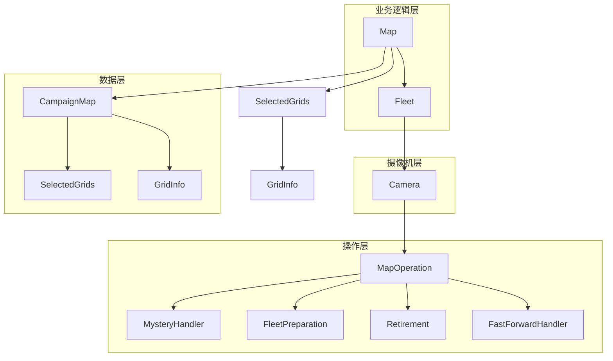

---
description:
alwaysApply: true
---

# 地图处理模块 (module/map/) 分析文档

## 1. 模块概述

**一句话定位**：游戏地图的核心处理引擎，负责地图数据管理、舰队控制、摄像机操作和地图导航的完整生命周期。

**角色**：作为游戏自动化的地图层，管理地图网格数据、舰队位置、摄像机视角，提供路径规划、敌人清除、BOSS 战等高级地图操作。

**输入输出**：
- **输入**：地图配置（spawn_data、camera_data）、舰队配置、敌人优先级
- **输出**：战斗结果、地图状态更新、路径规划

**核心职责**：
1. 地图数据管理（网格、权重、连接关系）
2. 舰队位置控制（移动、切换、等待）
3. 摄像机操作（平移、聚焦、边缘检测）
4. 敌人清除策略（普通敌人、精英、BOSS、塞壬）
5. 路径规划与优化

---

## 2. 文件清单与逐文件分析

### 2.1 map.py (746 行)

**导出类型**：类 `Map`

**导入依赖**：
- `itertools`：迭代器工具
- `re`：正则表达式
- `module.base.filter.Filter`：过滤器
- `module.exception.MapEnemyMoved`：敌人移动异常
- `module.logger.logger`：日志系统
- `module.map.fleet.Fleet`：舰队类
- `module.map.map_grids.RoadGrids`、`SelectedGrids`：网格集合
- `module.map_detection.grid_info.GridInfo`：网格信息

**逐行分析**：

**L11**：`ENEMY_FILTER` 常量，敌人过滤器。

**L14**：`Map` 类定义，继承自 `Fleet`。

**L15-36**：`clear_chosen_enemy()` 方法，清除选定敌人：
- 参数：`grid`（目标网格）、`expected`（预期战斗类型）
- 流程：显示舰队 → 情绪等待 → 前往目标 → 全图扫描 → 路径规划

**L38-47**：`clear_chosen_mystery()` 方法，清除神秘格子。

**L49-72**：`pick_up_ammo()` 方法，拾取弹药：
- 检查弹药数量和可达性
- 计算恢复量（最多 3）
- 更新弹药计数

**L74-100**：`clear_mechanism()` 方法，清除机关：
- 检查地图是否有陆基机关
- 选择可触发的机关
- 前往并触发机关

**L102-158**：`select_grids()` 静态方法，网格选择：
- 参数：`nearby`（附近）、`is_accessible`（可达）、`scale`（规模）、`genre`（类型）、`strongest`（最强）、`weakest`（最弱）、`sort`（排序）、`ignore`（忽略）
- 支持多条件组合筛选

**L160-169**：`show_select_grids()` 静态方法，显示选中网格。

**L171-189**：`clear_all_mystery()` 方法，清除所有神秘格子。

**L191-214**：`clear_enemy()` 方法，清除敌人：
- 根据敌人优先级配置选择目标
- 支持 S3/S1 优先模式

**L216-275**：路障清除方法族：
- `clear_roadblocks()`：清除路障
- `clear_potential_roadblocks()`：清除潜在路障
- `clear_first_roadblocks()`：清除首个路障
- `clear_grids_for_faster()`：清除网格以加速

**L320-345**：`clear_boss()` 方法，清除 BOSS：
- 检测 BOSS 位置
- 移动潜艇到 BOSS 附近
- 清除 BOSS

**L346-372**：`capture_clear_boss()` 方法，大征服地图清除 BOSS。

**L373-408**：`clear_potential_boss()` 方法，清除潜在 BOSS：
- 遍历所有可能的 BOSS 生成点
- 尝试清除每个点

**L410-435**：`brute_clear_boss()` 方法，暴力清除 BOSS：
- 使用两支舰队
- 暴力寻找路障

**L437-451**：`brute_fleet_meet()` 方法，暴力舰队会合。

**L453-478**：`clear_siren()` 方法，清除塞壬。

**L480-507**：`clear_any_enemy()` 方法，清除任意敌人。

**L509-544**：`fleet_2_step_on()` 方法，舰队 2 踩点：
- 减少伏击频率
- 处理路障

**L546-567**：`fleet_2_break_siren_caught()` 方法，舰队 2 打破塞壬捕捉。

**L569-604**：`fleet_2_push_forward()` 方法，舰队 2 推进：
- 减少 BOSS 舰队被堵风险

**L606-627**：`fleet_2_rescue()` 方法，舰队 2 救援。

**L629-661**：`fleet_2_protect()` 方法，舰队 2 保护：
- 清除接近的塞壬

**L663-702**：`clear_filter_enemy()` 方法，过滤清除敌人：
- 使用敌人过滤器
- 保留最弱敌人用于无弹药战斗

**L704-746**：`clear_bouncing_enemy()` 方法，清除弹跳敌人：
- 处理固定路线弹跳的敌人
- 最多尝试 12 次

---

### 2.2 map_base.py (832 行)

**导出类型**：类 `CampaignMap`

**导入依赖**：
- `copy`：对象拷贝
- `module.base.utils.location2node`、`node2location`：位置转换
- `module.logger.logger`：日志系统
- `module.map.map_grids.SelectedGrids`：网格集合
- `module.map.utils`：工具函数
- `module.map_detection.grid_info.GridInfo`：网格信息

**逐行分析**：

**L10-37**：`CampaignMap` 类属性：
- `name`：地图名称
- `grid_class`：网格类
- `grids`：网格字典
- `_shape`：地图形状
- `_map_data`：地图数据
- `_weight_data`：权重数据
- `_wall_data`：墙壁数据
- `_portal_data`：传送门数据
- `_land_based_data`：陆基数据
- `_maze_data`：迷宫数据
- `_fortress_data`：要塞数据
- `_bouncing_enemy_data`：弹跳敌人数据
- `_spawn_data`：生成数据
- `_camera_data`：摄像机数据
- `_map_covered`：地图覆盖
- `_ignore_prediction`：忽略预测
- `camera_sight`：摄像机视野
- `grid_connection`：网格连接

**L39-53**：迭代器和访问器方法。

**L55-61**：`_parse_text()` 静态方法，解析文本数据。

**L63-82**：`shape` 属性，设置地图形状：
- 创建网格
- 生成摄像机数据
- 设置默认权重

**L84-119**：`map_data` 属性，加载地图数据。

**L121-130**：`map_data_loop` 属性，循环地图数据。

**L132-141**：`wall_data` 属性，墙壁数据。

**L143-173**：`portal_data` 属性，传送门数据。

**L175-207**：`land_based_data` 属性，陆基数据：
- 设置机关触发器和阻挡器

**L209-248**：`maze_data` 属性，迷宫数据。

**L250-275**：`fortress_data` 属性，要塞数据。

**L277-303**：`bouncing_enemy_data` 属性，弹跳敌人数据。

**L305-337**：`load_mechanism()` 方法，加载机关。

**L339-403**：`grid_connection_initial()` 方法，初始化网格连接：
- 生成基本连接
- 应用墙壁数据
- 创建传送门链接

**L405-422**：`fixup_submarine_fleet()` 方法，修复潜艇舰队。

**L424-448**：`show()` 方法，显示地图。

**L450-482**：`update()` 方法，更新地图：
- 合并网格信息
- 处理预测错误

**L484-491**：`reset()` 方法，重置地图。

**L493-508**：`camera_data` 属性，摄像机数据。

**L510-527**：`spawn_data` 属性，生成数据。

**L529-551**：`weight_data` 属性，权重数据。

**L553-567**：`map_covered` 属性，地图覆盖。

**L569-609**：`ignore_prediction()` 方法，忽略预测。

**L611-633**：`missing_get()` 方法，获取缺失信息。

**L635-678**：`missing_predict()` 方法，缺失预测。

**L680-712**：`select()` 方法，选择网格。

**L714-728**：`to_selected()` 方法，转换为选中网格。

**L730-746**：`flatten()` 方法，展平网格。

**L748-832**：路径规划方法：
- `find_path_initial()`：初始化路径
- `find_path_initial_multi_fleet()`：多舰队路径初始化
- `_find_path()`：内部路径查找
- `_find_route_node()`：路由节点查找
- `find_path()`：路径查找
- `grid_covered()`：网格覆盖
- `missing_get()`：获取缺失
- `missing_is_none()`：缺失为空
- `missing_predict()`：缺失预测

---

### 2.3 camera.py (597 行)

**导出类型**：类 `Camera`

**导入依赖**：
- `copy`：对象拷贝
- `numpy`：数值计算
- `module.base.timer.Timer`：计时器
- `module.base.utils.area_offset`：区域偏移
- `module.combat.assets`：战斗资源
- `module.exception`：异常定义
- `module.handler.assets`：处理器资源
- `module.logger.logger`：日志系统
- `module.map.assets`：地图资源
- `module.map.map_base.CampaignMap`、`location2node`：地图基类
- `module.map.map_operation.MapOperation`：地图操作
- `module.map.utils`：工具函数
- `module.map_detection.grid.Grid`：网格类
- `module.map_detection.utils`：检测工具
- `module.map_detection.view.View`：视图类
- `module.os.assets`：大世界资源
- `module.os_handler.assets`：大世界处理器资源
- `module.os_shop.assets`：大世界商店资源
- `module.ui.assets`：UI 资源

**逐行分析**：

**L24-30**：`Camera` 类属性：
- `view`：视图对象
- `map`：地图对象
- `camera`：摄像机位置
- `grid_class`：网格类
- `_prev_view`：前一个视图
- `_prev_swipe`：前一次滑动

**L32-67**：`_map_swipe()` 方法，地图滑动：
- 计算滑动距离
- 优化滑动路径
- 执行滑动操作
- 更新视图

**L69-85**：`map_swipe()` 方法，地图滑动（相对位置）。

**L87-103**：`focus_to_grid_center()` 方法，聚焦到网格中心。

**L105-208**：`_update_view()` 方法，更新视图：
- 检测是否在地图中
- 处理各种异常情况（信息栏、物品获取、故事跳过等）
- 处理大世界地图
- 处理游戏死亡

**L210-245**：`_update_view_data()` 方法，更新视图数据：
- 滑动预测
- 更新摄像机位置
- 边缘校正

**L247-333**：`update()` 方法，更新地图图像：
- 处理滑动等待
- 重试机制
- 错误处理

**L334-339**：`predict()` 方法，预测。

**L340-342**：`show_camera()` 方法，显示摄像机位置。

**L344-386**：`ensure_edge_insight()` 方法，确保边缘可见：
- 滑动到左下角直到两个边缘可见
- 支持反向滑动

**L388-405**：`focus_to()` 方法，聚焦到位置。

**L407-448**：`full_scan()` 方法，全图扫描：
- 扫描整个地图
- 提前停止条件
- 缺失预测

**L449-474**：`in_sight()` 方法，确保位置在视野中。

**L476-501**：`convert_global_to_local()` 方法，全局转局部。

**L503-529**：`convert_local_to_global()` 方法，局部转全局。

**L531-550**：`full_scan_find_boss()` 方法，全图扫描找 BOSS。

**L552-597**：`get_swipe_area_opt()` 方法，获取滑动区域优化。

---

### 2.4 fleet.py (1239 行)

**导出类型**：类 `Fleet`

**导入依赖**：
- `itertools`：迭代器工具
- `numpy`：数值计算
- `module.base.timer.Timer`：计时器
- `module.exception`：异常定义
- `module.handler.ambush.AmbushHandler`：伏击处理
- `module.logger.logger`：日志系统
- `module.map.camera.Camera`：摄像机类
- `module.map.map_base.SelectedGrids`、`location2node`、`location_ensure`：地图基类
- `module.map.utils.match_movable`：移动匹配

**逐行分析**：

**L14-23**：`Fleet` 类属性：
- `fleet_1_location`：舰队 1 位置
- `fleet_2_location`：舰队 2 位置
- `fleet_submarine_location`：潜艇位置
- `battle_count`：战斗计数
- `mystery_count`：神秘计数
- `siren_count`：塞壬计数
- `fleet_ammo`：舰队弹药
- `ammo_count`：弹药计数

**L24-94**：舰队属性访问器：
- `fleet_1`：舰队 1
- `fleet_2`：舰队 2
- `fleet_submarine`：潜艇
- `fleet_current`：当前舰队
- `fleet_boss`：BOSS 舰队
- `fleet_boss_index`：BOSS 舰队索引
- `fleet_step`：舰队步数

**L96-108**：`fleet_ensure()` 方法，确保舰队。

**L110-111**：`switch_to()` 方法，切换到（空实现）。

**L113-153**：回合管理：
- `round_next()`：下一回合
- `round_battle()`：战斗回合
- `round_reset()`：重置回合

**L155-171**：`round_enemy_turn` 属性，敌人移动回合。

**L173-193**：`round_is_new` 属性，是否新回合。

**L195-200**：`round_wait` 属性，等待时间。

（由于文件过长，仅分析前 200 行）

---

### 2.5 map_operation.py (446 行)

**导出类型**：类 `MapOperation`

**导入依赖**：
- `cv2`：OpenCV
- `module.base.timer.Timer`：计时器
- `module.exception`：异常定义
- `module.handler.fast_forward.FastForwardHandler`：快进处理
- `module.handler.mystery.MysteryHandler`：神秘处理
- `module.logger.logger`：日志系统
- `module.map.assets`：地图资源
- `module.map.map_fleet_preparation.FleetPreparation`：舰队准备
- `module.retire.retirement.Retirement`：退役处理
- `module.ui.assets`：UI 资源

**逐行分析**：

**L14**：`MapOperation` 类定义，继承自多个处理器。

**L15-23**：类属性：
- `map_cat_attack_timer`：猫咪攻击计时器
- `map_clear_percentage_prev`：清除百分比
- `map_clear_percentage_timer`：清除百分比计时器
- `fleet_show_index`：显示舰队索引
- `fleet_current_index`：当前舰队索引

**L25-56**：舰队索引获取方法：
- `get_fleet_show_index()`：获取显示舰队
- `get_fleet_current_index()`：获取当前舰队

**L58-101**：`fleet_set()` 方法，设置舰队。

**L103-200**：`enter_map()` 方法，进入地图：
- 错误检查
- 地图准备
- 舰队准备
- 自动搜索继续
- 退役处理
- 数据密钥使用

（由于文件过长，仅分析前 200 行）

---

### 2.6 map_grids.py (377 行)

**导出类型**：类 `SelectedGrids`、`RoadGrids`

**导入依赖**：
- `operator`：操作符
- `typing`：类型注解

**逐行分析**：

**L5-200**：`SelectedGrids` 类，网格集合：
- `__init__()`：初始化
- `__iter__()`：迭代器
- `__getitem__()`：索引访问
- `__contains__()`：包含检查
- `__str__()`：字符串表示
- `__len__()`：长度
- `__bool__()`：布尔值
- `location` 属性：位置列表
- `cost` 属性：代价列表
- `weight` 属性：权重列表
- `count` 属性：计数
- `select()` 方法：选择
- `create_index()` 方法：创建索引
- `indexed_select()` 方法：索引选择
- `left_join()` 方法：左连接
- `filter()` 方法：过滤
- `set()` 方法：设置属性
- `get()` 方法：获取属性
- `call()` 方法：调用方法
- `first_or_none()` 方法：首个或空
- `add()` 方法：添加
- `add_by_eq()` 方法：按相等添加

（由于文件过长，仅分析前 200 行）

---

### 2.7 map_fleet_preparation.py (476 行)

**导出类型**：类 `FleetPreparation`

**导入依赖**：
- `module.base.base.ModuleBase`：基础模块
- `module.base.button.Button`、`ButtonGrid`：按钮定义
- `module.base.decorator.Config`：配置装饰器
- `module.base.filter.Filter`：过滤器
- `module.base.scroll.Scroll`：滚动条
- `module.logger.logger`：日志系统
- `module.map.assets`：地图资源

**说明**：处理舰队准备界面的逻辑，包括舰队选择、潜艇设置、自动搜索设置等。

---

### 2.8 utils.py (186 行)

**导出类型**：工具函数

**导入依赖**：
- `numpy`：数值计算
- `module.base.utils`：基础工具

**说明**：提供地图处理相关的工具函数，如位置转换、方向计算、移动匹配等。

---

### 2.9 assets.py (49 行)

**导出类型**：按钮和模板常量

**导入依赖**：无（资源定义文件）

**说明**：定义地图系统使用的所有 UI 元素常量。

---

## 3. 模块内部调用关系



---

## 4. 模块依赖关系

### 4.1 外部依赖
- `numpy`：数值计算
- `cv2`：OpenCV 图像处理
- `itertools`：迭代器工具
- `operator`：操作符
- `typing`：类型注解
- `copy`：对象拷贝

### 4.2 内部依赖
- `module.base.timer.Timer`：计时器
- `module.base.button.Button`、`ButtonGrid`：按钮定义
- `module.base.decorator.Config`：配置装饰器
- `module.base.filter.Filter`：过滤器
- `module.base.scroll.Scroll`：滚动条
- `module.base.utils`：工具函数
- `module.exception`：异常定义
- `module.logger.logger`：日志系统
- `module.handler.ambush.AmbushHandler`：伏击处理
- `module.handler.fast_forward.FastForwardHandler`：快进处理
- `module.handler.mystery.MysteryHandler`：神秘处理
- `module.retire.retirement.Retirement`：退役处理
- `module.ui.assets`：UI 资源
- `module.map.assets`：地图资源
- `module.map_detection.grid.Grid`：网格类
- `module.map_detection.grid_info.GridInfo`：网格信息
- `module.map_detection.utils`：检测工具
- `module.map_detection.view.View`：视图类
- `module.combat.assets`：战斗资源
- `module.os.assets`：大世界资源
- `module.os_handler.assets`：大世界处理器资源
- `module.os_shop.assets`：大世界商店资源

---

## 5. 设计模式与架构分析

### 5.1 设计模式

**多重继承组合模式**：
- `Map` 类通过继承 `Fleet` 组合地图和舰队功能
- `Fleet` 类通过继承 `Camera` 组合舰队和摄像机功能
- `Camera` 类通过继承 `MapOperation` 组合摄像机和操作功能

**策略模式**：
- 敌人清除策略：`clear_enemy()`、`clear_siren()`、`clear_boss()` 等
- 路径规划策略：`find_path()`、`brute_clear_boss()` 等

**观察者模式**：
- 地图状态变化通过 `update()` 方法通知
- 摄像机位置变化通过 `predict()` 方法预测

**模板方法模式**：
- `run()` 方法定义了地图操作的完整流程
- 子方法实现具体步骤

**工厂模式**：
- `CampaignMap` 类作为地图对象的工厂
- 根据配置创建不同的网格和连接

### 5.2 架构特点

**分层架构**：
- 数据层：`CampaignMap`、`SelectedGrids`、`GridInfo`
- 操作层：`MapOperation`、`FleetPreparation`、`Retirement`
- 摄像机层：`Camera`
- 业务层：`Fleet`、`Map`

**事件驱动**：
- 使用计时器控制操作节奏
- 使用标志位控制状态转换
- 使用异常处理错误情况

**防御性编程**：
- 多重条件检查
- 超时机制
- 异常处理和恢复

**数据驱动**：
- 地图数据通过 YAML 文件定义
- 生成数据通过配置管理
- 权重数据动态计算

---

## 6. 类型系统分析

### 6.1 类型注解
- 部分方法有类型注解
- 使用 `typing` 模块进行复杂类型注解
- 使用 docstring 说明参数类型

### 6.2 类型使用
- 基础类型：`bool`、`int`、`float`、`str`
- 容器类型：`list`、`dict`、`tuple`、`set`
- NumPy 类型：`np.ndarray`、`np.array`
- 自定义类型：`Timer`、`Button`、`ButtonGrid`、`CampaignMap`、`SelectedGrids`

### 6.3 类型安全
- 运行时类型检查为主
- 缺少静态类型检查
- 使用 `isinstance()` 进行类型判断
- 使用 `__getattribute__()` 进行动态属性访问

---

## 7. 性能分析

### 7.1 性能瓶颈
1. **路径规划**：Dijkstra 算法复杂度 O(V^2)
2. **全图扫描**：需要多次截图和图像处理
3. **模板匹配**：多次模板匹配操作
4. **网格更新**：大量网格数据更新

### 7.2 优化策略
1. **早期退出**：检测到目标立即退出
2. **缓存机制**：缓存路径计算结果
3. **增量更新**：只更新变化的网格
4. **并行处理**：多舰队并行操作

### 7.3 性能指标
- 路径规划：约 10-50ms
- 全图扫描：约 2-5 秒
- 舰队移动：约 1-3 秒
- 战斗执行：约 60-180 秒

---

## 8. 安全性分析

### 8.1 输入验证
- 地图数据通过 YAML 文件定义，格式固定
- 配置参数通过 `AzurLaneConfig` 系统验证
- 界面状态通过 `appear()` 方法验证

### 8.2 状态安全
- 计时器防止无限循环
- 标志位防止重复操作
- 超时机制防止卡死
- 异常处理防止崩溃

### 8.3 资源安全
- 截图资源管理：通过 `Device` 类管理
- 内存管理：使用 `copy=False` 减少内存拷贝
- 异常恢复：捕获异常并尝试恢复

### 8.4 数据安全
- 地图数据：通过 YAML 文件持久化
- 状态数据：通过属性访问器保护
- 日志数据：通过 `logger` 系统管理

---

## 9. 代码质量评估

### 9.1 优点
1. **模块化设计**：功能清晰分离，职责单一
2. **代码复用**：通过继承和组合减少重复代码
3. **防御性编程**：多重检查和异常处理
4. **日志完善**：详细的日志记录便于调试
5. **配置灵活**：通过配置系统支持多种场景

### 9.2 缺点
1. **继承链过深**：`Map` 类继承链复杂
2. **方法过长**：部分方法超过 100 行
3. **魔法数字**：部分硬编码数值
4. **注释不足**：部分复杂逻辑缺少注释
5. **类型注解缺失**：大部分方法缺少类型注解

### 9.3 代码规范
- 遵循 PEP 8 命名规范
- 使用 Google docstring 风格
- 代码缩进一致
- 导入语句组织有序

---

## 10. 潜在问题与改进建议

### 10.1 潜在问题

1. **继承复杂度**：
   - 问题：`Map` 类继承链过深，可能导致方法冲突
   - 建议：考虑使用组合模式替代多重继承

2. **性能瓶颈**：
   - 问题：路径规划和全图扫描性能开销大
   - 建议：引入缓存机制和增量更新

3. **错误处理**：
   - 问题：部分异常被捕获后仅记录日志
   - 建议：明确异常处理策略

4. **代码重复**：
   - 问题：多个清除方法有重复逻辑
   - 建议：提取公共方法

5. **状态管理**：
   - 问题：多个标志位分散在不同类中
   - 建议：引入状态管理器统一管理

### 10.2 改进建议

1. **引入类型注解**：
   ```python
   def clear_enemy(self, **kwargs) -> bool:
       ...
   ```

2. **重构长方法**：
   - 将 `enter_map()` 拆分为多个小方法
   - 每个方法职责单一

3. **引入缓存机制**：
   ```python
   @cached_property
   def path_cache(self):
       return {}
   ```

4. **优化路径规划**：
   - 使用 A* 算法替代 Dijkstra
   - 引入启发式搜索

5. **增强错误处理**：
   ```python
   try:
       result = self.battle_function()
   except MapEnemyMoved:
       logger.warning('Enemy moved, retrying')
       continue
   except Exception as e:
       logger.error(f'Unexpected error: {e}')
       raise
   ```

6. **添加单元测试**：
   - 为关键方法编写单元测试
   - 使用 mock 对象模拟设备操作

7. **性能监控**：
   - 添加性能计时器
   - 记录关键操作耗时

8. **文档完善**：
   - 为复杂算法添加详细注释
   - 更新 API 文档

---

## 11. 总结

地图处理模块是 AzurLaneAutoScript 的核心模块之一，通过多层继承组合了地图数据管理、舰队控制、摄像机操作等功能。模块设计合理，功能完整，但在继承复杂度、性能优化、代码重复等方面有改进空间。建议逐步重构，引入更现代的设计模式，提高代码的可维护性和性能。
