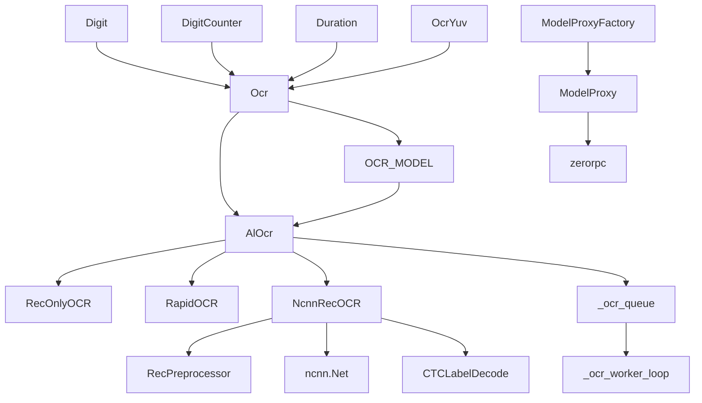

---
description:
alwaysApply: true
---

# module/ocr/ 模块分析

## 1. 模块概述

**定位**：OCR 文字识别系统，负责从游戏截图中提取文本信息。

**角色**：定义 `Ocr` 基类和数字/计数器/时长子类、`AlOcr` RapidOCR 后端、`NcnnRecOCR` ncnn 后端、`ModelProxyFactory` RPC 代理。支持 ONNX Runtime 和 ncnn 双后端，支持 DirectML/CoreML/Vulkan GPU 加速。

**输入/输出**：
- 输入：截图（`np.ndarray`）、识别区域（`Button`/`tuple`）
- 输出：识别文本（`str`）、数字（`int`）、计数器（`tuple`）、时长（`timedelta`）

**核心职责**：
1. 提供通用 OCR 文本识别（`Ocr`）
2. 提供数字识别（`Digit`）、计数器识别（`DigitCounter`）、时长识别（`Duration`）
3. 支持多种 OCR 后端（ONNX Runtime、ncnn、RPC）
4. 支持多语言（EN、CN、JP、TW）
5. 支持 GPU 加速（DirectML、CoreML、Vulkan）

## 2. 文件清单与逐文件分析

### 2.1 ocr.py（260 行）

**导出类型**：类 `Ocr`、`OcrYuv`、`Digit`、`DigitYuv`、`DigitCounter`、`DigitCounterYuv`、`Duration`、`DurationYuv`

**导入依赖**：
- 内部：`config.server`、`base.button`、`base.decorator`、`base.utils.*`、`logger`、`ocr.rpc`、`webui.setting`
- 外部：`time`、`datetime`、`typing`

**逐段分析**：

- `L22-113`：`Ocr` 基类 — `__init__()` 接受 `buttons`（识别区域）、`lang`（语言）、`letter`（字母颜色）、`threshold`（阈值）、`alphabet`（白名单）。`pre_process()` 使用 `extract_letters()` 提取字母。`ocr()` 裁剪→预处理→`crop_to_text()`→OCR→后处理。
- `L116-139`：`OcrYuv` — YUV 色彩空间变体。`pre_process()` 使用 `rgb2luma()` 提取 Y 通道。
- `L142-163`：`Digit` — 数字识别。`after_process()` 修正 OCR 错误（I→1、D→0、S→5、B→8）。返回 `int`。
- `L166-167`：`DigitYuv` — YUV 数字识别。
- `L170-204`：`DigitCounter` — 计数器识别（如 `14/15`）。返回 `(current, remain, total)`。
- `L207-208`：`DigitCounterYuv` — YUV 计数器识别。
- `L211-256`：`Duration` — 时长识别（如 `01:30:00`）。`parse_time()` 正则解析。返回 `timedelta`。
- `L259-260`：`DurationYuv` — YUV 时长识别。

### 2.2 al_ocr.py（557 行）

**导出类型**：类 `AlOcr`、`RecOnlyOCR`、`DetOnlyOCR`，函数 `reset_ocr_model()`

**导入依赖**：
- 内部：`exception.RequestHumanTakeover`、`logger`、`config.AzurLaneConfig`、`ocr.ncnn_ocr`
- 外部：`os`、`queue`、`threading`、`numpy`、`cv2`、`PIL.Image`、`rapidocr`

**逐段分析**：

- `L23-33`：导入 RapidOCR 依赖。失败时调用 `handle_ocr_error()` 提示安装 VC++ 运行库。
- `L39-67`：`RecOnlyOCR` — 仅加载识别模型，跳过检测和分类。`_initialize()` 重写。
- `L69-70`：全局配置加载。
- `L73-132`：OCR 工作队列 — `_OcrJob`（任务封装）、`_ocr_queue`（队列）、`_ocr_worker_loop()`（工作线程）。`_run_ocr_queued()` 将 OCR 操作排队到单线程执行，避免并发问题。
- `L135-186`：`_get_onnx_model_params()` — ONNX 模型参数。4 种语言：cn、jp、tw、en。`_create_ocr()` 创建 OCR 实例，支持 ONNX/ncnn 后端。
- `L189-213`：`_get_model()` — 惰性加载模型。全局变量 `_cn_model`/`_en_model`/`_jp_model`/`_tw_model`。
- `L216-293`：检测模型 — `DetOnlyOCR`（仅检测）、`_create_det_ocr_for_onnx()`（ONNX 全流程）、`_create_det_ocr_for_ncnn()`（ncnn 检测）。`_get_det_model()` 惰性加载。
- `L296-310`：`reset_ocr_model()` — 重置所有 OCR 模型，释放内存。
- `L313-557`：`AlOcr` 类 — `__init__()` 惰性初始化。`init()` 加载模型。`ocr()` 文本识别。`det()` 检测+识别，返回 `(text, box, score)` 列表。`ocr_for_single_lines()` 批量识别。`atomic_ocr()` 带字母白名单过滤。`_save_debug_image()`/`_save_det_debug()` 调试图保存。

### 2.3 ncnn_ocr.py（350 行）

**导出类型**：类 `NcnnRecOCR`、`RecPreprocessor`，函数 `has_ncnn_vulkan_gpu()`、`get_ncnn_vulkan_gpu_count()`

**导入依赖**：
- 内部：`logger`
- 外部：`atexit`、`math`、`threading`、`time`、`dataclasses`、`pathlib`、`cv2`、`numpy`、`rapidocr`

**逐段分析**：

- `L18-66`：模型规格 — `NcnnRecModelSpec` 数据类。4 种模型（en、cn、jp、tw），含 param/bin/keys 路径和输出名。
- `L69-99`：ncnn 加载 — `_load_ncnn()` 惰性导入。`_ensure_gpu_instance()` 创建 Vulkan GPU 实例。`_destroy_gpu_instance()` atexit 清理。
- `L134-166`：GPU 工具 — `get_ncnn_vulkan_gpu_count()`、`has_ncnn_vulkan_gpu()`、`_resolve_gpu_index()`。
- `L178-199`：`RecPreprocessor` — 图像预处理。`resize_norm_img()` 缩放+归一化+填充。
- `L202-350`：`NcnnRecOCR` — ncnn OCR 类。`__init__()` 加载模型。`__call__()` 识别：加载图像→缩放→预处理→推理→解码。`_infer()` ncnn 推理。`_to_ncnn_mat()` NumPy→ncnn.Mat。`_normalize_output()` 输出形状标准化。

### 2.4 models.py（27 行）

**导出类型**：类 `OcrModel`，全局实例 `OCR_MODEL`

**导入依赖**：
- 内部：`decorator.cached_property`、`ocr.al_ocr.AlOcr`

**逐段分析**：

- `L5-26`：`OcrModel` — 5 个缓存属性：`azur_lane`（EN）、`azur_lane_jp`（JP）、`cnocr`（CN）、`jp`（JP）、`tw`（TW）。惰性创建 `AlOcr` 实例。

### 2.5 rpc.py（276 行）

**导出类型**：类 `ModelProxy`、`ModelProxyFactory`、`OCRServer`，函数 `start_ocr_server()`

**导入依赖**：
- 内部：`logger`
- 外部：`zerorpc`、`numpy`、`threading`

**逐段分析**：

- `L1-50`：`ModelProxy` — RPC 代理。`__init__()` 连接 zerorpc 服务器。`atomic_ocr_for_single_lines()` 远程调用。
- `L52-100`：`ModelProxyFactory` — 动态代理工厂。`__getattr__()` 返回 `ModelProxy` 实例。
- `L102-276`：`OCRServer` — OCR 服务器。`start_ocr_server()` 启动 zerorpc 服务器。支持多模型并发。

## 3. 内部调用关系

## 4. 模块依赖分析

**外部依赖**：
- `rapidocr`：RapidOCR 框架
- `ncnn`：ncnn 推理框架（可选）
- `onnxruntime`：ONNX Runtime（可选）
- `onnxruntime-directml`：DirectML GPU 加速（Windows，可选）
- `numpy`、`cv2`：图像处理
- `zerorpc`：RPC 框架（可选）

**内部依赖**：
- `module.base`：`Button`、`cached_property`、`utils`
- `module.config`：`AzurLaneConfig`、`server`
- `module.exception`：`RequestHumanTakeover`
- `module.logger`：日志系统
- `module.webui.setting`：部署配置

## 5. 设计模式与架构分析

**设计模式**：
1. **工厂模式**：`_create_ocr()`/`_get_model()` 创建 OCR 实例
2. **代理模式**：`ModelProxy`/`ModelProxyFactory` RPC 代理
3. **模板方法**：`Ocr.ocr()` 定义识别骨架，子类重写 `after_process()`
4. **生产者-消费者**：`_ocr_queue` 单线程工作队列
5. **享元模式**：`OCR_MODEL` 全局共享模型实例

**架构特点**：
- 双后端架构：ONNX Runtime（默认）和 ncnn（更快）
- 惰性加载：首次使用时才加载模型
- 单线程队列：避免并发问题
- 多语言支持：EN、CN、JP、TW

## 6. 类型系统分析

- `Ocr` 使用 `TYPE_CHECKING` 避免循环导入
- `NcnnRecModelSpec` 使用 `@dataclass(frozen=True)` 不可变数据类
- `AlOcr` 使用 `threading.Event` 同步
- `RecPreprocessor` 使用 NumPy 数组类型

## 7. 性能分析

- OCR 推理时间：ONNX ~100-180ms，ncnn ~50-100ms
- 模型加载时间：首次 ~1-2s
- 单线程队列避免并发开销
- `RecPreprocessor.resize_norm_img()` 使用 NumPy 向量化
- GPU 加速：DirectML（Windows）、CoreML（macOS）、Vulkan（ncnn）

## 8. 安全分析

- `handle_ocr_error()` 提示安装 VC++ 运行库
- `_save_debug_image()` 限制文件数量（100 个）
- `reset_ocr_model()` 释放模型内存
- RPC 模式仅限本地连接

## 9. 代码质量评估

**优点**：
- 双后端架构灵活，ncnn 更快，ONNX 更通用
- 惰性加载减少启动时间
- 单线程队列保证线程安全
- 多语言支持完善

**问题**：
- `al_ocr.py` 过于庞大（557 行），应拆分
- OCR 工作队列使用全局变量，测试困难
- `models.py` 的语言映射硬编码
- RPC 模式缺少认证机制

## 10. 潜在问题与改进建议

1. **al_ocr.py 拆分**：将检测模型、识别模型、工作队列分离
2. **后端抽象**：定义 `OcrBackend` 接口，统一 ONNX/ncnn/RPC
3. **语言配置化**：将语言映射移到配置文件
4. **测试覆盖**：OCR 识别准确率测试
5. **RPC 安全**：添加认证和加密
6. **模型预热**：启动时预加载常用模型
